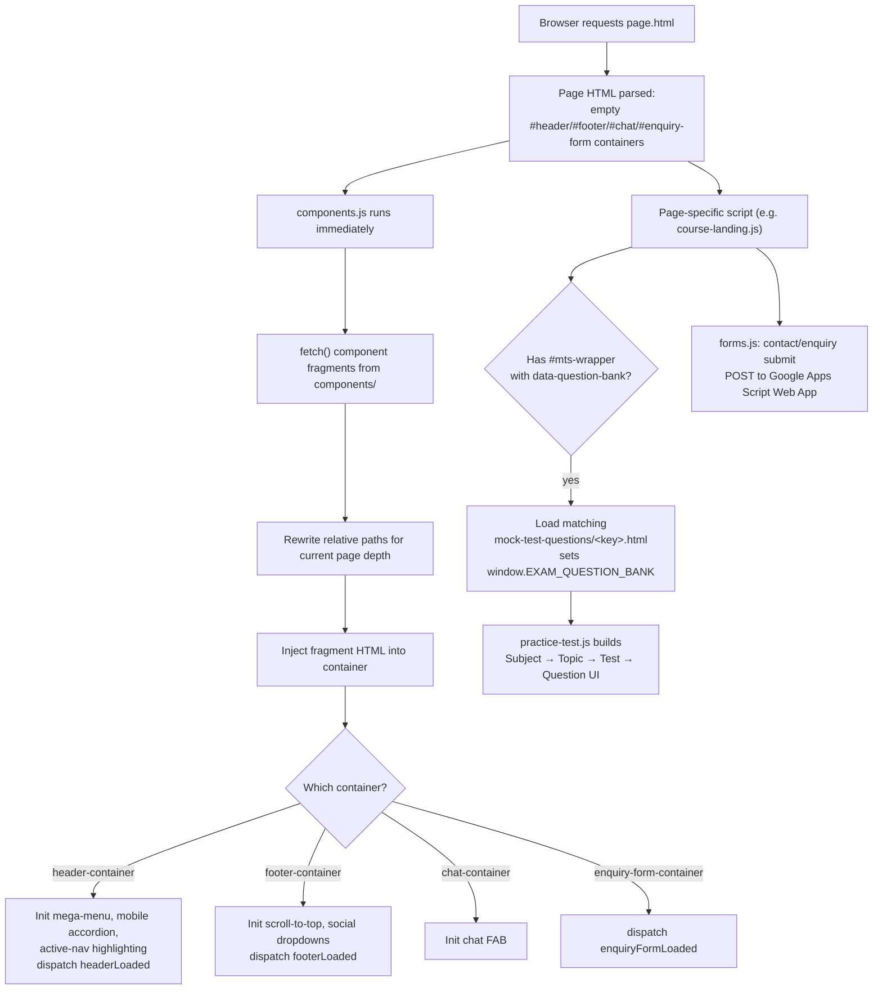
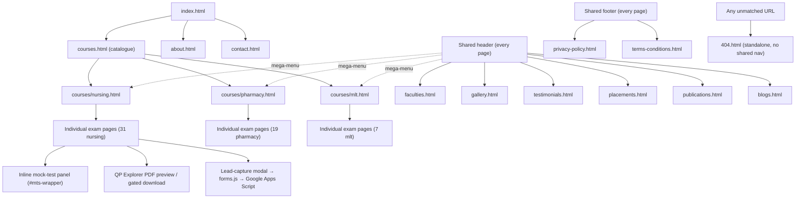

# Eduooz International Academy — Website

👋 Welcome! This is the website for **Eduooz International Academy**, a healthcare exam coaching academy in Trivandrum, Kerala, India. It helps students find and prepare for Nursing, Pharmacy, Medical Laboratory Technology (MLT), and German-language recruitment/licensing exams.

This single README is the **complete reference** for the site — everything a client, a new developer, or a future maintainer needs, in one place:
- **Not a developer?** Jump straight to [Quick Edits Anyone Can Make](#quick-edits-anyone-can-make) — step-by-step instructions for the everyday changes (swapping a PDF, fixing a phone number, editing text) with no coding knowledge required.
- **A developer picking this up?** Everything else covers setup, full file/folder documentation, architecture, every page template, forms, SEO, known issues, and troubleshooting.

**Status:** 🟢 Actively maintained (last commit: 2026-08-03)

[](https://developer.mozilla.org/en-US/docs/Web/HTML)
[](https://developer.mozilla.org/en-US/docs/Web/CSS)
[](https://developer.mozilla.org/en-US/docs/Web/JavaScript)
[](#tech-stack)
[](#license)

---

## Table of Contents

- [Overview](#overview)
- [Quick Edits Anyone Can Make](#quick-edits-anyone-can-make)
- [Features](#features)
- [Screenshots](#screenshots)
- [Demo](#demo)
- [Tech Stack](#tech-stack)
- [Project Structure](#project-structure)
- [File Reference](#file-reference)
- [Individual Exam Pages — Template & Full Inventory](#individual-exam-pages--template--full-inventory)
- [Installation](#installation)
- [Running the Project](#running-the-project)
- [Configuration](#configuration)
- [Usage](#usage)
- [Architecture](#architecture)
- [Shared Components](#shared-components)
- [Images & Assets](#images--assets)
- [Responsive Design](#responsive-design)
- [Navigation Flow](#navigation-flow)
- [Forms](#forms)
- [Important Files](#important-files)
- [Development / Modification Guide](#development--modification-guide)
- [Deployment](#deployment)
- [SEO](#seo)
- [Performance](#performance)
- [Accessibility](#accessibility)
- [Browser Support](#browser-support)
- [Third-Party Libraries & APIs](#third-party-libraries--apis)
- [Database](#database)
- [Troubleshooting](#troubleshooting)
- [Known Issues](#known-issues)
- [Future Improvements](#future-improvements)
- [Code Standards](#code-standards)
- [Git Workflow / Contributing](#git-workflow--contributing)
- [FAQ](#faq)
- [Appendix](#appendix)
- [License](#license)
- [Author](#author)

---

## Overview

**What it does:** This repository is the full public marketing and course-catalogue website for Eduooz International Academy. It presents the academy's course offerings (Nursing, Pharmacy, MLT, German language), faculty, placements, testimonials, publications, and blog content, and gives prospective students an in-browser free practice-test engine covering thousands of exam questions across subjects and topics.

**Who it's for:** Prospective students researching healthcare/lab-tech recruitment and licensing exams (Kerala PSC, Indian central government bodies such as AIIMS/RRB/DSSSB/ESIC/JIPMER, and GCC nursing/pharmacy licensing bodies such as DHA/HAAD/Prometric/Pearson VUE), as well as the academy's own marketing/content team maintaining the site.

**Why it exists:** It is the academy's primary online presence — lead generation (enquiry forms), course discovery, exam-specific landing pages with syllabi and previous question papers, and a free mock-test tool that demonstrates the academy's teaching content.

**Major functionality:**
- Course catalogue across 4 categories (Nursing, Pharmacy, MLT, German) and 58 individual exam landing pages
- A reusable in-browser practice-test engine (subject → topic → test → question hierarchy)
- Downloadable syllabus and previous-question-paper PDFs per exam
- Lead-capture and contact forms wired to a Google Apps Script backend
- A site-wide chat FAB widget and mega-menu navigation shared across all pages via a lightweight component loader
- SEO/AI-discovery metadata (`sitemap.xml`, `robots.txt`, `humans.txt`, `llms.txt`)

**Project architecture in one sentence:** a flat, page-per-file static site — every HTML page independently loads the CSS/JS it needs, with common UI (header, footer, chat, enquiry form) injected at runtime by one shared loader script rather than duplicated into every file. See [Architecture](#architecture) for the full picture.

---

## Quick Edits Anyone Can Make

You don't need to install anything or know how to code to make these common changes. The site has **no admin dashboard** — every page is a plain text file — but for small text/image/PDF swaps, GitHub's website lets you edit files directly in your browser and save ("commit") the change yourself.

**How to edit any file without installing anything:**
1. Open the file on [github.com](https://github.com/Eduooz-academy/Eduooz-website) (browse into the right folder, click the file).
2. Click the **pencil icon** (✏️) in the top-right of the file view — this opens an in-browser editor.
3. Make your change.
4. Scroll down, add a short note describing what you changed (e.g. "Update contact phone number"), and click **"Commit changes"**.
5. Tell your developer the change is ready — they'll review it and publish it live.

> 💡 If you're not sure a change is safe, ask a developer first rather than guessing — some pages (especially exam pages) have technical blocks near the top (`EXAM_CONFIG`, JSON-LD) that look like code and *are* code — don't edit those unless you know what they do.

### Common tasks

**Change a phone number, WhatsApp number, or email**
- Chat button (bottom-right on every page): edit `components/chat.html`.
- Footer / contact page: edit `contact.html` and `components/footer.html`.
- One number lives in a few places, so search for the old number across files before assuming you've caught every spot.

**Edit visible text (headings, paragraphs, FAQ answers)**
- Find the page (e.g. `about.html`, `courses/pharmacy.html`), open it, use your browser's Find (Ctrl+F) to locate the sentence, and edit the text between the `<tags>` — leave the tags themselves alone, only change the words between `>` and `<`.

**Replace or add a photo**
- Upload the new image into the matching folder under `assets/images/` (e.g. faculty photos go in `assets/images/Mentors/`).
- ⚠️ Match the exact filename spelling and CAPITALIZATION used elsewhere on the site — the live site is case-sensitive, so `mentors.jpg` and `Mentors.jpg` are treated as two different files and a mismatch causes a broken image.
- If you're just swapping a photo for an existing one, easiest is to keep the exact same filename and just upload the new file to replace it.

**Add or update a syllabus / previous-question-paper PDF**
- Syllabus PDFs go in `assets/Syllabus/<category>/` (nursing, pharmacy, or mlt).
- Previous question papers go in `assets/Prev.Qn.papers/<category>/`.
- After uploading, a developer needs to link the new PDF from the relevant exam page (a one-line edit) — flag it to them rather than trying to wire this up yourself.

**Update the contact address or legal pages**
- `contact.html` — office address, phone, map.
- `privacy-policy.html` / `terms-conditions.html` — legal text.

### What NOT to self-edit
- Anything inside `<script>...</script>` tags — this is code, not content, and a small mistake can break the whole page.
- `assets/css/` and `assets/js/` files — these control layout and behavior sitewide; a typo here can break every page, not just one.
- `sitemap.xml`, `robots.txt`, `CNAME` — these control how the site is found by search engines and how it's hosted; get a developer for these.
- `components/mock-test-questions/*.html` — the quiz question banks aren't plain text, they're JavaScript data. A single missing comma silently breaks the entire mock test for that exam category with no visible error on the page (this has happened before — see [Known Issues](#known-issues)).

---

## Features

- Responsive design across desktop, tablet, and mobile (accordion-based mobile navigation)
- Dynamic mega-menu navigation with per-category (Nursing/Pharmacy/MLT/German) course panels
- Shared header/footer/chat/enquiry-form components loaded at runtime via `fetch()` — no per-page duplication
- 58 individual course/exam landing pages across Central government, Kerala PSC, and GCC licensing categories
- In-browser **free practice test** engine (`practice-test.js`) with shuffled question order per topic
- Inline YouTube video player embedded directly in page media boxes (no popup/redirect)
- Downloadable **syllabus** and **previous question paper** PDFs with in-page preview, per exam
- Lead-enquiry popup form and contact form, both posting to a shared Google Apps Script Web App
- FAQ accordion sections (`faq-enquiry.js`)
- Google Reviews widget filtered per page type (nursing/pharmacy/german/lab-tech) — currently unconfigured, falls back to static hardcoded reviews (see [Third-Party Libraries & APIs](#third-party-libraries--apis))
- Publications gallery with lightbox (`publications.js`)
- Testimonials, placements, gallery, and faculty profile pages
- Scroll-to-top button, social-media dropdown panels (LinkedIn/Facebook/YouTube/Instagram, each with per-vertical sub-pages)
- GSAP/ScrollTrigger scroll animations, Three.js background effects, Lenis smooth scrolling
- SEO metadata on every page: canonical tags, Open Graph, Twitter Card, and JSON-LD structured data
- Custom `404.html` error page (`noindex, follow`)
- AI-crawler discovery file (`llms.txt`) alongside standard `sitemap.xml` / `robots.txt`

---

## Screenshots

> No screenshots currently exist in this repository. Add captured images to `docs/screenshots/` and reference them below.

| Page | Path |
|---|---|
| Homepage | `docs/screenshots/homepage.png` |
| Mobile homepage | `docs/screenshots/mobile-home.png` |
| Course landing page | `docs/screenshots/course-page.png` |

---

## Demo

**Intended live site:** https://www.eduooz.com/

**Current status:** A `CNAME` file at the repository root maps this repo to `eduooz.com`, indicating it is intended to be served via **GitHub Pages**. As of the last recorded SEO audit (2026-07-09), the live domain was still serving an older WordPress-based site (Elementor + Yoast SEO, hosted on Hostinger) rather than this repository — this codebase was a not-yet-deployed redesign at that time. Verify current deployment status directly against `https://www.eduooz.com/` before assuming this repo is what's live.

---

## Tech Stack

| Technology | Version | Purpose |
|---|---|---|
| HTML5 | — | Page structure (75 static `.html` pages, no templating engine) |
| CSS3 | — | Styling — one stylesheet per page/section under `assets/css/` |
| JavaScript (vanilla, ES5/ES6, no framework) | — | Interactivity, component loading, practice-test engine |
| [GSAP](https://gsap.com/) + ScrollTrigger | 3.12.5 (cdnjs) | Scroll-linked reveal/parallax animation across almost every page |
| [Three.js](https://threejs.org/) | r160 (unpkg) | Decorative WebGL particle/gyroscope backgrounds (hero sections, contact page) |
| [Lenis](https://lenis.darkroom.engineering/) | 1.0.42, `@studio-freight/lenis` (unpkg) | Inertia-based smooth scrolling |
| [Chart.js](https://www.chartjs.org/) | 4.4.3 (jsDelivr) | Donut/bar charts on the mock-test results screen and course pages |
| [Font Awesome 6](https://fontawesome.com/) | 6.5.1 (cdnjs) | Icon set, used throughout |
| Google Fonts | — | Plus Jakarta Sans (body/UI), Cormorant Garamond (serif accents) |
| Google Apps Script | — | Serverless backend receiving contact/enquiry form submissions |
| GitHub Pages | — | Static hosting target (implied by `CNAME`) |

All third-party libraries are loaded via CDN `<script>`/`<link>` tags directly in each HTML page — **no build tool, bundler, package manager, or `package.json`** exists in this repository. It is a pure static site: what you edit in `.html`/`.css`/`.js` is exactly what ships, with no compile step in between.

---

## Project Structure

```
Eduooz-website/
├── .env                            # Local reference copy of the Apps Script URL (gitignored — not read at runtime)
├── .gitignore
├── 404.html                        # Custom error page (fully static, no shared header/footer/chat)
├── CNAME                           # GitHub Pages custom-domain mapping (eduooz.com)
├── README.md                       # This file — the canonical reference for the whole project
├── about.html, blogs.html, contact.html, courses.html,
│   faculties.html, gallery.html, placements.html,
│   privacy-policy.html, terms-conditions.html, testimonials.html,
│   publications.html
├── index.html                      # Homepage
├── sitemap.xml                     # Search-engine sitemap (73 indexable URLs)
├── robots.txt
├── humans.txt
├── llms.txt                        # AI-crawler discovery/summary file
├── assets/
│   ├── css/                        # One stylesheet per page/feature (18 files)
│   ├── js/                         # One script per page/feature (20 files)
│   ├── images/                     # Site images, logo, favicon, mentor photos, gallery
│   ├── Prev.Qn.papers/             # Downloadable previous-question-paper PDFs (60 files)
│   └── Syllabus/                   # Downloadable syllabus PDFs (33 files)
├── components/
│   ├── header.html                 # Shared header + mega-menu (loaded via JS)
│   ├── footer.html                 # Shared footer (loaded via JS)
│   ├── chat.html                   # Chat FAB widget fragment
│   ├── lead-enquiry-form.html      # Enquiry/lead-capture form fragment
│   └── mock-test-questions/        # Practice-test question-bank data files (5 exam banks)
│       ├── nursing-questions.html
│       ├── nursing-gcc-questions.html
│       ├── pharmacy-questions.html
│       ├── pharmacy-gcc-questions.html
│       └── mlt-questions.html
└── courses/
    ├── Courses-list.txt            # Internal planning notes (exam counts, how-tos)
    ├── lab-tech.html                # Legacy/alternate MLT landing page — status unconfirmed, see Known Issues
    ├── nursing.html / pharmacy.html / mlt.html   # Category hub pages
    ├── german/german-language.html # Sole German course page
    ├── nursing/{central,kerala,gcc}/    # 13 + 11 + 7 individual nursing exam pages
    ├── pharmacy/{central,kerala,gcc}/   # 5 + 7 + 7 individual pharmacy exam pages
    └── mlt/{central,kerala}/            # 2 + 5 individual MLT exam pages
```

**Folder-by-folder notes:**

- **`assets/css/`** — every stylesheet on the site, one per page or shared/global file. Don't add page-specific `<style>` blocks in HTML — put styles here instead.
- **`assets/js/`** — every script on the site. Cross-page shared behavior (component loading, mega menu, inline video, chat FAB, scroll-to-top, social dropdowns) lives in `components.js`, not duplicated per page.
- **`assets/images/`** — see [Images & Assets](#images--assets) for the subfolder breakdown and the case-sensitivity trap.
- **`assets/Prev.Qn.papers/` and `assets/Syllabus/`** — downloadable PDFs linked from exam pages via `data-pdf`/`data-download` attributes on `.qp-card` elements (question papers) and `.btn-download-syllabus` links (syllabus). Subfoldered by category: `mlt/`, `nursing/`, `pharmacy/`.
- **`components/`** — HTML **fragments**, never standalone pages — fetched and injected into a container `<div>` by `components.js` (the 4 top-level files) or the practice-test engine's bundled loader (the `mock-test-questions/` files). `robots.txt` explicitly disallows crawling `/components/mock-test-questions/`, and the folder is excluded from `sitemap.xml`.
- **`courses/`** — the exam catalogue: 3 category-hub pages (`nursing.html`, `pharmacy.html`, `mlt.html`) plus subfolders per region (`central/`, `kerala/`, `gcc/`) holding one HTML file per exam. Exam pages reference `../../../assets/...` (three levels up) since they're nested three directories deep. `Courses-list.txt` is a plain-text outline (subject → region → exam name) — a fast lookup table, not itself read by any code.

---

## File Reference

Every JavaScript and CSS file on the site, what it does, and roughly how big it is (useful for judging how risky a change is before you make it).

### JavaScript files

| File | Lines | Loaded by | Purpose |
|---|---|---|---|
| `components.js` | 853 | Every page except `404.html` | Fetches & injects header/footer/chat/enquiry-form fragments; owns nav, mega-menu, mobile accordion, chat FAB, scroll-to-top, social dropdowns, and the site-wide inline YouTube player (`window.EduoozInlinePlayer`) |
| `forms.js` | 115 | Every page except `404.html` | All form submission logic (contact form + every `.lead-form`) → Google Apps Script |
| `faq-enquiry.js` | 37 | Most course pages + marketing pages | FAQ accordion UI only — **not** enquiry-form logic despite the name |
| `parallax.js` | 101 | Utility library (`window.EduoozParallax`) | Generic scroll-linked image parallax helper |
| `practice-test.js` | 1,035 (incl. bundled question-bank loader) | Course pages with a mock-test panel | Subject → Topic → Test → Question quiz engine; fetches question banks |
| `practice-test-gcc.js` | 663 | 7 nursing-GCC pages only | Flat Test → Question quiz engine variant; overrides `window.PracticeTest` after `practice-test.js` loads |
| `course-landing.js` | 6,641 | All ~58 individual exam pages | The largest file on the site — renders every `EXAM_CONFIG`-driven section, the Previous-Question-Paper "QP Explorer", eligibility checker, syllabus tabs, faculty carousel, etc. |
| `google-reviews.js` | 791 | Pages with a `#greview-track` element | Google Places review carousel — **ships unconfigured** (empty `apiKey`/`placeId`), always falls back to hardcoded static reviews |
| `index.js` | 3,439 | `index.html` | Homepage-specific animation/carousel/counter logic |
| `about.js` | 1,868 | `about.html` | About-page timeline, confetti, faculty carousel, horizon-scroll panels |
| `courses.js` | 2,056 | `courses.html` | Catalogue filter tabs, video testimonial playlist, faculty/placements carousels |
| `contact-bg.js` | 192 | `contact.html` | Three.js particle background plus duplicated Lenis/magnetic-button/navbar/scroll-top boilerplate |
| `blogs.js` | 275 | `blogs.html` | Blog archive filter tabs, fake "Load More" (no real pagination) |
| `faculties.js` | 110 | `faculties.html` | Scroll reveal + mobile tap-to-expand faculty cards |
| `gallery.js` | 400 | `gallery.html` | "Show More" batch reveal, magnetic cursor, lightbox with keyboard/swipe nav |
| `placements.js` | 175 | `placements.html` | Reveal animations + animated stat counters |
| `publications.js` | 483 | `publications.html` | Read-more truncation (word-safe), category filter, zoomable/pannable lightbox |
| `testimonials.js` | 348 | `testimonials.html` | Draggable dual-direction marquee, YouTube-shorts masonry grid with pagination |
| `privacy-policy.js` | 143 | `privacy-policy.html` | Sticky TOC + scroll-spy (byte-identical to `terms-conditions.js`) |
| `terms-conditions.js` | 143 | `terms-conditions.html` | Sticky TOC + scroll-spy (byte-identical to `privacy-policy.js`) |

### CSS files

| File | Lines | Scope |
|---|---|---|
| `global-heading-system.css` | 578 | **Canonical shared token/typography layer** — load before all other CSS |
| `header-footer.css` | 2,968 | Shared header, footer, chat widget — nearly every page |
| `faq-enquiry.css` | 510 | Shared FAQ accordion + shared lead-enquiry-form styling |
| `legal-shared.css` | 475 | Shared by `privacy-policy.html` + `terms-conditions.html` only |
| `404.css` | 194 | `404.html` only — deliberately isolated, off-brand palette |
| `inline-video-player.css` | 69 | Shared inline YouTube player injected by `components.js` |
| `index.css` | 5,015 | `index.html` |
| `about.css` | 3,393 | `about.html` |
| `courses.css` | 1,449 | `courses.html` (root catalogue) |
| `course-main.css` | 1,155 | `courses/nursing.html`, `courses/pharmacy.html`, `courses/mlt.html` (category hubs) |
| `course-landing.css` | 16,427 | All ~58 individual exam pages — **largest file in the repo** |
| `blogs.css` | 1,263 | `blogs.html` |
| `contact.css` | 502 | `contact.html` |
| `faculties.css` | 545 | `faculties.html` |
| `gallery.css` | 412 | `gallery.html` |
| `placements.css` | 370 | `placements.html` |
| `publications.css` | 618 | `publications.html` |
| `testimonials.css` | 338 | `testimonials.html` |

**CSS load order matters.** Practically every page follows: `Google Fonts → Font Awesome → global-heading-system.css → [feature CSS] → header-footer.css → [page-specific CSS]`. `global-heading-system.css` defines the canonical `:root` custom properties (`--brand-purple`, `--text-main`, etc.) and must load before anything that consumes them.

**⚠️ Duplicate `:root` blocks exist.** Both `about.css` and `legal-shared.css` define their own `:root` block reusing the *same variable names* as `global-heading-system.css` but with different values (e.g. `legal-shared.css`'s `--text-main` is `#0f172a`, a light-theme override, vs. `#ffffff` globally — intentional, since the legal pages use a light theme). Because all three `:root` selectors have identical CSS specificity, **whichever stylesheet is linked last in a page's `<head>` wins**. Add new global tokens only to `global-heading-system.css`; never redeclare `:root` in a new file.

**Naming convention:** kebab-case, feature-prefixed class names (not strict BEM): `.faq-question`, `.mts-topic-item`, `.qp-card-grid`, `.esn-*` (exam sticky nav), `.vfc-*` (vital feature card), `.pas-*` (premium app showcase). Pick a short, page-scoped prefix for new components and stay consistent within that feature.

---

## Individual Exam Pages — Template & Full Inventory

Every file under `courses/{nursing,pharmacy,mlt}/{central,kerala,gcc}/*.html` (57 files, plus the standalone `german-language.html` = 58 total) is built from one shared template. Rather than one file per page, here's the contract every exam page follows — **copy this pattern when adding a new exam page**:

**Head boilerplate (identical across all exam pages):**
- Standard meta/OG/Twitter/canonical block, unique per exam.
- Two `<script type="application/ld+json">` blocks: `@type: Course` and `@type: BreadcrumbList` (4 levels: Home → Specializations → category hub → this exam).
- CDN libraries: Google Fonts, Font Awesome 6.5.1, GSAP 3.12.5 + ScrollTrigger, Chart.js 4.4.3 (`defer`).
- CSS: `global-heading-system.css`, `header-footer.css`, `faq-enquiry.css`, `course-landing.css` (relative paths, `../../../assets/css/...`).
- JS: `faq-enquiry.js`, `course-landing.js`, `google-reviews.js`, `practice-test.js` (all `defer`), then `forms.js` (not deferred). GCC nursing pages additionally load `practice-test-gcc.js` **after** `practice-test.js` to override the quiz engine.
- An inline `<script>` block defining `window.EXAM_CONFIG`, `window.courseEligibility`, and `window.eligibilityCheckerConfig` — the per-page data contract that `course-landing.js` renders from. This is the block you edit to create new page content.

**Body sections (in order):** header/footer/chat containers → hero with breadcrumbs + CTA + stat carousel → sticky jump-nav → key-fact snapshot grid → about/video carousel → eligibility panel (from `courseEligibility`) → interactive eligibility checker (from `eligibilityCheckerConfig`) → syllabus tabs → "How to Prepare" accordion → Previous Question Papers "QP Explorer" → mock-test CTA/panel (`#mts-wrapper`) → FAQ → footer.

### Complete course-page inventory

| Category | Region | Filename | Exam / Recruiter |
|---|---|---|---|
| Nursing | Central | `aiims-norcet.html` | AIIMS NORCET |
| Nursing | Central | `dsssb-nursing-officer.html` | DSSSB Nursing Officer |
| Nursing | Central | `esic-nursing-officer.html` | ESIC Nursing Officer |
| Nursing | Central | `jipmer-nursing-officer.html` | JIPMER Nursing Officer |
| Nursing | Central | `military-nursing-service-mns.html` | Military Nursing Service (MNS) |
| Nursing | Central | `nvs-school-nurse.html` | NVS School Nurse |
| Nursing | Central | `pgimer-nursing.html` | PGIMER Nursing |
| Nursing | Central | `rcc-nursing.html` | RCC Nursing |
| Nursing | Central | `rml-nursing.html` | RML Nursing |
| Nursing | Central | `rrb-nursing-superintendent.html` | RRB Nursing Superintendent |
| Nursing | Central | `sgpgims-nursing.html` | SGPGIMS Nursing |
| Nursing | Central | `sree-chitra-nursing.html` | Sree Chitra Nursing |
| Nursing | Central | `ssc-staff-nurse.html` | SSC Staff Nurse |
| Nursing | Kerala | `apn.html` | APN |
| Nursing | Kerala | `dhs-nursing.html` | DHS Nursing |
| Nursing | Kerala | `dme-nursing.html` | DME Nursing |
| Nursing | Kerala | `homeo-nursing.html` | Homeo Nursing |
| Nursing | Kerala | `ims-staff-nurse.html` | IMS Staff Nurse |
| Nursing | Kerala | `jphn-dhs.html` | JPHN DHS |
| Nursing | Kerala | `jphn-dme.html` | JPHN DME |
| Nursing | Kerala | `lsgd-nursing.html` | LSGD Nursing |
| Nursing | Kerala | `msc-nursing-entrance.html` | MSc Nursing Entrance |
| Nursing | Kerala | `nursing-tutor.html` | Nursing Tutor |
| Nursing | Kerala | `treatment-organiser.html` | Treatment Organiser |
| Nursing | GCC | `dha-nursing-prometric.html` | DHA (Dubai) Prometric |
| Nursing | GCC | `haad-nursing-pearson-vue.html` | HAAD (Abu Dhabi) Pearson VUE |
| Nursing | GCC | `kuwait-nursing-prometric.html` | Kuwait Prometric |
| Nursing | GCC | `oman-nursing-pearson-vue.html` | Oman (OMSB) Pearson VUE |
| Nursing | GCC | `qatar-nursing-prometric.html` | Qatar Prometric |
| Nursing | GCC | `saudi-nursing-prometric.html` | Saudi Prometric |
| Nursing | GCC | `sharjah-nursing-prometric.html` | Sharjah Prometric |
| Pharmacy | Central | `aiims-cre-pharmacist.html` | AIIMS CRE Pharmacist |
| Pharmacy | Central | `gpat.html` | GPAT |
| Pharmacy | Central | `rrb-pharmacist.html` | RRB Pharmacist |
| Pharmacy | Central | `upsc-drug-inspector.html` | UPSC Drug Inspector |
| Pharmacy | Central | `vssc-pharmacist.html` | VSSC Pharmacist |
| Pharmacy | Kerala | `app-pharmacist.html` | APP Pharmacist |
| Pharmacy | Kerala | `dhs-dme-pharmacist.html` | DHS/DME Pharmacist |
| Pharmacy | Kerala | `drug-analyst.html` | Drug Analyst |
| Pharmacy | Kerala | `drug-inspector.html` | Drug Inspector (Kerala PSC) |
| Pharmacy | Kerala | `guruvayoor-devaswom-pharmacist.html` | Guruvayoor Devaswom Pharmacist |
| Pharmacy | Kerala | `lsgd-pharmacist.html` | LSGD Pharmacist |
| Pharmacy | Kerala | `oil-palm-pharmacist.html` | Oil Palm Pharmacist |
| Pharmacy | GCC | `bahrain-pharmacy-prometric.html` | Bahrain Prometric |
| Pharmacy | GCC | `dha-pharmacy-prometric.html` | DHA Prometric |
| Pharmacy | GCC | `haad-pharmacy-pearson-vue.html` | HAAD Pearson VUE |
| Pharmacy | GCC | `moh-pharmacy-prometric.html` | MOH Prometric |
| Pharmacy | GCC | `oman-pharmacy-pearson-vue.html` | Oman Pearson VUE |
| Pharmacy | GCC | `qatar-pharmacy-prometric.html` | Qatar Prometric |
| Pharmacy | GCC | `saudi-pharmacy-pearson-vue.html` | Saudi Pearson VUE |
| MLT | Central | `cre-lab-technician.html` | CRE Lab Technician |
| MLT | Central | `rrb-lab-technician.html` | RRB Lab Technician |
| MLT | Kerala | `dhs-lab-technician.html` | DHS Lab Technician |
| MLT | Kerala | `ims-ayurveda-lab-technician.html` | IMS Ayurveda Lab Technician |
| MLT | Kerala | `ims-homeo-lab-technician.html` | IMS Homeo Lab Technician |
| MLT | Kerala | `ims-oilpalm-lab-technician.html` | IMS Oil Palm Lab Technician |
| MLT | Kerala | `jla-lab-technician.html` | JLA Lab Technician |
| German | — | `german-language.html` | German Language (sole page — not linked from `courses.html`'s German cards, see [Known Issues](#known-issues)) |

---

## Installation

This is a static site with no dependencies to install.

```bash
git clone https://github.com/Eduooz-academy/Eduooz-website.git
cd Eduooz-website
```

There is no `npm install` step — there is no `package.json` in this repository.

## Running the Project

- **Quickest:** open `index.html` directly in a browser.
- **Recommended** (so relative paths and the `fetch()`-loaded components in `components/` resolve correctly under a real origin instead of `file://`): serve the folder with any static file server, for example:

  ```bash
  python -m http.server 8000
  ```

  then visit `http://localhost:8000/`.

- **VS Code:** open the folder and use the **Live Server** extension on `index.html` — this is the fastest way to get correct relative-path resolution with auto-reload.
- **Node / build command / dev server:** none exists in this project. There is no `package.json`, bundler config, or dev-server script to run.

---

## Configuration

There is no environment-variable-driven build (no bundler reads `.env`). Configuration in this repo consists of:

| File | Purpose |
|---|---|
| `.env` | Holds one line: `GOOGLE_APPS_SCRIPT_WEB_APP_URL="https://script.google.com/macros/s/…/exec"`. **Gitignored, and not read by any code at runtime** — confirmed identical to the URL hardcoded in `assets/js/forms.js`. It exists purely as a local human-readable reference of "which endpoint is currently live." **To actually change the form-submission endpoint, edit `assets/js/forms.js` directly — editing `.env` alone does nothing.** |
| `assets/js/forms.js` / `assets/js/contact-bg.js` | Contain the **same Apps Script URL hardcoded** as `SCRIPT_URL`, since browser JavaScript in a static site cannot read a server-side `.env` file. To point forms at a different backend, update `SCRIPT_URL` directly in these files. |
| `.gitignore` | Excludes `.qoder/`, `.claude/`, `.vscode/`, `.agents/`, `skills-lock.json`, `.env` from version control. No `node_modules` entry (none needed), no OS-junk entries (`.DS_Store`/`Thumbs.db`). |
| `robots.txt` | Crawl rules — allows `/`, disallows `/components/mock-test-questions/`. |
| `sitemap.xml` | Canonical list of 73 indexable public URLs with `<lastmod>` dates. |
| `CNAME` | Single line, `eduooz.com` — the GitHub Pages custom-domain binding file. |
| `humans.txt` / `llms.txt` | Human- and AI-crawler-facing descriptions of the site (not machine config). |

No `manifest.json`/PWA manifest, no `favicon` generator config beyond the static `assets/images/favicon.ico`, and no other environment variables exist in this project.

---

## Usage

Each top-level page is self-contained HTML that pulls in its own CSS/JS and the shared components:

- Browse course categories from the homepage mega-menu or `courses.html`, drill into an individual exam page (e.g. `courses/nursing/central/aiims-norcet.html`) for its syllabus, previous question papers, and mock tests.
- On a course page with a practice-test section (`#mts-wrapper`), select subject → topic → test to attempt a 25-question quiz drawn from that exam's question bank in `components/mock-test-questions/`.
- Submit the enquiry popup or the `contact.html` form to send a lead to the academy's Google Apps Script-backed spreadsheet/workflow.
- Static PDF resources (syllabus, previous question papers) are served straight from `assets/Syllabus/` and `assets/Prev.Qn.papers/` and previewed in-page via the `.qp-card` click handler in `course-landing.js`.

---

## Architecture

**Overall workflow:** every page is a static HTML document. Near the top of `<body>`, empty container `<div>`s (`#header-container`, `#footer-container`, `#chat-container`, `#enquiry-form-container`) are placeholders. A single shared script, `assets/js/components.js`, runs immediately (placed after those containers, so no `DOMContentLoaded` wait is needed), `fetch()`es the matching fragment from `components/`, rewrites any relative `href`/`src` paths for the page's depth (so the same fragment works whether the page is at the root or three folders deep under `courses/`), and injects the HTML. Loading the header additionally wires up the mega-menu, mobile accordion navigation, and active-link highlighting; loading the footer wires up scroll-to-top and the social-platform dropdowns; loading the chat fragment wires up the chat FAB.

**Component architecture:** there is no component framework — "components" are plain HTML fragments plus imperative DOM code in `components.js` that initializes behavior once a fragment is injected, coordinated via custom events (`headerLoaded`, `footerLoaded`, `enquiryFormLoaded`) that other page scripts can listen for.

**Path resolution:** `components.js`'s `getBasePath()` inspects its own `<script src="...">` attribute to compute how many directory levels up the assets root is, so the same file works unmodified whether the page is at the repo root (`index.html`) or three levels deep (`courses/nursing/central/aiims-norcet.html`).

**Execution model (applies to almost every page script):** most page scripts wrap their logic in `document.addEventListener("DOMContentLoaded", ...)` and, near the top, call a locally-defined `initLenis()` that instantiates `new Lenis({...})`, hooks it into `gsap.ticker`/`ScrollTrigger` if available, and falls back to `requestAnimationFrame` otherwise. **This function is copy-pasted near-verbatim into at least 9 files** (`index.js`, `about.js`, `courses.js`, `blogs.js`, `gallery.js`, `testimonials.js`, `privacy-policy.js`, `terms-conditions.js`, and twice inside `course-landing.js`) — the same is true of the scroll-to-top wiring and navbar-scroll logic. Site-wide tuning (easing curve, scroll-to-top threshold) currently has to be repeated file-by-file — see [Known Issues](#known-issues) and [Future Improvements](#future-improvements).

**Asset loading:** CSS/JS/fonts are loaded per page via `<link>`/`<script>` tags in each page's own `<head>`; third-party libraries come from public CDNs, not bundled locally.

**The mock-test engine (`practice-test.js` + bundled `question-bank.js`, and `practice-test-gcc.js`):** an exam page's `#mts-wrapper` carries `data-question-bank="<key>"`. The bundled `question-bank.js` loader reads that key, `fetch()`es `components/mock-test-questions/<key>.html` from the site root (resolved via `window.location.origin + '/components/...'` — an absolute-from-root URL, so this only works when served from the actual domain root, not a sub-path), parses it with `DOMParser`, extracts the `<script type="application/x-exam-questions">` tag's text, and evaluates it with `new Function('return ' + text)()`. **The question bank is JavaScript-object-literal syntax (unquoted keys, single-quoted strings), not strict JSON** — that's why `JSON.parse` isn't used, and also why a single missing comma anywhere in one of these files silently breaks the parse and the entire mock test for that page goes blank with no visible on-page error (only a console error). The parsed array is stored on `window.EXAM_QUESTION_BANK`, and `window.PracticeTest.init()` runs.

Two engine variants, selected purely by which `<script>` tags a page loads:
- **`practice-test.js`** (default): expects a 3-level hierarchy — Subject → Topic → Test(section) → Question. Each Test is fixed at 25 questions; each Topic is fixed at 5 Tests. If a subject's data has no `topics` array, the engine **synthesizes 5 pseudo-topics** by reusing that subject's flat `sections` array with each topic's question order independently shuffled (Fisher–Yates) — a deliberate stand-in until real per-topic content exists.
- **`practice-test-gcc.js`** (7 nursing-GCC pages only, loaded *after* `practice-test.js`): overwrites `window.PracticeTest` with a flat Test → Question engine (no Subject/Topic nesting). Load order in the `<head>` is load-bearing — swapping the two `<script>` tags silently breaks the GCC pages' quiz.

**State is entirely in-memory** — no `localStorage`/`sessionStorage` persistence for quiz progress; a page refresh resets all answers.

**Question data schema is not fully consistent across the 5 bank files:**

| File | Structure |
|---|---|
| `nursing-gcc-questions.html`, `pharmacy-gcc-questions.html` | Flat: `[{ name, icon, color, questions:[{q,opts,ans,exp}] }]` — 5 "Test" objects, ~25 Qs each |
| `nursing-questions.html`, `mlt-questions.html` | Nested: `[{ name, icon, color, topics:[{ name, sections:[{ name, questions:[...] }] }] }]` — Subject → Topic → Test → Question |
| `pharmacy-questions.html` | One level shallower: `[{ name, icon, color, sections:[{ name, questions:[...] }] }]` — Category → Test → Question, no `topics` level (so `practice-test.js`'s pseudo-topic fallback is what renders this file today) |

Every question object has 4 fields: `q` (question text), `opts` (option strings array), `ans` (zero-based index of the correct option), `exp` (explanation shown after answering).



---

## Shared Components

### Header (`components/header.html`)
Global site navigation — logo, primary nav links, "About Us" dropdown, "Courses" mega-menu (the full 3-category × region course link inventory lives inside this one file), Publications/Testimonials/Placements/Contact links, and a "Free Demo" CTA. No inline script — all behavior (`initMegaMenu`, `initMobileNavbar`, `initMobileAccordion`, `highlightActiveNav`) lives in `components.js` and runs immediately after injection. 100% shared — edit this one file to change nav links or course entries site-wide.

### Footer (`components/footer.html`)
CTA banner, 4-column link grid (Brand/social, Elite Programs, Explore, Quick Links), copyright + legal links. `initScrollToTop()` and `initSocialDropdown()` in `components.js` wire it up after injection.

### Chat widget (`components/chat.html`)
Floating FAB button that expands into a panel offering a WhatsApp deep link (`wa.me/918111850054?text=...`) and a `tel:` direct-call link. Shows after 300px scroll or 4 seconds, whichever comes first. Absent on `404.html` and, as an oversight, `courses.html` (see [Known Issues](#known-issues)).

### Lead enquiry form (`components/lead-enquiry-form.html`)
The site-wide "Start your journey today" lead-capture form: `name`/`phone`/`course` required, `email`/`message` optional. No `action`/`id` attribute — entirely handled by `forms.js`'s delegated `.lead-form` submit listener, which is why it still works even though the form is injected asynchronously *after* `forms.js` has already run.

### Mock-test-system panel (`#mts-wrapper`)
Not a `components/` fragment — this markup is inline in each exam page, with a `data-question-bank` attribute selecting its data file. Fully documented in [Architecture](#architecture).

---

## Images & Assets

### `assets/images/` subfolders

| Subfolder | Approx. files | Notes |
|---|---|---|
| `1st-rank-holders/` | 13 | flat |
| `Eduooz-App/` | 16 | flat — mobile-app mockup screenshots used on the homepage |
| `Mentors/` (capital M) | 14 | has a nested `Mentors/optimized/` subfolder |
| `all-rank-holders/` | 285 | deep — ~65 rank-tier subfolders; at least one folder name has a typo, `"69th rabk holder"` |
| `courses/` | 58 | subfolders `German`, `MLT`, `Nursing`, `Pharmacy` |
| `gallary-images/` | 58 | **note the misspelling "gallary"** — this is the real, load-bearing folder name; don't "fix" it without updating every reference |
| `optimized/` | 27 | flat, pre-compressed/renamed copies |
| `publications/` | 30 | flat |
| `resized-images/` | 0 | **empty — dead folder**, safe to remove or repurpose |

Plus ~30 loose top-level files directly in `assets/images/` (`favicon.ico`, `eduooz-log.png`, `eduooz-favicon.png`, `404_page.jpg`, etc.).

### Favicons and logo
- `favicon.ico` — actively referenced as `<link rel="icon" href="https://eduooz.com/assets/images/favicon.ico">` on 10+ pages, always using the absolute production URL rather than a relative path.
- `eduooz-favicon.png` — **zero references anywhere in the codebase.** Orphaned; either wire it up or remove it.
- `eduooz-log.png` also does double duty as the `apple-touch-icon` and as most pages' Open Graph share image.

### Case sensitivity — the single most impactful deployment gotcha
GitHub Pages serves over a **case-sensitive** filesystem; a Windows local checkout is **case-insensitive**, so a wrong-case image path (e.g. `assets/images/mentors/…` instead of the real `assets/images/Mentors/…`) loads fine locally on Windows but **404s in production**. This exact bug happened once already (fixed 2026-07-09 across 49 pages) with the `Mentors/` folder. Always copy-paste the exact on-disk path/case rather than retyping it.

### PDFs
`assets/Prev.Qn.papers/{mlt,nursing,pharmacy}/` — 60 PDFs, inconsistent naming. `assets/Syllabus/{mlt,nursing,pharmacy}/` — 33 PDFs, more consistent `Exam-Name-Syllabus.pdf` naming — **follow this folder's convention** when adding new PDFs.

### Fonts
No local font files — Google Fonts loaded via `<link>`, Plus Jakarta Sans + Cormorant Garamond, `display=swap`.

---

## Responsive Design

**Desktop (≥1025px):** full mega-menu hover nav, multi-column grids, GSAP-driven parallax/tilt effects generally gated behind `gsap.matchMedia("(min-width: 1025px)")` to protect mobile performance.

**Tablet (768px–1024px):** header collapses into a full-screen slide-in mobile nav at `1024px`/`1019px`; most 2–3 column grids drop to 1–2 columns; the mega-menu becomes a nested tap-to-expand accordion.

**Mobile (<768px, down to ~480px):** single-column stacking; form rows collapse to 1 column at `576px`; pill/badge/heading sizes shrink further at `480px`. The QP Explorer switches from a fixed two-column split panel to an inline accordion layout where the preview panel relocates to sit directly under the tapped card.

**Common breakpoints in use site-wide:** `1024px`/`1019px` (desktop→tablet), `991px`/`992px` (secondary tablet tier), `768px`/`767px` (tablet→mobile), `640px`/`600px` (small tablet), `576px`/`480px` (small phone). `header-footer.css` also has `@media (prefers-reduced-motion: reduce)` to zero out nav/mega-menu transitions.

**Known responsive issue:** because `initLenis()`/scroll-top/navbar wiring is duplicated per-file rather than shared, a mobile-specific fix made in one page's script doesn't automatically propagate to other pages, even though they look identical.

---

## Navigation Flow



**Menu structure:** Home · About Us (dropdown: Faculties, Gallery, Blogs, Privacy Policy, Terms) · Courses (mega-menu: Nursing/Pharmacy/MLT/German tabs) · Publications · Testimonials · Placements · Contact Us · "Free Demo" CTA → `index.html#media`.

---

## Forms

| Form | Location | Fields | Validation | Success | Error |
|---|---|---|---|---|---|
| Shared lead-enquiry form | `components/lead-enquiry-form.html` | `name*`, `phone*`, `email`, `course*`, `message` | HTML5 `required` only — no email/phone format regex anywhere | `alert("Enquiry submitted successfully!")`, form reset, dispatches `leadFormSuccess` | `alert("Something went wrong. Please try again.")`, dispatches `leadFormError` |
| Contact form | `contact.html` `#contactForm` | `name*`, `email*`, `phone`, `subject`, `message*` | HTML5 `required` only | `alert("Message sent successfully!")`, form reset | `alert("Something went wrong. Please try again.")` |
| QP-download / syllabus-download lead gate | dynamically-built modal in `course-landing.js` | same fields as the shared lead form | HTML5 `required` | unlocks download via `leadFormSuccess`, sets `sessionStorage`/`localStorage` flags | modal stays open |

**Submission mechanics:** `fetch(SCRIPT_URL, { method: "POST", mode: "no-cors", headers: {"Content-Type": "text/plain;charset=utf-8"}, body: JSON.stringify(data) })`. `mode: "no-cors"` deliberately dodges a CORS preflight against Apps Script, but it also makes the response **opaque** — the code cannot read a status code or body, so it always shows the success alert as long as the network request itself didn't outright fail. **A server-side error, a malformed payload, or a broken Apps Script deployment would still show "submitted successfully" to the user.** There is no honeypot, CAPTCHA, or rate-limiting — the endpoint is a fully open POST target visible in client-side source.

Submitting the syllabus-download lead form also silently unlocks the QP-download gate and vice versa, since both read/write the same `localStorage["popupLeadFormSubmitted"]` flag.

---

## Important Files

| File | Purpose |
|---|---|
| `index.html` | Homepage — hero, achiever spotlight, course highlights |
| `assets/js/components.js` | Shared component loader; mega-menu, mobile nav, chat FAB, scroll-to-top, social dropdowns, inline YouTube player |
| `assets/js/practice-test.js` | Reusable free-practice-test engine driven by `window.EXAM_QUESTION_BANK` |
| `assets/js/course-landing.js` | Largest script (6,600+ lines); drives individual exam landing pages — video playlists, question-paper previews, Google Reviews filtering, etc. |
| `assets/js/forms.js` | Contact-form and lead-enquiry-form submission handling via `fetch()` to Google Apps Script |
| `components/header.html` / `footer.html` | Shared site chrome (nav, mega-menu, social links, footer columns) |
| `components/mock-test-questions/*.html` | Per-exam-category practice question banks (nursing, nursing-gcc, pharmacy, pharmacy-gcc, mlt) |
| `courses/Courses-list.txt` | Internal working notes — full exam list, page counts, and "how to add a new exam" / "how to add a PDF" instructions |
| `sitemap.xml` | 73-URL canonical sitemap for search engines |
| `robots.txt` | Crawl directives |
| `llms.txt` | Structured site summary for AI crawlers/assistants |
| `humans.txt` | Credits/technology disclosure file |
| `CNAME` | GitHub Pages custom-domain binding |
| `.env` | Local (gitignored) reference for the Apps Script endpoint URL |

---

## Development / Modification Guide

| Task | Files to edit | Notes |
|---|---|---|
| Add a new marketing page | New `.html` at repo root; copy an existing sibling page's full `<head>` + 4 container `<div>`s | Add to `sitemap.xml`; add a nav link in `components/header.html` if it should appear in the menu |
| Add a new exam/course page | Copy an existing page in the same category/region under `courses/`; edit the `EXAM_CONFIG`/`courseEligibility`/`eligibilityCheckerConfig` inline `<script>` block and body content | See the template in [Individual Exam Pages](#individual-exam-pages--template--full-inventory). Add the exam to `components/header.html`'s mega-menu, the category hub page's card grid, and `sitemap.xml` |
| Add a component | New fragment under `components/`; register its path in the `components` map in `components.js`; add a matching container `<div>` + `loadComponent(...)` call | — |
| Add mock-test questions to an existing exam/subject | The relevant file under `components/mock-test-questions/` | Follow the exact `{q, opts, ans, exp}` schema documented in [Architecture](#architecture) |
| Add a new exam/practice test bank | Create `components/mock-test-questions/<key>.html` (copy an existing one), then on the course page add `data-question-bank="<key>"` to `#mts-wrapper` | No changes needed to `practice-test.js`, `course-landing.js`, or CSS |
| Change the main menu | `components/header.html` | One edit, applies to every page automatically |
| Change the footer | `components/footer.html` | One edit, applies to every page automatically |
| Change the chat widget contact numbers/copy | `components/chat.html` | One edit, applies everywhere |
| Add an FAQ item (marketing pages) | The page's own `.faq-elite-section` markup | — |
| Add an FAQ item (exam pages) | That page's `window.EXAM_CONFIG.faqs` | Two parallel FAQ-accordion implementations exist in `course-landing.js` — confirm which one the target page renders (see [Known Issues](#known-issues)) |
| Change global colors | `assets/css/global-heading-system.css` `:root` block | Don't add a competing `:root` block elsewhere — see [File Reference](#file-reference) |
| Add images | Correct subfolder under `assets/images/`, matching exact case | See [Images & Assets](#images--assets) |
| Add a new form | Reuse `.lead-form` class + `forms.js`'s existing delegated handler | Only build a dedicated handler if the field set is genuinely different; update `forms.js`'s `data` object construction if fields change |
| Add a new Previous Question Paper PDF | Upload PDF to `assets/Prev.Qn.papers/`, set `data-pdf`/`data-download` on the `.qp-card`, flip its badge from "Coming Soon" to "Preview Available", wrap the title in a matching `<a href>` for crawlability | Follow the existing nursing/pharmacy course-page pattern |
| Update the sitemap | `sitemap.xml` | Add/remove/rename entries as pages change; only bump `<lastmod>` when content meaningfully changes |
| Add schema/structured data | The page's `<script type="application/ld+json">` blocks | Follow the existing `Course`/`BreadcrumbList` pattern |

---

## Deployment

A `CNAME` file at the repository root (`eduooz.com`) indicates this repo is intended to be deployed via **GitHub Pages**. No deployment secrets, tokens, CI/CD workflow files, or DNS configuration are stored in this repository (no `.github/workflows/` directory exists) — deployment appears to be manual/external to this repo.

**Known caveat:** as of the last recorded SEO audit (2026-07-09), `https://www.eduooz.com/` was still serving an older WordPress site (Elementor + Yoast SEO, hosted on Hostinger) rather than this repository. Confirm current live status before treating this repo as the deployed source of truth.

**To actually deploy once ready:** push to whichever branch GitHub Pages is configured to serve from (check the repo's Pages settings in GitHub's UI, not a file here — commonly `main`), ensure `CNAME` is present at the repo root (it already is), and confirm DNS for `eduooz.com` points at GitHub Pages. SSL/TLS is provisioned automatically by GitHub Pages once DNS is correctly pointed — no certificate management needed in this repo.

**Update process:** edit the relevant file(s), commit, push. No cache-busting/versioning mechanism exists for CSS/JS — if you need to force a hard refresh for returning visitors after a change, consider a manual `?v=` query string on the affected `<link>`/`<script>` tags (not currently done anywhere).

**Backup/restore:** standard git history is the only backup mechanism — there's no database or server-side state to separately back up. `git checkout` any prior commit to restore.

---

## SEO

- **Meta tags:** every page sets a unique `<title>` and `<meta name="description">`; several also set `<meta name="keywords">`.
- **Open Graph / Twitter Cards:** `og:title`, `og:description`, `og:type`, `og:image`, `og:url`, `og:site_name`, and matching `twitter:card`/`twitter:title`/`twitter:description`/`twitter:image` tags are present across pages.
- **Robots:** `robots.txt` allows crawling of `/` and disallows `/components/mock-test-questions/`; `404.html` sets `<meta name="robots" content="noindex, follow">`.
- **Sitemap:** `sitemap.xml` lists 73 canonical indexable URLs with `<lastmod>` dates, explicitly excluding component fragments and noindex pages.
- **Canonicals:** pages set `<link rel="canonical">` pointing at their own `https://eduooz.com/...` URL.
- **Structured data (JSON-LD):** `Organization`/`WebSite` on the homepage, `LocalBusiness`-style data on `contact.html`, `Course` on every individual exam page, `BreadcrumbList` on every page (3–4 levels deep). No `FAQPage` schema is used anywhere despite every page having a visible FAQ accordion — a straightforward SEO opportunity.
- **AI discovery:** `llms.txt` gives a curated, human-readable summary of the site's purpose and structure for AI assistants/crawlers, supplementing `sitemap.xml`/`robots.txt`.

**Adding SEO for a new page:** copy the full `<head>` block from an existing sibling page → update `<title>`/description/canonical/OG/Twitter/JSON-LD → add the URL to `sitemap.xml` with today's `<lastmod>` → if it's a new category, also update `llms.txt`.

---

## Performance

- **Image optimization:** `assets/images/optimized/` exists (pre-optimized/resized copies), but `assets/images/resized-images/` is empty and unused.
- **Lazy loading:** images across gallery/placements/publications use native `loading="lazy" decoding="async"`. No `srcset`/responsive images anywhere — every image ships at one fixed resolution regardless of viewport.
- **JS loading strategy:** inconsistent — most page scripts use `defer`, but `forms.js` and `components.js` on some pages load without `defer`/`async`, blocking parse. GSAP/ScrollTrigger/Three.js load synchronously in `<head>` on nearly every page, delaying first paint.
- **CSS loading:** no critical-CSS extraction; every page loads its full stylesheet chain render-blocking, in `<head>`.
- **Caching:** relies on CDN caching for third-party libraries/fonts; no service worker or custom cache-control config (no `manifest.json`).
- **Bundle size:** no bundler — every page independently pulls the full CDN library set, even pages that barely use them.
- **`course-landing.css` (16,427 lines) and `course-landing.js` (6,641 lines)** load in full on every single exam page even though any given page only exercises a fraction of their selectors/functions.

**Possible improvements:** add `defer` consistently to third-party `<script>` tags; introduce `srcset`/`sizes` for hero/gallery images; consider a lightweight Node script purely to concatenate/minify shared CSS/JS without introducing a framework.

---

## Accessibility

- **Semantic HTML:** generally good — `<nav>`, `<header>`, `<footer>`, `<section>` with `id`s used throughout.
- **ARIA:** used deliberately in the mega-menu (`role="tab"`/`aria-selected`/`aria-expanded`), mobile hamburger, syllabus tabs (`role="tablist"`), and gallery lightbox (focus trap, `aria-label`).
- **Alt text:** present on most content images; not systematically audited — spot-check before assuming full coverage, especially the large `all-rank-holders/` photo set.
- **Keyboard navigation:** supported in several custom widgets — QP cards (`tabindex="0"`, Enter/Space), gallery lightbox (arrow keys, Tab trap, Escape), syllabus tabs (arrow/Home/End), mega-menu (`keydown` for Enter/Space).
- **Reduced motion:** `header-footer.css` respects `prefers-reduced-motion: reduce` for nav/mega-menu transitions; most GSAP scroll-reveal animations elsewhere do **not** check this media query — a real gap for users who've asked to minimize motion.
- **Color contrast:** not formally audited — the "glass"/translucent design language (low-opacity backgrounds, light text on gradient blobs) is worth a dedicated contrast pass.

---

## Browser Support

Not formally declared (no `browserslist` config). Based on the technologies used:

| Browser | Expected Support |
|---|---|
| Chrome / Edge (Chromium) | Full — primary target |
| Firefox | Full |
| Safari (macOS/iOS) | Full, assuming standard ES6+/CSS Grid support |
| Internet Explorer 11 | Not supported — relies on `fetch()`, arrow functions, template literals, CSS Grid/custom properties |

**Cross-browser notes:** `header-footer.css` uses the modern `:has()` selector (requires Chrome 105+/Safari 15.4+/Firefox 121+). No polyfills are loaded anywhere — everything relies on native modern-browser support for `fetch`, `DOMParser`, CSS Grid, and CSS custom properties.

---

## Third-Party Libraries & APIs

| Library | Version | Where used | Purpose |
|---|---|---|---|
| GSAP + ScrollTrigger | 3.12.5 (cdnjs) | Nearly every page | Scroll-reveal, parallax, timeline animation |
| Three.js | r160 (unpkg) | Hero backgrounds on most pages | Decorative WebGL particle/gyroscope effects — purely visual, removable page-by-page with no functional loss |
| Lenis | 1.0.42 (unpkg) | Every page except 404 | Inertia smooth-scrolling |
| Chart.js | 4.4.3 (jsDelivr, `defer`) | Mock-test results screen; exam pages | Donut + bar charts |
| Font Awesome | 6.5.1 (cdnjs) | Every page | Icon set — used via `<i class="fa-solid …">` throughout markup |
| Google Fonts | — | Every page | Plus Jakarta Sans, Cormorant Garamond |
| Google Apps Script | — | `forms.js` | Receives all form POSTs (the only custom backend endpoint this repo calls) |

No npm packages exist anywhere — no `package.json`, no `node_modules`. Everything above is loaded via `<script src="https://...">`/`<link href="https://...">` directly in each HTML file.

### Two unconfigured API integrations
Both exist fully coded but ship with an **empty API key**, so both permanently take their fallback path:
- **YouTube Data API v3** — `about.js`, `index.js`, `courses.js` each define `const YOUTUBE_API_KEY = "";` and a function that, if a key were present, would refresh a video card's real title/views/duration. With an empty key it returns immediately and every card just shows whatever's hardcoded in its `data-*` HTML attributes.
- **Google Places API** — `google-reviews.js` defines `GOOGLE_REVIEWS_CFG = { placeId: '', apiKey: '', ... }`; since both are empty, it always falls back to the file's own hardcoded `STATIC_REVIEWS` array. The file's top-of-file comment is a ready-to-follow setup guide for whoever eventually wants to activate live Google reviews.

Both are safe, intentional graceful-degradation designs, not bugs — but a new developer should know "live Google reviews" and "real-time YouTube stats" are **not** actually happening in production today.

### Form submission endpoint (the one active API call)
- **Endpoint:** Google Apps Script Web App, hardcoded in `assets/js/forms.js` as `SCRIPT_URL`.
- **Method:** `POST`, `mode: "no-cors"`, `Content-Type: text/plain;charset=utf-8` (avoids a CORS preflight against Apps Script).
- **Payload:** Contact form → `{ formType: "contact", name, email, phone, subject, message }`. Lead/enquiry form → `{ formType: "lead", name, phone, email, course, message, [source, paperTitle, paperYear if present] }`.
- **What the endpoint itself does** is outside this repo — coordinate with whoever owns that Apps Script project (likely a Google Sheet + Apps Script bound to the academy's account) if the payload shape ever needs to change.

---

## Database

**There is no database.** This is a fully static site — no server-side runtime, no SQL/NoSQL store, no ORM. The closest things to "data" here are the mock-test question banks (`components/mock-test-questions/*.html` — static, hand-authored, not a database) and form submissions, which are POSTed to an external Google Apps Script that presumably writes to a Google Sheet outside this repo.

---

## Troubleshooting

| Problem | Cause | Solution |
|---|---|---|
| Header/footer/chat widget don't appear | Page opened directly via `file://` instead of a served origin, so `fetch()` for `components/*.html` is blocked by browser security policy | Serve the folder with a local static server (e.g. `python -m http.server 8000`) instead of double-clicking the HTML file |
| Broken relative links/images on a page under `courses/.../` | `components.js`'s path-rewriting logic depends on detecting its own `<script src>` correctly; a malformed or moved `<script src="…components.js">` tag breaks base-path detection | Ensure the `components.js` `<script>` tag's `src` still contains `assets/` in a consistent relative form matching the page's depth |
| Mentor photo or other image missing only on GitHub Pages (works locally) | GitHub Pages serves over a case-sensitive filesystem; Windows local checkouts are case-insensitive | Match the exact on-disk case for every image path |
| Practice test section is empty | `window.EXAM_QUESTION_BANK` never got set — the question-bank `<script>` for that page's `data-question-bank` key is missing, wrongly ordered, or has no matching file in `components/mock-test-questions/` — **or the question-bank file itself has a JS syntax error** (e.g. a missing comma between question objects), which fails silently except for a console error | Confirm `#mts-wrapper[data-question-bank]` matches an existing file, both `<script>` tags are present in the right order, and check DevTools Console for a `[QuestionBank]` error |
| GCC nursing page's mock test behaves like the regular Subject/Topic engine instead of the flat Test engine | `practice-test-gcc.js` `<script>` tag missing, or ordered **before** `practice-test.js` instead of after | `practice-test-gcc.js` must load strictly after `practice-test.js` — it overwrites `window.PracticeTest` |
| Contact/enquiry form submits but no data received | `SCRIPT_URL` in `assets/js/forms.js`/`contact-bg.js` points at a stale or inaccessible Google Apps Script deployment; `mode: "no-cors"` makes failures silent in the browser console | Verify the Apps Script Web App is still deployed and the URL matches the current deployment; check the Apps Script's own execution log/Google Sheet directly, since this isn't diagnosable from browser DevTools alone |
| Site looks unstyled or broken on a subpage | A stylesheet `<link>` path is wrong relative to that page's folder depth (pages under `courses/nursing/central/` need an extra `../../../`) | Compare the `<link rel="stylesheet">` paths against a working sibling page at the same folder depth |
| Console errors about `gsap`/`ScrollTrigger`/`Lenis` being undefined | A page-specific script ran before its CDN `<script>` tag finished loading, or the CDN tag was removed/reordered | Confirm the CDN `<script>` tags for GSAP/ScrollTrigger/Lenis/Three.js appear **before** any script referencing them |
| Deployment shows an old WordPress site instead of this repo | This repo may not yet be the active GitHub Pages deployment for `eduooz.com` (true as of 2026-07-09 — re-verify) | Check the domain's actual DNS/hosting target before assuming a push here changes production |

---

## Known Issues

| # | Issue | Where | Impact |
|---|---|---|---|
| 1 | `courses.html` has no `#chat-container` — the chat widget never renders on that page | `courses.html` | Minor UX inconsistency |
| 2 | `contact.html` omits `faq-enquiry.css`/`.js` while the shared components may depend on them for enquiry-form styling | `contact.html` | Verify visually if the shared form is ever surfaced there |
| 3 | Google Places reviews and YouTube live-metadata integrations are fully coded but ship with empty API keys — always fall back to static data | `google-reviews.js`, `about.js`, `index.js`, `courses.js` | Not a bug, but easy to mistake for "live data" if undocumented |
| 4 | `initLenis()` / scroll-to-top / navbar-scroll boilerplate is copy-pasted near-verbatim into 9+ files | throughout `assets/js/` | Any site-wide tuning (easing, thresholds) currently must be repeated file-by-file |
| 5 | Two parallel syllabus tab/accordion implementations and two parallel FAQ-accordion implementations coexist in `course-landing.js` | `course-landing.js` | Risk of fixing the "wrong" (unused/legacy) implementation |
| 6 | `mode: "no-cors"` form submissions cannot detect server-side failures — users always see a success alert if the network request itself didn't fail | `forms.js` | A broken Apps Script deployment would silently lose leads while telling users it worked |
| 7 | No CAPTCHA/honeypot/rate-limiting on the open POST endpoint | `forms.js` | Spam-submission risk |
| 8 | `eduooz-favicon.png` is unreferenced anywhere; `assets/images/resized-images/` is a completely empty folder | `assets/images/` | Dead assets, safe cleanup candidates |
| 9 | Filename casing traps on GitHub Pages' case-sensitive filesystem (already bit the project once with `Mentors/`) | `assets/images/` | Silent production-only 404s for images |
| 10 | `courses.html`'s "German" category cards all link to `contact.html` instead of the one real page `courses/german/german-language.html` | `courses.html` | Broken/inconsistent navigation for the German track |
| 11 | `courses/lab-tech.html` exists alongside the proper `courses/mlt.html` hub — purpose/status not confirmed | `courses/lab-tech.html` | Needs a deliberate decision before deleting or linking to it |
| 12 | Blog articles on `blogs.html` are all non-functional placeholder links (`aria-disabled="true"`) | `blogs.html` | Expected/known content gap, not a bug |
| 13 | The mock-test question-bank files use non-JSON JS-literal syntax — a single missing comma silently breaks the entire quiz for that exam category | `components/mock-test-questions/*.html` | Already happened once on the pharmacy bank; always double-check bracket/comma balance after editing a question bank |
| 14 | Legacy WordPress URLs (from the site's pre-migration life) are not yet covered by redirect stubs in this repo | — | Will need real redirect handling before/when this repo replaces the WordPress deployment |

---

## Future Improvements

- **Extract shared JS boilerplate** (`initLenis`, scroll-to-top, `initNavbarScroll`, `initFooterAnimation`) into one small shared script (e.g. `assets/js/page-base.js`) loaded by every page — the single highest-leverage refactor available without introducing a build step.
- **Activate the YouTube Data API and Google Places API** integrations that are already fully coded — just needs API keys dropped into the relevant constants.
- **Add `FAQPage` JSON-LD** alongside the existing visible FAQ accordions — low-effort, direct SEO benefit.
- **Add `srcset`/`sizes`** to hero and gallery images for responsive image delivery.
- **Consolidate the two syllabus-tab implementations and two FAQ-accordion implementations** in `course-landing.js` into one each.
- **Add a lightweight local dev/build helper** purely for minification/cache-busting (not a framework migration) if page-weight becomes a concern.
- **Real spam protection** (a honeypot field is the lowest-effort option requiring no third-party service) on both forms.
- **Resolve the `courses.html` "German" card links** to point at the real `courses/german/german-language.html` page.
- **Formalize a redirect-stub pattern** for legacy WordPress URLs before this repo goes live at `eduooz.com`.

---

## Code Standards

*(Describes the conventions actually observed in the codebase — match these when editing, even where not every file follows them perfectly.)*

- **File naming:** kebab-case for all HTML/CSS/JS filenames (`aiims-norcet.html`, `course-landing.css`).
- **Folder naming:** lowercase (`courses/`, `assets/`), except image subfolders which vary — see [Images & Assets](#images--assets).
- **HTML:** 2-space indentation; lowercase `<!doctype html>`; every page includes the full meta/OG/Twitter/JSON-LD block even when short on content (404 excepted).
- **CSS:** kebab-case, feature-prefixed class names; custom properties centralized in `global-heading-system.css`; the codebase is **desktop-first** with `max-width` overrides, not mobile-first.
- **JavaScript:** mix of `var`/`let`/`const` in older files (notably `course-landing.js`) — prefer `const`/`let` in new code. IIFEs (`(function(){ "use strict"; ... })()`) are used for library-style files (`components.js`, `parallax.js`, `practice-test.js`); plain `DOMContentLoaded` listeners for page-specific scripts.
- **Commenting style:** sparse but purposeful — explain **why**, not what. Don't add comments restating what a selector obviously does.
- **Indentation:** 2 spaces is dominant; a few files (e.g. `contact-bg.js`) mix 4-space — match the surrounding file, not the repo average.
- **Formatting:** no Prettier/ESLint config exists — there's no automated enforcement. Match the existing style of whichever file you're editing.

---

## Git Workflow / Contributing

No `CONTRIBUTING.md` or formally documented branch/commit conventions exist. Based on actual repository state:

- **Branches:** development happens on personal branches (`alfiya`, `nihal-dev` observed alongside `main`); merge back to `main` when ready.
- **Commit messages:** existing history uses short, lower-case, present-tense/descriptive summaries (e.g. `publications page update`) rather than strict Conventional Commits — follow that established style.
- **Pull requests:** not formally documented; open a PR against `main` and describe the pages/components affected.
- **Coding standards:** no linter/formatter config — match the existing code style in the file you're editing (see [Code Standards](#code-standards)).
- **Deployment branch:** whichever branch GitHub Pages is configured to serve from (verify in the repo's GitHub Pages settings) — likely `main`, but confirm before assuming.

---

## FAQ

**Q: Is there a build step I need to run?**
No. This is a pure static HTML/CSS/JS site with no `package.json`, bundler, or compiler.

**Q: Why don't the header/footer/nav show up when I just open `index.html` from disk?**
The shared components are loaded via `fetch()`, which most browsers block on `file://` URLs. Serve the folder with a local static server instead (see [Running the Project](#running-the-project)).

**Q: Where do contact/enquiry form submissions go?**
To a Google Apps Script Web App endpoint (`SCRIPT_URL` in `assets/js/forms.js`), which presumably logs them to a Google Sheet or triggers a workflow — the receiving script itself is not part of this repository.

**Q: How do I add a new exam page with its own practice test?**
See [Development / Modification Guide](#development--modification-guide) — copy an existing question-bank file under `components/mock-test-questions/`, set `data-question-bank` on the new page's `#mts-wrapper`, and reuse the existing `practice-test.js` engine unmodified.

**Q: Is `eduooz.com` currently running this code?**
Uncertain as of this README — see the caveat under [Demo](#demo) and [Deployment](#deployment).

**Q: Why is there a `.env` file if there's no build step?**
It's a local, gitignored reference copy of the Google Apps Script URL used by the form scripts; it is not read by any bundler or server process, since the same URL is hardcoded directly into the client-side JavaScript.

**Q: Can a non-developer update the site themselves?**
For small content swaps (photos, PDFs, text, phone numbers) — yes, see [Quick Edits Anyone Can Make](#quick-edits-anyone-can-make). For anything touching `<script>` blocks, CSS/JS files, the mock-test question banks, or deployment — no, that needs a developer.

---

## Appendix

### Glossary
| Term | Meaning |
|---|---|
| MLT | Medical Laboratory Technology / Technician |
| GCC | Gulf Cooperation Council (Gulf-region licensing exams: DHA, HAAD, MOH, Prometric, Pearson VUE) |
| QP | Question Paper (the "QP Explorer" previous-question-paper viewer) |
| MTS | "Mock Test System" — the `.mts-*` class prefix used by the quiz engine's UI |
| PSC | Public Service Commission (Kerala PSC = the state recruiter for most "Kerala" track exams) |
| CRE | Common Recruitment Examination |
| NORCET | Nursing Officer Recruitment Common Eligibility Test (AIIMS) |
| EXAM_CONFIG | The per-exam-page inline JS object driving `course-landing.js`'s dynamic rendering |
| Apps Script | Google Apps Script — the serverless backend receiving form POSTs |

### Useful commands
```bash
# Local dev server (recommended over opening files directly)
python -m http.server 8000

# Find every reference to a given image before renaming/moving it
grep -rn "old-filename.png" .

# Count lines in a file (gauge before opening a very large one)
wc -l assets/css/course-landing.css

# List every course page under a category/region
ls courses/nursing/kerala/
```

### Browser testing checklist
- [ ] Header mega-menu (hover on desktop, tap-to-expand on mobile)
- [ ] Chat FAB open/close, WhatsApp/tel links
- [ ] Lead form submit (success + simulated offline failure)
- [ ] Contact form submit
- [ ] Mock-test engine: answer a question, navigate Next/Prev, finish a Test, view Results charts
- [ ] QP Explorer: preview a real PDF, trigger the lead-gate on download, confirm "Coming Soon" state on an empty `data-pdf` card
- [ ] Gallery lightbox: open, arrow-key nav, swipe on touch, Escape to close
- [ ] Responsive check at ~1024px, ~768px, ~480px

---

## License

No license file (e.g. `LICENSE`, `LICENSE.md`) was found in this repository. **No license has been specified.**

---

## Author

**Eduooz International Academy**
2nd floor, Terminal Plaza, Bypass road, Chakkai, Trivandrum, Kerala – 695024, India
Phone: +91 8111850054
Website: https://www.eduooz.com/

Repository: [github.com/Eduooz-academy/Eduooz-website](https://github.com/Eduooz-academy/Eduooz-website)
