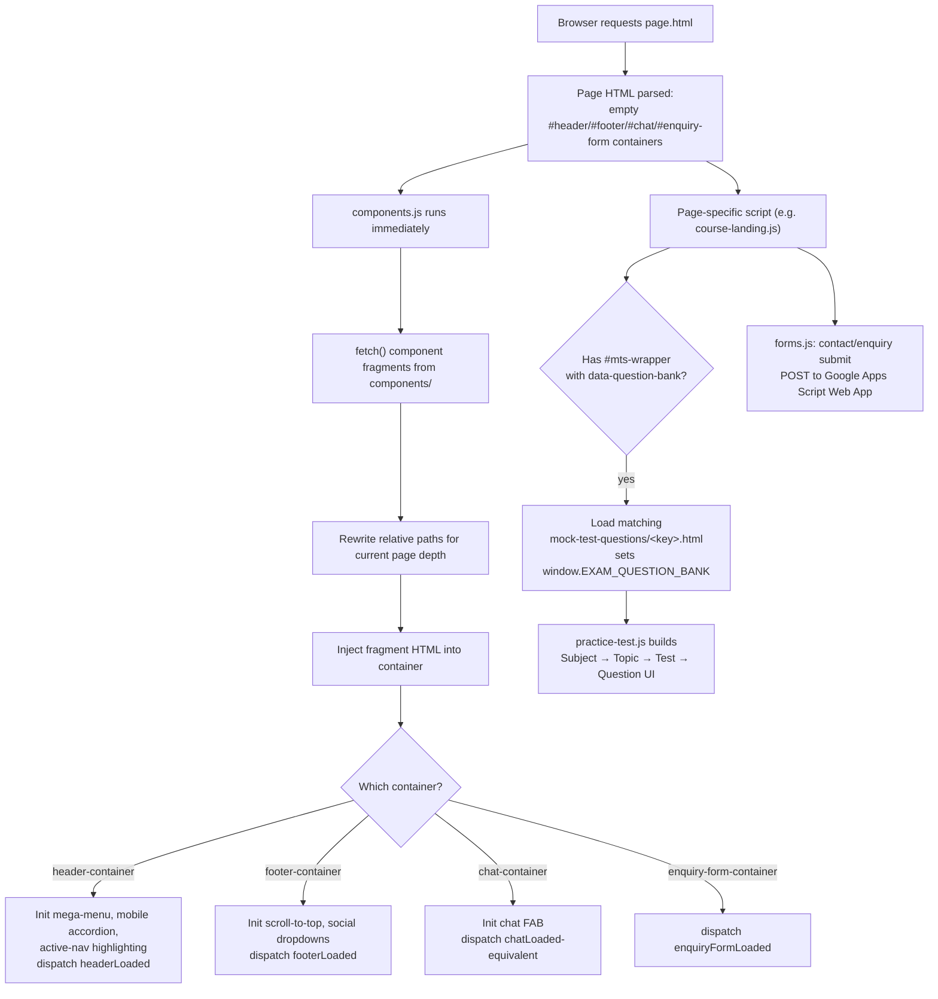

# Eduooz International Academy — Website

Official static website for **Eduooz International Academy**, a healthcare exam coaching academy based in Trivandrum, Kerala, India, preparing candidates for Nursing, Pharmacy, Medical Laboratory Technology (MLT), and German-language recruitment and licensure exams.

**Status:** 🟢 Active development (last commit: 2026-07-30)

[](https://developer.mozilla.org/en-US/docs/Web/HTML)
[](https://developer.mozilla.org/en-US/docs/Web/CSS)
[](https://developer.mozilla.org/en-US/docs/Web/JavaScript)
[](#tech-stack)
[](#license)

---

## Table of Contents

- [Overview](#overview)
- [Features](#features)
- [Screenshots](#screenshots)
- [Demo](#demo)
- [Tech Stack](#tech-stack)
- [Project Structure](#project-structure)
- [Installation](#installation)
- [Running the Project](#running-the-project)
- [Configuration](#configuration)
- [Usage](#usage)
- [Architecture](#architecture)
- [Important Files](#important-files)
- [Development Guide](#development-guide)
- [Deployment](#deployment)
- [SEO](#seo)
- [Performance](#performance)
- [Browser Support](#browser-support)
- [Troubleshooting](#troubleshooting)
- [Documentation](#documentation)
- [Contributing](#contributing)
- [FAQ](#faq)
- [License](#license)
- [Author](#author)

---

## Overview

**What it does:** This repository is the full public marketing and course-catalogue website for Eduooz International Academy. It presents the academy's course offerings (Nursing, Pharmacy, MLT, German language), faculty, placements, testimonials, publications, and blog content, and gives prospective students an in-browser free practice-test engine covering thousands of exam questions across subjects and topics.

**Who it's for:** Prospective students researching healthcare/lab-tech recruitment and licensing exams (Kerala PSC, Indian central government bodies such as AIIMS/RRB/DSSSB/ESIC/JIPMER, and GCC nursing/pharmacy licensing bodies such as DHA/HAAD/Prometric/Pearson VUE), as well as the academy's own marketing/content team maintaining the site.

**Why it exists:** It is the academy's primary online presence — lead generation (enquiry forms), course discovery, exam-specific landing pages with syllabi and previous question papers, and a free mock-test tool that demonstrates the academy's teaching content.

**Major functionality:**
- Course catalogue across 4 categories (Nursing, Pharmacy, MLT, German) and 58 individual exam landing pages
- A reusable in-browser practice-test engine (subject → topic → test → question hierarchy)
- Downloadable syllabus and previous-question-paper PDFs per exam
- Lead-capture and contact forms wired to a Google Apps Script backend
- A site-wide chat FAB widget and mega-menu navigation shared across all pages via a lightweight component loader
- SEO/AI-discovery metadata (`sitemap.xml`, `robots.txt`, `humans.txt`, `llms.txt`)

---

## Features

- Responsive design across desktop, tablet, and mobile (accordion-based mobile navigation)
- Dynamic mega-menu navigation with per-category (Nursing/Pharmacy/MLT/German) course panels
- Shared header/footer/chat/enquiry-form components loaded at runtime via `fetch()` — no per-page duplication
- 58 individual course/exam landing pages across Central government, Kerala PSC, and GCC licensing categories
- In-browser **free practice test** engine (`practice-test.js`) with shuffled question order per topic
- Inline YouTube video player embedded directly in page media boxes (no popup/redirect)
- Downloadable **syllabus** and **previous question paper** PDFs with in-page preview, per exam
- Lead-enquiry popup form and contact form, both posting to a shared Google Apps Script Web App
- FAQ accordion sections (`faq-enquiry.js`)
- Google Reviews widget filtered per page type (nursing/pharmacy/german/lab-tech)
- Publications gallery with lightbox (`publications.js`)
- Testimonials, placements, gallery, and faculty profile pages
- Scroll-to-top button, social-media dropdown panels (LinkedIn/Facebook/YouTube/Instagram, each with per-vertical sub-pages)
- GSAP/ScrollTrigger scroll animations, Three.js background effects, Lenis smooth scrolling
- SEO metadata on every page: canonical tags, Open Graph, Twitter Card, and JSON-LD structured data
- Custom `404.html` error page (`noindex, follow`)
- AI-crawler discovery file (`llms.txt`) alongside standard `sitemap.xml` / `robots.txt`

---

## Screenshots

> No screenshots currently exist in this repository. Add captured images to `docs/screenshots/` and reference them below.

| Page | Path |
|---|---|
| Homepage | `docs/screenshots/homepage.png` |
| Mobile homepage | `docs/screenshots/mobile-home.png` |
| Course landing page | `docs/screenshots/course-page.png` |

---

## Demo

**Intended live site:** https://www.eduooz.com/

**Current status:** A `CNAME` file at the repository root maps this repo to `eduooz.com`, indicating it is intended to be served via **GitHub Pages**. As of the last recorded SEO audit (2026-07-09), the live domain was still serving an older WordPress-based site (Elementor + Yoast SEO, hosted on Hostinger) rather than this repository — this codebase was a not-yet-deployed redesign at that time. Verify current deployment status directly against `https://www.eduooz.com/` before assuming this repo is what's live.

---

## Tech Stack

| Technology | Purpose |
|---|---|
| HTML5 | Page structure (66+ static `.html` pages, no templating engine) |
| CSS3 | Styling — one stylesheet per page/section under `assets/css/` |
| JavaScript (vanilla, ES5/ES6, no framework) | Interactivity, component loading, practice-test engine |
| [GSAP](https://gsap.com/) + ScrollTrigger | Scroll and UI animation (loaded via cdnjs) |
| [Three.js](https://threejs.org/) | Hero background/visual effects (loaded via unpkg) |
| [Lenis](https://lenis.darkroom.engineering/) | Smooth scrolling (loaded via unpkg) |
| [Chart.js](https://www.chartjs.org/) | Score/analytics charts on course pages (loaded via jsDelivr) |
| [Font Awesome 6](https://fontawesome.com/) | Icon set (loaded via cdnjs) |
| Google Fonts | Plus Jakarta Sans, Cormorant Garamond |
| Google Apps Script | Serverless backend receiving contact/enquiry form submissions |
| GitHub Pages | Static hosting target (implied by `CNAME`) |

All third-party libraries are loaded via CDN `<script>`/`<link>` tags directly in each HTML page. There is **no build tool, bundler, package manager, or `package.json`** in this repository — it is a pure static site.

---

## Project Structure

```
Eduooz-website/
├── assets/
│   ├── css/                       # One stylesheet per page/feature (18 files)
│   ├── js/                        # One script per page/feature (21 files)
│   ├── images/                    # Site images, logo, favicon, mentor photos, gallery
│   ├── Prev.Qn.papers/            # Downloadable previous-question-paper PDFs (nursing/…)
│   └── Syllabus/                  # Downloadable syllabus PDFs (nursing/…)
├── components/
│   ├── header.html                # Shared header + mega-menu (loaded via JS)
│   ├── footer.html                # Shared footer (loaded via JS)
│   ├── chat.html                  # Chat FAB widget fragment
│   ├── lead-enquiry-form.html     # Enquiry/lead-capture form fragment
│   └── mock-test-questions/       # Practice-test question-bank data files (5 exam types)
├── courses/
│   ├── nursing.html / pharmacy.html / mlt.html
│   ├── nursing/{central,kerala,gcc}/      # Individual nursing exam pages
│   ├── pharmacy/{central,kerala,gcc}/     # Individual pharmacy exam pages
│   ├── mlt/{central,kerala}/              # Individual MLT exam pages
│   ├── german/german-language.html
│   ├── lab-tech.html
│   └── Courses-list.txt                   # Internal planning notes (exam counts, how-tos)
├── about.html, blogs.html, contact.html, courses.html,
│   faculties.html, gallery.html, placements.html,
│   privacy-policy.html, terms-conditions.html, testimonials.html,
│   publications.html
├── index.html                     # Homepage
├── 404.html                       # Custom error page
├── sitemap.xml                    # Search-engine sitemap (73 indexable URLs)
├── robots.txt
├── humans.txt
├── llms.txt                       # AI-crawler discovery/summary file
├── CNAME                          # GitHub Pages custom-domain mapping (eduooz.com)
├── .env                           # Local reference copy of the Apps Script URL (gitignored)
└── README.md
```

**Important folders:**
- **`assets/js/`** — every page has its own script (e.g. `about.js`, `courses.js`); shared cross-page behavior (component loading, mega menu, inline video, chat FAB, scroll-to-top, social dropdowns) lives in `components.js`.
- **`components/`** — HTML fragments fetched at runtime and injected into `#header-container`, `#footer-container`, `#chat-container`, and `#enquiry-form-container` on every page.
- **`courses/`** — the exam catalogue, organized by category (`nursing`/`pharmacy`/`mlt`/`german`) and then by region/body (`central`/`kerala`/`gcc`).
- **`components/mock-test-questions/`** — the raw question-bank data consumed by the practice-test engine; excluded from `robots.txt` crawling.

---

## Installation

This is a static site with no dependencies to install.

```bash
git clone https://github.com/Eduooz-academy/Eduooz-website.git
cd Eduooz-website
```

There is no `npm install` step — there is no `package.json` in this repository.

## Running the Project

- **Quickest:** open `index.html` directly in a browser.
- **Recommended** (so relative paths and the `fetch()`-loaded components in `components/` resolve correctly under a real origin instead of `file://`): serve the folder with any static file server, for example:

  ```bash
  python -m http.server 8000
  ```

  then visit `http://localhost:8000/`.

- **VS Code:** open the folder and use the **Live Server** extension on `index.html` — this is the fastest way to get correct relative-path resolution with auto-reload.
- **Node / build command / dev server:** none exists in this project. There is no `package.json`, bundler config, or dev-server script to run.

---

## Configuration

There is no environment-variable-driven build (no bundler reads `.env`). Configuration in this repo consists of:

| File | Purpose |
|---|---|
| `.env` | Local reference copy of `GOOGLE_APPS_SCRIPT_WEB_APP_URL`, the endpoint that receives form submissions. **Gitignored** — not committed, not read by any script at runtime. |
| `assets/js/forms.js` / `assets/js/contact-bg.js` | Contain the **same Apps Script URL hardcoded** as `SCRIPT_URL`, since browser JavaScript in a static site cannot read a server-side `.env` file. To point forms at a different backend, update `SCRIPT_URL` directly in these files. |
| `.gitignore` | Excludes `.qoder/`, `.claude/`, `.vscode/`, `.agents/`, `skills-lock.json`, `.env` from version control. |
| `robots.txt` | Crawl rules — allows `/`, disallows `/components/mock-test-questions/`. |
| `sitemap.xml` | Canonical list of 73 indexable public URLs with `<lastmod>` dates. |
| `CNAME` | GitHub Pages custom-domain binding (`eduooz.com`). |
| `humans.txt` / `llms.txt` | Human- and AI-crawler-facing descriptions of the site (not machine config). |

No `manifest.json`/PWA manifest, no `favicon` generator config beyond the static `assets/images/favicon.ico`, and no other environment variables exist in this project.

---

## Usage

Each top-level page is self-contained HTML that pulls in its own CSS/JS and the shared components:

- Browse course categories from the homepage mega-menu or `courses.html`, drill into an individual exam page (e.g. `courses/nursing/central/aiims-norcet.html`) for its syllabus, previous question papers, and mock tests.
- On a course page with a practice-test section (`#mts-wrapper`), select subject → topic → test to attempt a 25-question quiz drawn from that exam's question bank in `components/mock-test-questions/`.
- Submit the enquiry popup or the `contact.html` form to send a lead to the academy's Google Apps Script-backed spreadsheet/workflow.
- Static PDF resources (syllabus, previous question papers) are served straight from `assets/Syllabus/` and `assets/Prev.Qn.papers/` and previewed in-page via the `.qp-card` click handler in `course-landing.js`.

---

## Architecture

**Overall workflow:** every page is a static HTML document. Near the top of `<body>`, empty container `<div>`s (`#header-container`, `#footer-container`, `#chat-container`, `#enquiry-form-container`) are placeholders. A single shared script, `assets/js/components.js`, runs immediately (it's placed after those containers, so no `DOMContentLoaded` wait is needed), `fetch()`es the matching fragment from `components/`, rewrites any relative `href`/`src` paths for the page's depth (so the same fragment works whether the page is at the root or three folders deep under `courses/`), and injects the HTML. Loading the header additionally wires up the mega-menu, mobile accordion navigation, and active-link highlighting; loading the footer wires up scroll-to-top and the social-platform dropdowns; loading the chat fragment wires up the chat FAB.

**Component architecture:** there is no component framework — "components" are plain HTML fragments plus imperative DOM code in `components.js` that initializes behavior once a fragment is injected, coordinated via custom events (`headerLoaded`, `footerLoaded`, `enquiryFormLoaded`) that other page scripts can listen for.

**Asset loading:** CSS/JS/fonts are loaded per page via `<link>`/`<script>` tags in each page's own `<head>`; third-party libraries (GSAP, Three.js, Lenis, Chart.js, Font Awesome, Google Fonts) come from public CDNs, not bundled locally.

**JavaScript flow (practice-test engine):** a course page sets `data-question-bank="<key>"` on `#mts-wrapper` and loads two scripts — the matching question-bank data file from `components/mock-test-questions/<key>.html` (which sets `window.EXAM_QUESTION_BANK`) and the shared `practice-test.js` engine, which reads that global, builds the Subject → Topic → Test → Question navigation (5 tests per topic, 25 questions per test), shuffles question order per topic, and renders the quiz UI — all without any change to `practice-test.js`, `course-landing.js`, or CSS.



---

## Important Files

| File | Purpose |
|---|---|
| `index.html` | Homepage — hero, achiever spotlight, course highlights |
| `assets/js/components.js` | Shared component loader; mega-menu, mobile nav, chat FAB, scroll-to-top, social dropdowns, inline YouTube player |
| `assets/js/practice-test.js` | Reusable free-practice-test engine driven by `window.EXAM_QUESTION_BANK` |
| `assets/js/course-landing.js` | Largest script (6,600+ lines); drives individual exam landing pages — video playlists, question-paper previews, Google Reviews filtering, etc. |
| `assets/js/forms.js` | Contact-form and lead-enquiry-form submission handling via `fetch()` to Google Apps Script |
| `components/header.html` / `footer.html` | Shared site chrome (nav, mega-menu, social links, footer columns) |
| `components/mock-test-questions/*.html` | Per-exam-category practice question banks (nursing, nursing-gcc, pharmacy, pharmacy-gcc, mlt) |
| `courses/Courses-list.txt` | Internal working notes — full exam list, page counts, and "how to add a new exam" / "how to add a PDF" instructions |
| `sitemap.xml` | 73-URL canonical sitemap for search engines |
| `robots.txt` | Crawl directives |
| `llms.txt` | Structured site summary for AI crawlers/assistants |
| `humans.txt` | Credits/technology disclosure file |
| `CNAME` | GitHub Pages custom-domain binding |
| `.env` | Local (gitignored) reference for the Apps Script endpoint URL |

---

## Development Guide

- **Add a page:** create a new `.html` file, copy the `<head>` boilerplate (meta/OG/Twitter/canonical/JSON-LD) from a similar existing page, include `#header-container`/`#footer-container`/`#chat-container`/`#enquiry-form-container` divs, and load `assets/js/components.js` plus a new page-specific stylesheet/script if needed.
- **Add a component:** add a new fragment under `components/`, register its path in the `components` map in `assets/js/components.js`, and add a matching container `<div>` + `loadComponent(...)` call.
- **Modify CSS:** each page has its own stylesheet under `assets/css/` (e.g. `about.css` for `about.html`); shared header/footer/nav styling lives in `header-footer.css`, and shared heading styles live in `global-heading-system.css`.
- **Modify JavaScript:** each page has its own script under `assets/js/`; cross-page shared behavior belongs in `components.js`, not duplicated per page.
- **Add images:** place under `assets/images/` (see existing subfolders — `Mentors/`, `courses/`, `gallary-images/`, `publications/`, etc.). On GitHub Pages, file paths are **case-sensitive** — match the on-disk case exactly.
- **Update navigation:** edit the mega-menu markup and `data-category` panels in `components/header.html`; the JS in `components.js` (`activateMegaMenuCategory`, `initMobileAccordion`) drives category switching without further changes.
- **Add an FAQ:** extend the FAQ accordion markup on the relevant page and wire it up via `assets/js/faq-enquiry.js`.
- **Add a form:** follow the pattern in `components/lead-enquiry-form.html` / `contact.html`, posting to the shared `SCRIPT_URL` in `assets/js/forms.js`.
- **Add a new exam/practice test:** per `courses/Courses-list.txt` — create `components/mock-test-questions/<key>.html` (copy an existing one, replace the question array), then on the course page add `data-question-bank="<key>"` to `#mts-wrapper` and include the same two `<script>` tags. No changes needed to `practice-test.js`, `course-landing.js`, or CSS.
- **Add a new Previous Question Paper PDF:** upload the PDF to `assets/Prev.Qn.papers/`, set `data-pdf`/`data-download` on the corresponding `.qp-card`, change its badge from "Coming Soon" to "Preview Available", and wrap the card title in a matching `<a href>` so crawlers can discover the PDF directly (see the pattern already used on nursing/pharmacy course pages).
- **Update sitemap:** add/remove/rename entries in `sitemap.xml` whenever public pages change, and only bump `<lastmod>` when a page's content meaningfully changes. Never add `components/` fragment files to it.

---

## Deployment

A `CNAME` file at the repository root (`eduooz.com`) indicates this repo is intended to be deployed via **GitHub Pages**. No deployment secrets, tokens, CI/CD workflow files, or DNS configuration are stored in this repository — deployment appears to be manual/external to this repo (no `.github/workflows/` directory exists).

**Known caveat:** as of the last recorded SEO audit (2026-07-09), `https://www.eduooz.com/` was still serving an older WordPress site rather than this repository. Confirm current live status before treating this repo as the deployed source of truth.

---

## SEO

- **Meta tags:** every page sets a unique `<title>` and `<meta name="description">`; several also set `<meta name="keywords">`.
- **Open Graph / Twitter Cards:** `og:title`, `og:description`, `og:type`, `og:image` (+ width/height/type/alt), `og:url`, `og:site_name`, and matching `twitter:card`/`twitter:title`/`twitter:description`/`twitter:image` tags are present on pages (e.g. `index.html`, `contact.html`, `404.html`).
- **Robots:** `robots.txt` allows crawling of `/` and disallows `/components/mock-test-questions/` (the raw practice-test data files); `404.html` sets `<meta name="robots" content="noindex, follow">`.
- **Sitemap:** `sitemap.xml` lists 73 canonical indexable URLs with `<lastmod>` dates, explicitly excluding component fragments, redirect stubs, and noindex pages.
- **Canonicals:** pages set `<link rel="canonical">` pointing at their own `https://eduooz.com/...` URL.
- **Structured data:** JSON-LD `Organization` and `WebSite` schema on the homepage (with `PostalAddress` and `ContactPoint`), and `LocalBusiness`-style data on `contact.html`.
- **AI discovery:** `llms.txt` gives a curated, human-readable summary of the site's purpose and page structure for AI assistants/crawlers, supplementary to `sitemap.xml`/`robots.txt`.

---

## Performance

- **Image optimization:** `assets/images/optimized/` and `assets/images/resized-images/` subfolders exist, indicating some images are pre-optimized/resized before being committed.
- **Lazy loading:** not verified globally in this audit — check individual `` tags for `loading="lazy"` before assuming it's applied site-wide.
- **CSS:** split per-page (no site-wide bundle), so each page only loads the stylesheet(s) it needs; a standalone `clean_css.js`-style maintenance approach was referenced in prior project notes but no such script exists in the current tree — verify before relying on it.
- **JavaScript:** split per-page similarly; heavier shared libraries (GSAP, Three.js, Chart.js) are loaded from CDNs with browser caching, not bundled/minified locally.
- **Caching:** relies on CDN caching for third-party libraries and Google Fonts; no service worker or custom cache-control configuration exists in this repository (no `manifest.json`, no service-worker script).

---

## Browser Support

Not formally declared in this repository (no `browserslist` config or documented support matrix exists). Based on the technologies used:

| Browser | Expected Support |
|---|---|
| Chrome / Edge (Chromium) | Full — primary target (uses modern `fetch`, `IntersectionObserver`-style scroll effects, CSS Grid) |
| Firefox | Full |
| Safari (macOS/iOS) | Full, assuming standard ES6+/CSS Grid support |
| Internet Explorer 11 | Not supported — the site relies on `fetch()`, arrow functions, template literals, and CSS Grid/custom properties throughout |

---

## Troubleshooting

| Problem | Cause | Solution |
|---|---|---|
| Header/footer/chat widget don't appear | Page opened directly via `file://` instead of a served origin, so `fetch()` for `components/*.html` is blocked by browser security policy | Serve the folder with a local static server (e.g. `python -m http.server 8000`) instead of double-clicking the HTML file |
| Broken relative links/images on a page under `courses/.../` | `components.js`'s path-rewriting logic depends on detecting its own `<script src>` correctly; a malformed or moved `<script src="…components.js">` tag breaks base-path detection | Ensure the `components.js` `<script>` tag's `src` still contains `assets/` in a consistent relative form matching the page's depth |
| Mentor photo or other image missing only on GitHub Pages (works locally) | GitHub Pages serves over a case-sensitive filesystem; Windows local checkouts are case-insensitive | Match the exact on-disk case for every image path (this previously broke `assets/images/Mentors/` referenced as lowercase `mentors/`) |
| Practice test section is empty | `window.EXAM_QUESTION_BANK` never got set — the question-bank `<script>` for that page's `data-question-bank` key is missing, in the wrong order, or the key has no matching file in `components/mock-test-questions/` | Confirm `#mts-wrapper[data-question-bank]` matches an existing file in `components/mock-test-questions/`, and that both required `<script>` tags are present in the right order |
| Contact/enquiry form submits but no data received | `SCRIPT_URL` in `assets/js/forms.js`/`contact-bg.js` points at a stale or inaccessible Google Apps Script deployment; the fetch uses `mode: "no-cors"` so failures are silent in the browser console | Verify the Apps Script Web App is still deployed and the URL in `forms.js` matches the current deployment |
| Site looks unstyled or broken on a subpage | A stylesheet `<link>` path is wrong relative to that page's folder depth (pages under `courses/nursing/central/` need an extra `../../../`) | Compare the `<link rel="stylesheet">` paths against a working sibling page at the same folder depth |

---

## Documentation

No dedicated `docs/` folder currently exists in this repository — all documentation lives in this README plus in-code comments (notably the detailed comment blocks in `assets/js/components.js`, `assets/js/practice-test.js`, and `assets/js/course-landing.js`) and the working notes in `courses/Courses-list.txt`.

**Recommended, not yet present:**

```
docs/
├── TECHNICAL_DOCUMENTATION.md
├── ARCHITECTURE.md
├── COMPONENTS.md
├── DEPLOYMENT.md
└── CONTRIBUTING.md
```

Until these exist, treat this README plus the source files listed under [Important Files](#important-files) as the canonical reference.

---

## Contributing

No `CONTRIBUTING.md` or documented branch/commit conventions currently exist in this repository. Based on the actual commit history and branches observed:

- **Branches:** development happens on personal branches (`alfiya`, `nihal-dev` observed alongside `main`); merge back to `main` when ready.
- **Commit messages:** existing history uses short, lower-case, present-tense/descriptive summaries (e.g. `publications page update`, `update pharmacy gcc test questions and lead pop-up form submission feature`) rather than a strict Conventional Commits format — follow that established style for consistency.
- **Pull requests:** not formally documented; open a PR against `main` and describe the pages/components affected.
- **Coding standards:** no linter/formatter config (no `.eslintrc`, `.prettierrc`, or `.editorconfig` present) — match the existing code style in the file you're editing (2-space indentation, `"use strict"` IIFE pattern in shared scripts, per-page CSS/JS naming that mirrors the HTML filename).

---

## FAQ

**Q: Is there a build step I need to run?**
No. This is a pure static HTML/CSS/JS site with no `package.json`, bundler, or compiler.

**Q: Why don't the header/footer/nav show up when I just open `index.html` from disk?**
The shared components are loaded via `fetch()`, which most browsers block on `file://` URLs. Serve the folder with a local static server instead (see [Running the Project](#running-the-project)).

**Q: Where do contact/enquiry form submissions go?**
To a Google Apps Script Web App endpoint (`SCRIPT_URL` in `assets/js/forms.js`), which presumably logs them to a Google Sheet or triggers a workflow — the receiving script itself is not part of this repository.

**Q: How do I add a new exam page with its own practice test?**
See [Development Guide](#development-guide) — copy an existing question-bank file under `components/mock-test-questions/`, set `data-question-bank` on the new page's `#mts-wrapper`, and reuse the existing `practice-test.js` engine unmodified.

**Q: Is `eduooz.com` currently running this code?**
Uncertain as of this README — see the caveat under [Demo](#demo) and [Deployment](#deployment).

**Q: Why is there a `.env` file if there's no build step?**
It's a local, gitignored reference copy of the Google Apps Script URL used by the form scripts; it is not read by any bundler or server process, since the same URL is hardcoded directly into the client-side JavaScript.

---

## License

No license file (e.g. `LICENSE`, `LICENSE.md`) was found in this repository. **No license has been specified.**

---

## Author

**Eduooz International Academy**
2nd floor, Terminal Plaza, Bypass road, Chakkai, Trivandrum, Kerala – 695024, India
Phone: +91 8111850054
Website: https://www.eduooz.com/

Repository: [github.com/Eduooz-academy/Eduooz-website](https://github.com/Eduooz-academy/Eduooz-website)
