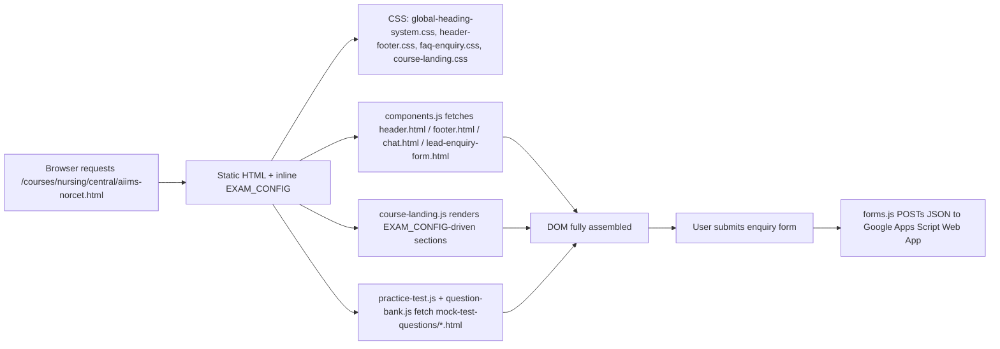
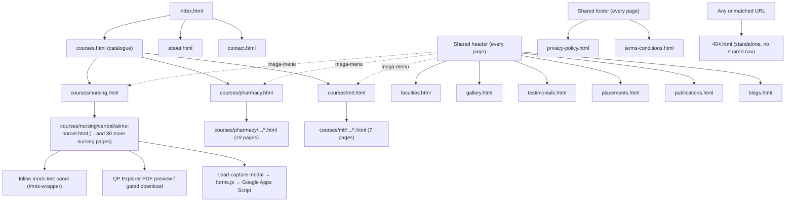
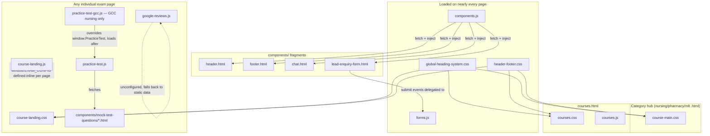
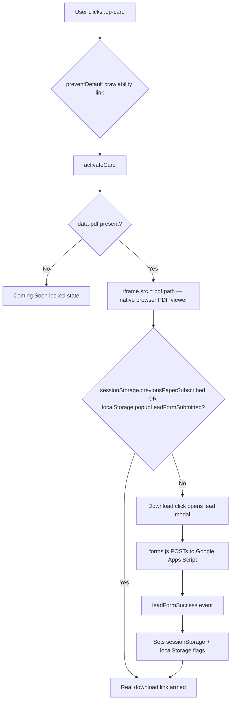
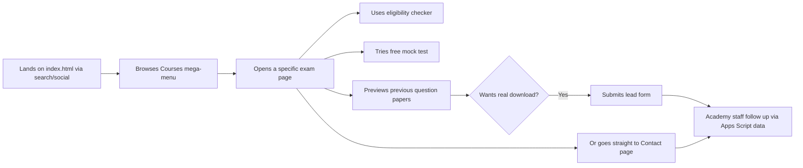

# Eduooz Website — Complete Developer Handover Documentation

**Audience:** a developer who has never seen this repository before and must be able to maintain, debug, extend, and deploy it without the original author.

**Repository root:** `d:/Eduooz/live/Eduooz-website` (Windows checkout; deploys to a case-sensitive filesystem — see [§21 Known Issues](#21-known-issues)).

**Companion document:** `README.md` at the repo root is a shorter, maintainer-facing quick-start. This document supersedes it in depth and corrects several places where the README has drifted from the current codebase (each correction is called out explicitly where it matters).

---

## Table of Contents

1. [Project Overview](#1-project-overview)
2. [Folder Structure](#2-folder-structure)
3. [File Documentation](#3-file-documentation)
4. [HTML Documentation](#4-html-documentation)
5. [CSS Documentation](#5-css-documentation)
6. [JavaScript Documentation](#6-javascript-documentation)
7. [Component Documentation](#7-component-documentation)
8. [Images and Assets](#8-images-and-assets)
9. [Responsive Design](#9-responsive-design)
10. [Navigation Flow](#10-navigation-flow)
11. [Forms](#11-forms)
12. [SEO Documentation](#12-seo-documentation)
13. [Performance](#13-performance)
14. [Accessibility](#14-accessibility)
15. [Third-Party Libraries](#15-third-party-libraries)
16. [Configuration Files](#16-configuration-files)
17. [Deployment Guide](#17-deployment-guide)
18. [Git Workflow](#18-git-workflow)
19. [Database](#19-database)
20. [API Documentation](#20-api-documentation)
21. [Known Issues](#21-known-issues)
22. [Future Improvements](#22-future-improvements)
23. [Modification Guide](#23-modification-guide)
24. [Troubleshooting Guide](#24-troubleshooting-guide)
25. [Code Standards](#25-code-standards)
26. [Dependency Map](#26-dependency-map)
27. [Project Workflow Diagrams](#27-project-workflow-diagrams)
28. [Quick Reference](#28-quick-reference)
29. [Change Log Template](#29-change-log-template)
30. [Appendix](#30-appendix)

---

## 1. Project Overview

### Project Name
Eduooz Website — the public marketing and course-catalogue site for **Eduooz International Academy**.

### Purpose
Eduooz International Academy is a healthcare exam coaching academy based in Trivandrum, Kerala, India. The site markets and documents exam-coaching programs for three fields — **Nursing**, **Pharmacy**, and **Medical Laboratory Technology (MLT)** — across three recruitment tracks per field (Central government exams, Kerala PSC/state exams, and GCC/Gulf licensing exams), plus a placeholder German-language track. It also hosts an in-browser **mock-test/practice-question engine**, a **publications catalogue**, a **placements/alumni showcase**, and the standard set of informational pages (About, Faculty, Gallery, Testimonials, Blogs, Contact, legal pages).

### Target Users
- **Prospective students** (and their parents) researching a specific competitive exam (e.g. AIIMS NORCET, Kerala PSC DHS Nursing, DHA Prometric) and deciding whether to enrol.
- **Enrolled/prospective students** using the free practice-test engine to self-assess.
- **Search engines and AI crawlers** — the site carries an unusually complete SEO/structured-data and `llms.txt` setup (see [§12](#12-seo-documentation)).
- **Academy staff** — indirectly, as recipients of lead-form submissions (see [§20](#20-api-documentation)).

### Main Features
- Marketing homepage with animated hero, stats, video "masterclasses", testimonials, and FAQ.
- ~62 individual exam-detail pages (one per recruitment exam) sharing one rich template: eligibility checker, syllabus, previous-question-paper PDF viewer, mock-test CTA, FAQ.
- A reusable, framework-free **mock-test/quiz engine** reading question banks from static HTML data files.
- Publications catalogue with a cover-image lightbox and WhatsApp-based ordering.
- Photo gallery, testimonials archive, faculty directory, placements/alumni wall.
- Lead-capture forms (site-wide enquiry form + a dedicated Contact form) that POST to a Google Apps Script web app.
- Legal pages (Privacy Policy, Terms & Conditions) and a custom 404 page.

### Technologies Used
Static **HTML5 / CSS3 / vanilla JavaScript** — no framework (no React/Vue/Angular), no bundler, no package manager, no build step. Third-party libraries are all loaded via `<script>`/`<link>` tags straight from CDNs:

| Library | Version (pinned) | Purpose |
|---|---|---|
| GSAP + ScrollTrigger | 3.12.5 (cdnjs) | Scroll-linked reveal/parallax animation across almost every page |
| Three.js | r160 / 0.160.0 (unpkg) | Decorative WebGL particle/gyroscope backgrounds (hero sections, contact page) |
| Lenis | 1.0.42 (`@studio-freight/lenis`, unpkg) | Inertia-based smooth scrolling |
| Chart.js | 4.4.3 (jsDelivr) | Donut/bar charts on the mock-test results screen and course pages |
| Font Awesome | 6.5.1 (cdnjs) | Icon set, used throughout |
| Google Fonts | — | Plus Jakarta Sans (body/UI), Cormorant Garamond (serif accents) |

See [§15](#15-third-party-libraries) for the full list including two **unconfigured** integrations (YouTube Data API, Google Places API).

### Project Architecture
A flat, page-per-file static site. Every HTML page independently `<link>`s the CSS it needs and `<script>`s the JS it needs — there is no shared bundle. Common UI (header, footer, chat widget, lead-enquiry form) is **not** duplicated into every HTML file; instead each page has four empty container `<div>`s (`#header-container`, `#footer-container`, `#chat-container`, `#enquiry-form-container`) that `assets/js/components.js` fills at runtime via `fetch()` calls to `components/*.html` fragments. This is the single most important architectural fact to understand before touching anything — see [§7](#7-component-documentation).

### Overall Workflow
1. Browser requests an `.html` page directly (GitHub Pages serves static files with no server logic).
2. The page's own `<head>` pulls in shared/page CSS and CDN libraries.
3. Near the end of `<body>`, `components.js` runs immediately (no `DOMContentLoaded` wait) and fetches the four shared fragments into their containers.
4. Page-specific JS (e.g. `index.js`, `course-landing.js`) runs, mostly on `DOMContentLoaded`, wiring up animations, carousels, and interactive widgets.
5. If the page hosts the mock-test engine, `practice-test.js` + `question-bank.js` (bundled in the same file) fetch a question-bank HTML fragment from `components/mock-test-questions/`, parse an embedded pseudo-JSON blob out of it, and render the quiz.
6. Any form submit is intercepted by `assets/js/forms.js` and POSTed (fire-and-forget, `mode: "no-cors"`) to a hardcoded Google Apps Script URL.



---

## 2. Folder Structure

```
Eduooz-website/
├── .env                          # local reference only — NOT read at runtime (see §16)
├── .gitignore
├── 404.html                      # custom error page (fully static, no shared components)
├── CNAME                         # GitHub Pages custom-domain file → eduooz.com
├── README.md                     # short maintainer quick-start (see note above)
├── about.html
├── blogs.html
├── contact.html
├── courses.html                  # master course catalogue / hub of hubs
├── faculties.html
├── gallery.html
├── humans.txt
├── index.html                    # homepage
├── llms.txt                      # AI-crawler summary (not a sitemap)
├── placements.html
├── privacy-policy.html
├── publications.html
├── robots.txt
├── sitemap.xml
├── terms-conditions.html
├── testimonials.html
├── assets/
│   ├── css/                      # 18 stylesheets, see §5
│   ├── js/                       # 20 scripts, see §6
│   ├── images/                   # all raster/vector site imagery, see §8
│   ├── Prev.Qn.papers/           # downloadable previous-question-paper PDFs (60 files)
│   └── Syllabus/                 # downloadable syllabus PDFs (33 files)
├── components/
│   ├── header.html                # shared nav bar fragment
│   ├── footer.html                # shared footer fragment
│   ├── chat.html                  # shared floating WhatsApp/Call chat widget fragment
│   ├── lead-enquiry-form.html     # shared lead-capture form fragment
│   └── mock-test-questions/       # 5 question-bank data files, see §6 and §19
│       ├── nursing-questions.html
│       ├── nursing-gcc-questions.html
│       ├── pharmacy-questions.html
│       ├── pharmacy-gcc-questions.html
│       └── mlt-questions.html
├── courses/
│   ├── Courses-list.txt           # plain-text planning reference (matches live pages — see §3)
│   ├── lab-tech.html              # legacy/alternate MLT landing page (verify before deleting — see §21)
│   ├── nursing.html               # category hub
│   ├── pharmacy.html              # category hub
│   ├── mlt.html                   # category hub
│   ├── german/
│   │   └── german-language.html   # sole German course page (all "German" cards on courses.html link to contact.html instead of here — see §21)
│   ├── nursing/
│   │   ├── central/  (13 exam pages)
│   │   ├── kerala/   (11 exam pages)
│   │   └── gcc/      (7 exam pages)
│   ├── pharmacy/
│   │   ├── central/  (5 exam pages)
│   │   ├── kerala/   (7 exam pages)
│   │   └── gcc/      (7 exam pages)
│   └── mlt/
│       ├── central/  (2 exam pages)
│       └── kerala/   (5 exam pages)
└── docs/
    └── DEVELOPER_HANDOVER.md      # this file
```

### Folder-by-folder notes

**`assets/css/`**
- Purpose: every stylesheet on the site.
- What belongs here: `.css` files only, one per page or one shared/global file.
- Never place here: page-specific `<style>` blocks that only apply to one element (keep those out entirely — don't add more inline `<style>` blocks either; `index.html` currently has one small inline override that should have lived in `index.css`).
- Dependencies: none (plain CSS, no preprocessor).

**`assets/js/`**
- Purpose: every script on the site.
- What belongs here: `.js` files only. No JSON, no data files (question banks intentionally live under `components/mock-test-questions/` instead, not here).
- Never place here: build tool configuration — there is no build tool.

**`assets/images/`**
- Purpose: every raster/vector image, favicon, and logo used across the site.
- See [§8](#8-images-and-assets) for subfolder-by-subfolder detail and the case-sensitivity trap.

**`assets/Prev.Qn.papers/` and `assets/Syllabus/`**
- Purpose: downloadable PDFs linked from individual exam pages via `data-pdf`/`data-download` attributes on `.qp-card` elements (question papers) and `.btn-download-syllabus` links (syllabus).
- Subfoldered by category: `mlt/`, `nursing/`, `pharmacy/`.
- Never place here: images or non-PDF documents. Naming is inconsistent (see [§21](#21-known-issues)) — new files should follow the syllabus folder's cleaner `Exam-Name-Syllabus.pdf` convention rather than the previous-papers folder's mixed convention.

**`components/`**
- Purpose: HTML **fragments** — never standalone pages. Every file here is fetched and injected into a container `<div>` by `assets/js/components.js` (the four top-level files) or `practice-test.js`'s bundled loader (the `mock-test-questions/` files).
- What belongs here: fragment HTML only. No page needs its own `<head>`/`<title>`/meta tags in these files (and they don't have them) since they're never navigated to directly.
- Never place here: real standalone pages. `robots.txt` explicitly disallows crawling `/components/mock-test-questions/`, and the whole folder is intentionally excluded from `sitemap.xml`.
- **README discrepancy:** `README.md` describes a `components/question-banks/` folder that does not exist on disk. The only question-data folder is `components/mock-test-questions/`.

**`courses/`**
- Purpose: the course catalogue — 3 category-hub pages (`nursing.html`, `pharmacy.html`, `mlt.html`) plus subfolders per region (`central/`, `kerala/`, `gcc/`) holding one HTML file per exam.
- What belongs here: exam-detail pages following the shared template (see [§4](#4-html-documentation) → "Individual exam page template") and the 3 hub pages.
- Never place here: shared assets — exam pages reference `../../../assets/...` (three levels up) since they're nested three directories deep.
- `Courses-list.txt` is a plain-text outline (subject → region → exam name) that matches the current file inventory closely — useful as a fast lookup table but not itself referenced by any code.

**`docs/`**
- Purpose: this handover document. New process/reference documentation should go here rather than in the repo root, to keep the root's file list matching `README.md`'s own listing.

---

## 3. File Documentation

Documenting every one of the 84 HTML files individually would mean repeating the same template ~62 times (the exam pages are generated from one template — see [§4](#4-html-documentation)). Instead, this section documents every **unique** file (all CSS, all JS, all components, all config) in full, and gives the exam-page template plus a complete inventory table once.

### 3.1 JavaScript files — summary table

Full narrative documentation of each file is in [§6](#6-javascript-documentation). Quick-reference summary:

| File | Lines | Loaded by | Purpose |
|---|---|---|---|
| `components.js` | 853 | Every page except `404.html` | Fetches & injects header/footer/chat/enquiry-form fragments; owns nav, mega-menu, mobile accordion, chat FAB, scroll-to-top, social dropdowns, and the site-wide inline YouTube player (`window.EduoozInlinePlayer`) |
| `forms.js` | 109 | Every page except `404.html` | All form submission logic (contact form + every `.lead-form`) → Google Apps Script |
| `faq-enquiry.js` | 37 | ~73 pages (most course pages + marketing pages) | FAQ accordion UI only — **not** enquiry-form logic despite the name |
| `parallax.js` | 101 | Utility library (`window.EduoozParallax`) | Generic scroll-linked image parallax helper |
| `practice-test.js` | 905 (incl. bundled `question-bank.js` loader) | Course pages with a mock-test panel | Category → Topic → Test → Question quiz engine; fetches question banks |
| `practice-test-gcc.js` | 533 | 7 nursing-GCC pages only | Flat Test → Question quiz engine variant; overrides `window.PracticeTest` after `practice-test.js` loads |
| `course-landing.js` | 6,625 | All ~62 individual exam pages | The largest file on the site — renders every `EXAM_CONFIG`-driven section, the Previous-Question-Paper "QP Explorer", eligibility checker, syllabus tabs, faculty carousel, etc. |
| `google-reviews.js` | 791 | Pages with a `#greview-track` element | Google Places review carousel — **ships unconfigured** (empty `apiKey`/`placeId`), always falls back to hardcoded static reviews |
| `index.js` | 3,429 | `index.html` | Homepage-specific animation/carousel/counter logic |
| `about.js` | 1,868 | `about.html` | About-page timeline, confetti, faculty carousel, horizon-scroll panels |
| `courses.js` | 2,056 | `courses.html` | Catalogue filter tabs, video testimonial playlist, faculty/placements carousels |
| `contact-bg.js` | 192 | `contact.html` | Three.js particle background **plus** duplicated Lenis/magnetic-button/navbar/scroll-top boilerplate (contact.html loads no other general-purpose script) |
| `blogs.js` | 275 | `blogs.html` | Blog archive filter tabs, fake "Load More" (no real pagination) |
| `faculties.js` | 110 | `faculties.html` | Scroll reveal + mobile tap-to-expand faculty cards |
| `gallery.js` | 400 | `gallery.html` | "Show More" batch reveal, magnetic cursor, lightbox with keyboard/swipe nav |
| `placements.js` | 175 | `placements.html` | Reveal animations + animated stat counters |
| `publications.js` | 483 | `publications.html` | Read-more truncation (word-safe, measured), category filter, zoomable/pannable lightbox |
| `testimonials.js` | 348 | `testimonials.html` | Draggable dual-direction marquee, YouTube-shorts masonry grid with pagination |
| `privacy-policy.js` | 143 | `privacy-policy.html` | Sticky TOC + scroll-spy (byte-identical to `terms-conditions.js`) |
| `terms-conditions.js` | 143 | `terms-conditions.html` | Sticky TOC + scroll-spy (byte-identical to `privacy-policy.js`) |

### 3.2 CSS files — summary table

Full narrative documentation is in [§5](#5-css-documentation).

| File | Lines | Scope |
|---|---|---|
| `global-heading-system.css` | 578 | **Canonical shared token/typography layer** — load before all other CSS |
| `header-footer.css` | 2,968 | Shared header, footer, chat widget — nearly every page |
| `faq-enquiry.css` | 510 | Shared FAQ accordion + shared lead-enquiry-form styling |
| `legal-shared.css` | 475 | Shared by `privacy-policy.html` + `terms-conditions.html` only |
| `404.css` | 194 | `404.html` only — deliberately isolated, off-brand palette |
| `inline-video-player.css` | 69 | Shared inline YouTube player injected by `components.js` |
| `index.css` | 4,971 | `index.html` |
| `about.css` | 3,392 | `about.html` |
| `courses.css` | 1,449 | `courses.html` (root catalogue) |
| `course-main.css` | 1,155 | `courses/nursing.html`, `courses/pharmacy.html`, `courses/mlt.html` (category hubs) |
| `course-landing.css` | 16,335 | All ~62 individual exam pages — **largest file in the repo** |
| `blogs.css` | 1,246 | `blogs.html` |
| `contact.css` | 502 | `contact.html` |
| `faculties.css` | 545 | `faculties.html` |
| `gallery.css` | 412 | `gallery.html` |
| `placements.css` | 370 | `placements.html` |
| `publications.css` | 618 | `publications.html` |
| `testimonials.css` | 338 | `testimonials.html` |

### 3.3 Individual exam page — the shared template

Every file under `courses/{nursing,pharmacy,mlt}/{central,kerala,gcc}/*.html` (62 files) is built from the same template. Rather than documenting each one, here is the template contract every exam page follows — **this is what you copy when adding a new exam page** (see [§23](#23-modification-guide)):

**Head boilerplate (identical across all exam pages):**
- Standard meta/OG/Twitter/canonical block, unique per exam.
- Two `<script type="application/ld+json">` blocks: `@type: Course` and `@type: BreadcrumbList` (4 levels: Home → Specializations → category hub → this exam).
- CDN libraries: Google Fonts, Font Awesome 6.5.1, GSAP 3.12.5 + ScrollTrigger, Chart.js 4.4.3 (`defer`).
- CSS: `global-heading-system.css`, `header-footer.css`, `faq-enquiry.css`, `course-landing.css` (relative paths, `../../../assets/css/...`).
- JS: `faq-enquiry.js`, `course-landing.js`, `google-reviews.js`, `practice-test.js` (all `defer`), then `forms.js` (not deferred). GCC nursing pages additionally load `practice-test-gcc.js` **after** `practice-test.js` to override the quiz engine.
- An inline `<script>` block defining **`window.EXAM_CONFIG`**, **`window.courseEligibility`**, and **`window.eligibilityCheckerConfig`** — this is the per-page data contract that `course-landing.js` renders from. This is the single block you edit to create a new exam page's content (see [§23](#23-modification-guide)).

**Body sections (in order):**
1. `#header-container` / `#footer-container` / `#chat-container` (empty, filled by `components.js`) — note `#enquiry-form-container` is *not* a separate container on exam pages the way it is on marketing pages; the lead form appears inline within gated flows (syllabus/QP-download lead modals) instead.
2. Decorative `.color-mesh` blob background.
3. `.course-hero-section` — breadcrumbs, title, CTA buttons, and the "Vital Feature Card" (`#vital-card`) stat/feature carousel.
4. `#exam-sticky-nav` — jump links to the sections below (Overview / Eligibility / Syllabus / Papers / Materials / FAQ).
5. `#exam-snapshot` — a grid of key-fact cards (conducting body, post name, qualification, etc.) — static HTML, not `EXAM_CONFIG`-driven.
6. `#about-exam` — video carousel + stat badges.
7. `#eligibility` (inside `.elig-scroll-scene`, a scroll-jacked two-column panel) — qualification cards + age-relaxation cards, rendered from `window.courseEligibility`.
8. `#elig-checker` — the interactive eligibility form, built entirely by `course-landing.js` from `window.eligibilityCheckerConfig`.
9. `#syllabus` — tabbed syllabus content (static HTML per subject tab in the sample page read; some pages instead render from `CONFIG.syllabus` — both code paths exist in `course-landing.js`, see [§6](#6-javascript-documentation)).
10. `#preparation` — "How to Prepare" accordion timeline.
11. `#papers` — the Previous Question Papers **QP Explorer** (`.qp-card-grid` of `.qp-card` elements with `data-pdf`/`data-title`/`data-year`/`data-download`, plus a live in-page PDF `<iframe>` preview panel) — see [§6](#6-javascript-documentation) for the full click/preview/download-gate mechanism.
12. `#materials` / mock-test CTA and, on pages that embed the quiz inline, the `#mts-wrapper` mock-test panel (`data-question-bank="<key>"` attribute selects which file under `components/mock-test-questions/` to load).
13. `#faq` — FAQ accordion.
14. Footer.

### 3.4 Complete course-page inventory

| Category | Region | Filename | Exam / Recruiter |
|---|---|---|---|
| Nursing | Central | `aiims-norcet.html` | AIIMS NORCET |
| Nursing | Central | `dsssb-nursing-officer.html` | DSSSB Nursing Officer |
| Nursing | Central | `esic-nursing-officer.html` | ESIC Nursing Officer |
| Nursing | Central | `jipmer-nursing-officer.html` | JIPMER Nursing Officer |
| Nursing | Central | `military-nursing-service-mns.html` | Military Nursing Service (MNS) |
| Nursing | Central | `nvs-school-nurse.html` | NVS School Nurse |
| Nursing | Central | `pgimer-nursing.html` | PGIMER Nursing |
| Nursing | Central | `rcc-nursing.html` | RCC Nursing |
| Nursing | Central | `rml-nursing.html` | RML Nursing |
| Nursing | Central | `rrb-nursing-superintendent.html` | RRB Nursing Superintendent |
| Nursing | Central | `sgpgims-nursing.html` | SGPGIMS Nursing |
| Nursing | Central | `sree-chitra-nursing.html` | Sree Chitra Nursing |
| Nursing | Central | `ssc-staff-nurse.html` | SSC Staff Nurse |
| Nursing | Kerala | `apn.html` | APN |
| Nursing | Kerala | `dhs-nursing.html` | DHS Nursing |
| Nursing | Kerala | `dme-nursing.html` | DME Nursing |
| Nursing | Kerala | `homeo-nursing.html` | Homeo Nursing |
| Nursing | Kerala | `ims-staff-nurse.html` | IMS Staff Nurse |
| Nursing | Kerala | `jphn-dhs.html` | JPHN DHS |
| Nursing | Kerala | `jphn-dme.html` | JPHN DME |
| Nursing | Kerala | `lsgd-nursing.html` | LSGD Nursing |
| Nursing | Kerala | `msc-nursing-entrance.html` | MSc Nursing Entrance |
| Nursing | Kerala | `nursing-tutor.html` | Nursing Tutor |
| Nursing | Kerala | `treatment-organiser.html` | Treatment Organiser |
| Nursing | GCC | `dha-nursing-prometric.html` | DHA (Dubai) Prometric |
| Nursing | GCC | `haad-nursing-pearson-vue.html` | HAAD (Abu Dhabi) Pearson VUE |
| Nursing | GCC | `kuwait-nursing-prometric.html` | Kuwait Prometric |
| Nursing | GCC | `oman-nursing-pearson-vue.html` | Oman (OMSB) Pearson VUE |
| Nursing | GCC | `qatar-nursing-prometric.html` | Qatar Prometric |
| Nursing | GCC | `saudi-nursing-prometric.html` | Saudi Prometric |
| Nursing | GCC | `sharjah-nursing-prometric.html` | Sharjah Prometric |
| Pharmacy | Central | `aiims-cre-pharmacist.html` | AIIMS CRE Pharmacist |
| Pharmacy | Central | `gpat.html` | GPAT |
| Pharmacy | Central | `rrb-pharmacist.html` | RRB Pharmacist |
| Pharmacy | Central | `upsc-drug-inspector.html` | UPSC Drug Inspector |
| Pharmacy | Central | `vssc-pharmacist.html` | VSSC Pharmacist |
| Pharmacy | Kerala | `app-pharmacist.html` | APP Pharmacist |
| Pharmacy | Kerala | `dhs-dme-pharmacist.html` | DHS/DME Pharmacist |
| Pharmacy | Kerala | `drug-analyst.html` | Drug Analyst |
| Pharmacy | Kerala | `drug-inspector.html` | Drug Inspector (Kerala PSC) |
| Pharmacy | Kerala | `guruvayoor-devaswom-pharmacist.html` | Guruvayoor Devaswom Pharmacist |
| Pharmacy | Kerala | `lsgd-pharmacist.html` | LSGD Pharmacist |
| Pharmacy | Kerala | `oil-palm-pharmacist.html` | Oil Palm Pharmacist |
| Pharmacy | GCC | `bahrain-pharmacy-prometric.html` | Bahrain Prometric |
| Pharmacy | GCC | `dha-pharmacy-prometric.html` | DHA Prometric |
| Pharmacy | GCC | `haad-pharmacy-pearson-vue.html` | HAAD Pearson VUE |
| Pharmacy | GCC | `moh-pharmacy-prometric.html` | MOH Prometric |
| Pharmacy | GCC | `oman-pharmacy-pearson-vue.html` | Oman Pearson VUE |
| Pharmacy | GCC | `qatar-pharmacy-prometric.html` | Qatar Prometric |
| Pharmacy | GCC | `saudi-pharmacy-pearson-vue.html` | Saudi Pearson VUE |
| MLT | Central | `cre-lab-technician.html` | CRE Lab Technician |
| MLT | Central | `rrb-lab-technician.html` | RRB Lab Technician |
| MLT | Kerala | `dhs-lab-technician.html` | DHS Lab Technician |
| MLT | Kerala | `ims-ayurveda-lab-technician.html` | IMS Ayurveda Lab Technician |
| MLT | Kerala | `ims-homeo-lab-technician.html` | IMS Homeo Lab Technician |
| MLT | Kerala | `ims-oilpalm-lab-technician.html` | IMS Oil Palm Lab Technician |
| MLT | Kerala | `jla-lab-technician.html` | JLA Lab Technician |
| German | — | `german-language.html` | German Language (sole page; not linked from `courses.html`'s German cards — see §21) |

> **Corrects a stale README claim:** `README.md`'s "Maintenance Notes" describe `ims-ayurveda-lab-technician.html` and `ims-homeo-lab-technician.html` as `noindex` redirect stubs pointing to a page called `ims-homeo-ayurveda-lab-technician.html`. **That target file does not exist**, and both "stub" files are in fact full, real, ~3,390-line content pages with no `noindex` meta and no redirect of any kind — confirmed by direct inspection and by their presence (along with `ims-oilpalm-lab-technician.html`) in `sitemap.xml` as normal indexable URLs. All three IMS MLT pages are live, distinct content today. Treat this README section as historical/outdated; do not go looking for a redirect-stub pattern anywhere in the current codebase.

---

## 4. HTML Documentation

### 4.1 Root marketing/informational pages

| Page | URL | Purpose | Key Forms | Key CSS | Key JS |
|---|---|---|---|---|---|
| `index.html` | `/` | Homepage | Shared enquiry form | `global-heading-system`, `faq-enquiry`, `index`, `header-footer` | `components`, `forms`, `faq-enquiry`, `parallax`, `index` |
| `about.html` | `/about.html` | Brand story, mission/methodology | Shared enquiry form | `global-heading-system`, `faq-enquiry`, `header-footer`, `about` | `components`, `forms`, `parallax`, `about`, `faq-enquiry` |
| `blogs.html` | `/blogs.html` | Blog listing (all articles are disabled placeholders) | Shared enquiry form + non-functional search box | `global-heading-system`, `header-footer`, `blogs`, `faq-enquiry` | `components`, `forms`, `blogs`, `faq-enquiry` |
| `contact.html` | `/contact.html` | Contact info, dedicated form, map | Page-specific `#contactForm` | `global-heading-system`, `contact`, `header-footer` (no `faq-enquiry.css`) | `components`, `forms`, `contact-bg` (no `faq-enquiry.js`) |
| `courses.html` | `/courses.html` | Master filterable course catalogue | Shared enquiry form | `global-heading-system`, `index`, `header-footer`, `courses`, `faq-enquiry` | `components`, `forms`, `courses`, `faq-enquiry` |
| `faculties.html` | `/faculties.html` | Faculty/mentor directory (13 cards) | Shared enquiry form | `global-heading-system`, `header-footer`, `faculties`, `faq-enquiry` | `components`, `forms`, `faculties`, `faq-enquiry` |
| `gallery.html` | `/gallery.html` | Photo wall + lightbox | Shared enquiry form | `global-heading-system`, `header-footer`, `gallery`, `faq-enquiry` | `components`, `forms`, `gallery`, `faq-enquiry` |
| `placements.html` | `/placements.html` | Rank-holder/alumni photo archive | Shared enquiry form | `global-heading-system`, `header-footer`, `placements`, `faq-enquiry` | `components`, `forms`, `placements`, `faq-enquiry` |
| `privacy-policy.html` | `/privacy-policy.html` | Legal | Shared enquiry form | `global-heading-system`, `header-footer`, `legal-shared`, `faq-enquiry` | `components`, `forms`, `faq-enquiry`, `privacy-policy` |
| `publications.html` | `/publications.html` | Study-material catalogue | WhatsApp order links (no real form) | `global-heading-system`, `header-footer`, `publications`, `faq-enquiry` | `components`, `forms`, `publications`, `faq-enquiry` |
| `terms-conditions.html` | `/terms-conditions.html` | Legal | Shared enquiry form | `global-heading-system`, `header-footer`, `legal-shared`, `faq-enquiry` | `components`, `forms`, `faq-enquiry`, `terms-conditions` |
| `testimonials.html` | `/testimonials.html` | Full testimonials archive | Shared enquiry form | `global-heading-system`, `header-footer`, `testimonials`, `faq-enquiry` | `components`, `forms`, `testimonials`, `faq-enquiry` |
| `404.html` | any unmatched path | Custom error page | None | `global-heading-system`, `404` (absolute `/assets/...` paths) | **None** — no shared components, no nav/footer/chat at all |

All pages except `404.html` load, before their own script: Lenis (unpkg), `components.js`, `forms.js`, in that order, then their page-specific scripts.

**SEO/structured-data richness varies by page:** `index.html`, `about.html`, and `contact.html` carry an `Organization`/`LocalBusiness` JSON-LD block in addition to `BreadcrumbList`; `courses.html`, `faculties.html`, `gallery.html`, `placements.html`, `publications.html`, and `testimonials.html` carry `BreadcrumbList` only. `blogs.html` carries a `Blog` type. `privacy-policy.html`/`terms-conditions.html` carry `WebPage`.

**Two page-level oversights worth knowing about:**
- `courses.html` has **no `#chat-container`** element at all (confirmed absent) — the floating chat widget never appears on that one page.
- `contact.html` loads its own `#contactForm` but omits `faq-enquiry.css`/`faq-enquiry.js`, which the shared enquiry-form component elsewhere relies on for styling — check visually if the shared form is ever added back to that page.

**Content/branding inconsistencies to be aware of when editing:**
- The shared enquiry form (`components/lead-enquiry-form.html`) lists `admissions@eduooz.online`; `privacy-policy.html`, `terms-conditions.html`, and `contact.html` all list `eduoozinternationalacademy@gmail.com`. Confirm which is current before changing either.
- `privacy-policy.html` and `terms-conditions.html` use the shorter brand "Eduooz Academy" in their `<title>`; every other page uses "Eduooz International Academy".

### 4.2 Individual exam pages
Documented as a template in [§3.3](#33-individual-exam-page--the-shared-template) with the full 62-page inventory in [§3.4](#34-complete-course-page-inventory).

### 4.3 Category hub pages
`courses/nursing.html`, `courses/pharmacy.html`, `courses/mlt.html` — each lists every exam page in its category as a card grid, loads `course-main.css` + `courses.js`/shared scripts, and links out to the individual exam pages in [§3.4](#34-complete-course-page-inventory).

---

## 5. CSS Documentation

### 5.1 Architecture
Per-page stylesheets plus a small set of explicitly shared files, all loaded via plain `<link>` tags in a fixed order — there is no CSS bundler, no Sass/Less/PostCSS, and no CSS Modules. Practically every page's `<head>` follows this pattern:

```
Google Fonts → Font Awesome → global-heading-system.css → [feature CSS: faq-enquiry.css / legal-shared.css] → header-footer.css → [page-specific CSS]
```

**Load-order matters.** `global-heading-system.css` defines the canonical `:root` custom properties and must load before anything that consumes `var(--brand-purple)` etc. — which is everything.

### 5.2 Naming convention
kebab-case, section/feature-prefixed class names — not strict BEM, but a similar spirit: `.faq-question`, `.enquiry-glass-panel`, `.mts-topic-item`, `.qp-card-grid`, `.aev-carousel`. Different features on the site use different short prefixes (`qp-` for question papers, `syl-`/`syllabus-` for syllabus tabs, `esn-` for the exam sticky nav, `mts-` for the mock-test-system panel, `vfc-` for the "vital feature card", `pas-` for the "premium app showcase") — there is **no single documented prefix glossary**, so when adding a new component pick a short, page-scoped prefix and stay consistent within that feature.

### 5.3 Global styles, variables, color palette, typography
`assets/css/global-heading-system.css` is the canonical shared token file (its own header comment says so: *"Canonical typography, pill labels, gradient text, and spacing system. Load this BEFORE any page-specific stylesheet."*). Its `:root` block:

```css
--brand-dark: #0a0514;
--brand-purple: #5b21b6;
--brand-accent: #39189d;
--brand-magenta: #c026d3;
--brand-cyan: #06b6d4;
--text-main: #ffffff;
--text-muted: #cbd5e1;
--bg-light: #f8fafc;
--text-light-theme: #0f172a;
--text-muted-light: #475569;
--font-main: "Plus Jakarta Sans", sans-serif;
--font-serif: "Cormorant Garamond", serif;
--glass-bg: rgba(255, 255, 255, 0.03);
--glass-border: rgba(255, 255, 255, 0.12);
--glass-light-bg: rgba(255, 255, 255, 0.60);
--glass-light-border: rgba(255, 255, 255, 0.90);
```

It also owns the global CSS reset (`* { margin:0; padding:0; box-sizing:border-box; }`) and generic heading/pill/label typography classes (`.page-hero-title`, `.frost-pill-hero`, `.section-title`, `.panel-title`, etc.) used across nearly every page. It has no button or card components — purely typography/tokens/reset.

**⚠️ Duplicate/competing `:root` blocks — add new variables here, nowhere else.** Both `about.css` and `legal-shared.css` define their *own* additional `:root` block with the *same variable names* but different values:

| Variable | `global-heading-system.css` | `about.css` | `legal-shared.css` |
|---|---|---|---|
| `--text-main` | `#ffffff` | `#ffffff` | `#0f172a` |
| `--text-muted` | `#cbd5e1` | `#cbd5e1` | `#334155` |
| `--glass-border` | `rgba(255,255,255,0.12)` | *(not redefined)* | `#e2e8f0` |
| `--font-serif` | `"Cormorant Garamond", serif` | *(commented out — falls through to the global file)* | `"Cormorant Garamond", serif` |

`legal-shared.css`'s divergent `--text-main`/`--text-muted` values are almost certainly intentional (the legal pages are a light theme against the site's otherwise-dark default), but because all three `:root` selectors have identical specificity, **whichever stylesheet is linked last in a given page's `<head>` wins**. New global tokens should only ever be added to `global-heading-system.css`; if you need a page-scoped override, scope it to that page's own class, not a bare `:root` redeclaration.

**Known selector collisions to check before editing** (same class name, different rules, resolved only by `<link>` order):
- `.frost-pill-hero`, `.frost-pill-light`, `.panel-title` — differ between `global-heading-system.css` and `about.css`.
- `.scroll-to-top` — differs between `header-footer.css` (translucent white circle) and `legal-shared.css` (solid purple circle).
- `.card-content` — means "bento-card content wrapper" in `about.css` vs. "chat contact-card content" in `header-footer.css`.
- Within `about.css` itself: `.card-watermark` and `.glowing-dot-purple` are each defined twice (harmless duplication, but consolidate if touching either).
- `faq-enquiry.css`'s `.faq-num` references `var(--font-primary)`, which is **never defined anywhere** — a likely typo for `--font-main`/`--font-serif`; it silently falls back to the browser default serif font. Fix by defining `--font-primary` or changing the reference.

### 5.4 Responsive breakpoints in use (site-wide)
The site does not use one single fixed breakpoint set — every file declares its own `@media (max-width: …)` queries, but they cluster tightly around:

| Breakpoint | Typical meaning |
|---|---|
| `1024px` / `1019px` | Desktop → tablet: header collapses to the mobile slide-in nav, multi-column grids go to 1–2 columns |
| `991px` / `992px` | Secondary tablet tier used by several page files |
| `768px` / `767px` | Tablet → mobile: most 2-column layouts collapse to 1 column |
| `640px` / `600px` | Small-tablet tier used by `courses.css`, `course-main.css`, `faculties.css` |
| `576px` / `480px` | Small phone: form rows stack, pill/button sizes shrink |

`header-footer.css` additionally has `@media (max-width: 1024px) and (prefers-reduced-motion: reduce)` to zero out nav/mega-menu transition durations for users who've requested reduced motion — a good pattern to replicate if adding new large animated components.

### 5.5 Component CSS families

| Prefix | Feature | Primary file(s) |
|---|---|---|
| `.mts-*` | Mock-test-system panel (quiz UI) | shared markup styled inline in each exam page / `course-landing.css` |
| `.qp-*` | Previous-Question-Paper "QP Explorer" | `course-landing.css` |
| `.syl-*` / `.syllabus-*` | Syllabus tabs/accordion — **two parallel implementations coexist**, see [§6](#6-javascript-documentation) | `course-landing.css` |
| `.esn-*` | Exam sticky nav (section jump links) | `course-landing.css` |
| `.vfc-*` | "Vital Feature Card" hero stat carousel | `course-landing.css` |
| `.pas-*` | "Premium App Showcase" phone mockup | `course-landing.css` |
| `.fac-*` / `.fpc-*` | Faculty cards/carousel | `faculties.css`, `about.css`, `course-landing.css` |
| `.chat-*` | Floating chat widget | `header-footer.css` |
| `.dd-*` | Footer social dropdown panels | `header-footer.css` |
| `.book-card*` | Publications catalogue cards | `publications.css` |
| `.rank-img-card` / `.fac-glass-panel` | Placements rank-holder photo grid | `placements.css` |

### 5.6 `course-landing.css` — the largest file (16,335 lines)
Styles all ~62 individual exam pages (as opposed to `courses.css` → the root catalogue, and `course-main.css` → the 3 category hubs — confirmed by checking which HTML files `<link>` each). Because every exam page embeds the same markup skeleton with only content swapped via `EXAM_CONFIG`, this file is one long, mostly linear stylesheet covering, in order, the hero/vital-card, sticky nav, snapshot grid, about/video carousel, eligibility split-panel + scroll-lock, eligibility checker form, syllabus tabs (both generations), preparation accordion, the QP Explorer, FAQ, and the "premium app showcase" decoration. It defines its own local color/spacing values inline throughout rather than via a small set of exam-specific theme variables — there is **no CSS-variable-based per-category theming** (Nursing/Pharmacy/MLT pages do not swap an accent-color variable; any color variation between exam pages comes from what's hardcoded per section, not a theme switch). If asked to give each category a distinct accent color, that would currently require either a new `body`-class-scoped variable set or manual overrides per section — it's not a small change.

---

## 6. JavaScript Documentation

### 6.1 Execution model (applies to almost every file)
With few exceptions, every page script wraps its logic in `document.addEventListener("DOMContentLoaded", () => { … })` and, near the top, calls a locally-defined `initLenis()` that:
1. Instantiates `new Lenis({...})` and stores it on `window.lenis`.
2. If GSAP + ScrollTrigger are loaded, hooks Lenis into `gsap.ticker` and `ScrollTrigger.update`; otherwise falls back to a manual `requestAnimationFrame` loop.

**This `initLenis()` function is copy-pasted verbatim (or near-verbatim) into at least 9 different files** (`index.js`, `about.js`, `courses.js`, `blogs.js`, `gallery.js`, `testimonials.js`, `privacy-policy.js`, `terms-conditions.js`, and twice more inside `course-landing.js` itself). Same for the scroll-to-top button wiring and the `initNavbarScroll()`/`initFooterAnimation()` pair (which listen for the `headerLoaded`/`footerLoaded` custom events dispatched by `components.js` once those fragments are injected, so they work whether the header/footer element already exists or not yet). **If you need to change Lenis's easing curve, the scroll-to-top threshold, or the navbar-light-mode trigger point site-wide, you currently have to edit it in every one of these files individually** — there is no shared `page-base.js`. This is the single highest-value refactor opportunity on the site (see [§22](#22-future-improvements)).

### 6.2 `components.js` — the component loader (read this before touching layout)
`assets/js/components.js` (853 lines, IIFE, `"use strict"`) runs its component-loading calls **immediately at parse time**, not on `DOMContentLoaded` — it relies on being placed near the end of `<body>`, after the container `<div>`s already exist in the DOM.

**Path resolution:** `getBasePath()` inspects its own `<script src="...">` attribute to compute how many directory levels up the assets root is, so the same file works unmodified whether the page is at the repo root (`index.html`) or three levels deep (`courses/nursing/central/aiims-norcet.html`). Fetched fragment HTML then has every relative `href`/`src` attribute rewritten with that base path via a regex replace (skips absolute URLs, `mailto:`, `tel:`, `javascript:`, `data:`, `#`, and root-relative `/...` paths).

**Loading sequence:** `loadComponent(path, containerId)` does `fetch(path).then(r => r.text()).then(html => { container.innerHTML = html; ...post-init... })` for each of the four fragments, fired in this fixed order (not awaited/sequenced — they race independently): header → footer → chat → enquiry form. **`innerHTML` assignment does not execute any `<script>` tags inside the fragment** — but this is moot because none of the four fragment files contain any inline `<script>`; all their interactivity is wired up by `components.js` itself immediately after injection:
- After header injects: `highlightActiveNav()`, `initMobileAccordion()`, `initMegaMenu()`, `initMobileNavbar()` (**in that specific order** — a code comment explains `initMobileAccordion` must wrap the course-list DOM before the other two attach handlers to it), then dispatches a `headerLoaded` event on `window`.
- After footer injects: `initScrollToTop()`, `initSocialDropdown()`, then dispatches `footerLoaded`.
- After chat injects: `initChatFab()`.
- After the enquiry form injects: dispatches `enquiryFormLoaded` (no init function needed — `forms.js`'s delegated listener on `document` already covers it).
- **Error handling:** a failed `fetch` (404, network error) is caught and only `console.error`'d — the container is simply left empty, with no user-visible fallback or retry.

**Other responsibilities bundled into this same file:**
- `window.EduoozInlinePlayer` (`play`/`stop`/`stopIfBox`) — the site-wide shared inline YouTube player. Any element anywhere can opt in to click-to-play just by carrying a `data-yt-video`/`data-youtube`/`data-video-url` attribute, with zero page-specific JS required — a global delegated `click` listener on `document` handles it. Only one video plays at a time; starting a new one tears down whichever box was previously playing.
- The full mega-menu (desktop hover / mobile tap-to-expand nested accordion) and mobile hamburger-nav logic for the "Courses" dropdown, including a `DEFAULT_MEGA_MENU_CATEGORY = "nursing"` constant that the menu always resets to when closed.
- `initSocialDropdown()` — the footer's Facebook/YouTube/Instagram sub-link panels, with hover-to-open on desktop (mouse) and tap-to-toggle on touch, auto-repositioning horizontally so the panel never overflows the viewport edge.

### 6.3 The mock-test engine (`practice-test.js` + bundled `question-bank.js`, and `practice-test-gcc.js`)

**Data flow:** an exam page's `#mts-wrapper` element carries `data-question-bank="<key>"`. The `question-bank.js` loader (bundled in the same physical file as `practice-test.js`, appended after it) reads that key, fetches `components/mock-test-questions/<key>.html` from the site root (**note:** it resolves via `window.location.origin + '/components/...'` — an absolute-from-root URL, which only works when the site is actually served from its domain root; this would break under a sub-path deployment), parses the response with `DOMParser`, extracts the `<script type="application/x-exam-questions">` tag's text content, and evaluates it with `new Function('return ' + text)()` — **the question bank is JavaScript-object-literal syntax (unquoted keys, single-quoted strings), not strict JSON**, which is why `JSON.parse` isn't used. The parsed array is stored on `window.EXAM_QUESTION_BANK`, and `window.PracticeTest.init()` is called.

**Two engine variants, selected purely by which `<script>` tags a page loads:**
- **`practice-test.js`** (default, all non-GCC-nursing pages): expects a **3-level hierarchy** — Subject → Topic → Test(section) → Question. Each Test is fixed at 25 questions; each Topic is fixed at 5 Tests (125 Qs); a Subject's topic count varies. If a subject in the data has no `topics` array of its own, the engine **synthesizes 5 pseudo-topics** by reusing that subject's flat `sections` array with each topic's question order independently shuffled (Fisher–Yates) — a deliberate stand-in until real per-topic content is written for that subject (documented in the file's own header comment).
- **`practice-test-gcc.js`** (loaded as a *second* script, after `practice-test.js`, on the 7 nursing-GCC pages only): overwrites `window.PracticeTest` with a **flat Test → Question** engine (no Subject/Topic nesting) matching the simpler GCC question-bank schema. Because script execution order determines which `window.PracticeTest` object exists when `question-bank.js`'s `.init()` call fires, load order in the HTML `<head>` is load-bearing here — swapping the two `<script>` tags would silently break the GCC pages' quiz.

**State:** entirely **in-memory** (`subjectStates`/`testStates` objects, per subject/test) — there is **no `localStorage`/`sessionStorage` persistence** for quiz progress. A page refresh resets all answers to unattempted. Progress *does* persist across switching between subjects/topics within the same page load (each keeps its own cursor/answers object). Scoring, the results screen (Chart.js donut + bar charts), and a filterable (`all`/`correct`/`wrong`) question-review list are all rendered client-side from that in-memory state; nothing is ever sent to a server.

**Question data schema** — confirmed by direct inspection, and **it is not fully consistent across files**:

| File | Structure |
|---|---|
| `nursing-gcc-questions.html`, `pharmacy-gcc-questions.html` | Flat: `[{ name, icon, color, questions:[{q,opts,ans,exp}] }]` — 5 "Test" objects, ~25 Qs each |
| `nursing-questions.html`, `mlt-questions.html` | Nested: `[{ name, icon, color, topics:[{ name, sections:[{ name, questions:[{q,opts,ans,exp}] }] }] }]` — Subject → Topic → Test → Question |
| `pharmacy-questions.html` | Nested one level shallower: `[{ name, icon, color, sections:[{ name, questions:[{q,opts,ans,exp}] }] }]` — Category → Test → Question, **no `topics` level** (so `practice-test.js`'s "synthesize 5 pseudo-topics from `sections`" fallback path is what actually renders this file today) |

Every question object, regardless of nesting depth, has the same 4 fields: `q` (question text string), `opts` (array of option strings), `ans` (zero-based index into `opts` for the correct answer), `exp` (rationale/explanation string shown after answering). Verbatim example:

```js
{ q:'A 15-year-old girl is admitted after a Motor Vehicle Accident...',
  opts:['Initiative versus guilt','Industry versus inferiority','Trust versus mistrust','Identity vs. Role confusion'],
  ans:3,
  exp:'Adolescents (12–18 years) are working through Erikson\'s psychosocial stage...' }
```

`nursing-questions.html` carries an unusually detailed HTML comment at its top documenting exactly which subjects/topics currently have real content vs. are still placeholders — read that comment first before assuming any given topic is "done."

### 6.4 `course-landing.js` (6,625 lines — the largest script)
Powers every individual exam page. It is really several loosely concatenated feature modules rather than one cohesive script (visible from internal section-banner comments). Key things a maintainer must know:

- **The QP Explorer** (`initQPExplorer()`): binds a direct (non-delegated) `click`/`keydown` listener to every `.qp-card` at init time. `e.preventDefault()` is always called, specifically to stop the card's embedded `<a href="…pdf">.qp-card-pdf-link</a>` (added purely so search engines can index the PDF directly) from navigating — a human click always routes into the in-page preview instead. Clicking calls `activateCard(card)` → `loadPreview(pdfUrl, year, title, downloadUrl)`, which points a bare `<iframe id="qp-iframe">` straight at the static PDF path (the **browser's native PDF viewer** renders it — no PDF.js, no Google Drive viewer). A card with no `data-pdf` attribute (a real, currently-live state — e.g. `courses/mlt/central/cre-lab-technician.html`'s papers section) shows a graceful "Coming Soon" locked state instead, with no console error. The real download link is gated behind a lead-capture modal (`openLeadModal()`) unless `sessionStorage["previousPaperSubscribed"]` or the cross-feature `localStorage["popupLeadFormSubmitted"]` flag is already set — **submitting the syllabus-download lead form also silently unlocks the QP download gate and vice versa**, since both read/write the same `localStorage` key.
- **`initSyllabusGate()`** applies the identical lead-gate pattern to `.btn-download-syllabus` links, using its own `sessionStorage["syllabusSubscribed"]` key plus the same shared `localStorage["popupLeadFormSubmitted"]` flag. WhatsApp-URL syllabus links (`wa.me`/`api.whatsapp.com`) skip the gate entirely.
- **Two parallel syllabus tab/accordion implementations coexist** — `initSyllabusTabs()` (`.syl-*` classes) and a separate later IIFE module (`.syllabus-*` classes) — near-duplicated logic including two independently-implemented draggable "scroll progress" thumbs. Confirm which markup a given page actually uses before assuming a fix to one applies to both.
- **Two FAQ accordion implementations coexist** — an old max-height-based one (`.faq-q`/`.faq-a`, likely dead/legacy markup) and the current one (`initFaqAccordion()`, `.faq-question`/`.faq-item`, matches what `renderFAQ()` actually generates).
- **`initMockTestSystem()` is an intentional empty stub** (kept only so the generic init-array loop doesn't throw) — the real mock-test logic lives entirely in `practice-test.js`, loaded as a separate `<script>`.
- **No storage beyond the two `localStorage`/`sessionStorage` gate keys above** — everything else (faculty rotation, carousels, tilt effects, the FOMO countdown timer) is transient, in-memory, reset on reload. The FOMO countdown (`#fomo-timer`) is cosmetic — a fresh random 48+ hour value is generated on every page load, not a real deadline.
- **`setInterval(cycleFaculty, 5000)` (faculty auto-rotation) is never cleared** — runs for the page's entire lifetime; harmless under normal single-load navigation but a latent leak if this script were ever loaded into a DOM that persists across client-side route changes (it currently never is, since this is a plain multi-page site).

### 6.5 Two unconfigured third-party API integrations
Both of the following exist fully coded but ship with an **empty API key**, so both permanently take their fallback path in production:

- **YouTube Data API v3** — `about.js`, `index.js`, and `courses.js` each independently define `const YOUTUBE_API_KEY = ""; // PASTE YOUR YOUTUBE DATA API V3 KEY HERE` and a `fetchYTMetadataRealtime(card)` function that, *if* a key were present, would call `https://www.googleapis.com/youtube/v3/videos?...&key=...` to refresh a video card's real title/view-count/duration/publish-date. With an empty key the function returns immediately (`if (!YOUTUBE_API_KEY) return;`) and every video card simply keeps whatever title/stats/duration are hardcoded in its `data-*` HTML attributes.
- **Google Places API** — `google-reviews.js` defines `GOOGLE_REVIEWS_CFG = { placeId: '', apiKey: '', ... }`. `fetchFromPlacesAPI()` checks for both being non-empty; since they're empty, it immediately calls `useFallback()`, which renders the file's own hardcoded `STATIC_REVIEWS` array through the exact same `.greview-card` markup/carousel the live API path would have used. The file's top-of-file comment block is a complete, ready-to-follow setup guide (get an API key, restrict it to the domain, find the Place ID) for whoever eventually wants to switch this to live Google reviews.

Both are safe, intentional graceful-degradation designs (not bugs) — but a new developer should know these exist and are currently inert, rather than assuming "Live Google reviews" or "real-time YouTube stats" are actually happening in production.

### 6.6 Function Reference Table (highest-value functions, by file)

| Function | File | Purpose | Parameters | Returns | Called By |
|---|---|---|---|---|---|
| `loadComponent` | `components.js` | Fetch + inject one shared fragment, run its post-init | `componentPath, containerId` | — | 4x at file bottom (header/footer/chat/enquiry) |
| `getBasePath` | `components.js` | Compute relative path back to repo root from any page depth | — | string | `loadComponent`, `EduoozInlinePlayer` setup |
| `playInlineVideo` | `components.js` | Inject/point the shared inline YouTube iframe | `mediaBox, idOrUrl` | — | `window.EduoozInlinePlayer.play`, global click delegate |
| `initMegaMenu` | `components.js` | Wire desktop hover / mobile tap course mega-menu | — | — | after header fragment injects |
| `loadQuestionBank` | `practice-test.js` (bundled) | Fetch + `new Function`-eval a question-bank fragment | — | — | `DOMContentLoaded` or immediately if DOM ready |
| `topicsFor` | `practice-test.js` | Get/lazily-synthesize a subject's topic array | `subIdx` | topics array | `renderQuestion`, `buildSubjectNav`, etc. |
| `renderQuestion` | `practice-test.js` / `practice-test-gcc.js` | Render current question + options + feedback | — | — | nav/tab clicks, boot |
| `submitAnswer` | `practice-test.js` / `practice-test-gcc.js` | Record selected answer, re-render | — | — | submit button click |
| `showResults` | `practice-test.js` / `practice-test-gcc.js` | Aggregate scores, build Chart.js charts + review list | — | — | last question's "Next" click |
| `activateCard` | `course-landing.js` | Select a QP card, load its PDF preview | `card` | — | `.qp-card` click/keydown |
| `loadPreview` | `course-landing.js` | Point the PDF iframe, show locked/loading/loaded states | `pdfUrl, year, title, downloadUrl` | — | `activateCard` |
| `applyAccessState` | `course-landing.js` | Arm/disarm the real download link based on subscription flags | — | — | `loadPreview`, `unlockSubscription` |
| `initEligibilityChecker` | `course-landing.js` | Build + wire the dynamic eligibility form | — | — | init pipeline |
| `runEligibilityCheck` | `course-landing.js` | Validate submitted eligibility answers against config rules | `form, resultEl, cfg` | — | eligibility form submit |
| `renderFAQ` | `course-landing.js` | Build the two-column FAQ accordion from `CONFIG.faqs` | — | — | init pipeline |
| `fetchYTMetadataRealtime` | `about.js`/`index.js`/`courses.js` | Refresh a video card from YouTube API (no-op, unconfigured) | `card` | promise | playlist card render |
| `fetchFromPlacesAPI` | `google-reviews.js` | Load real Google reviews (no-op, unconfigured) → `useFallback` | `pageType` | — | `init()` |
| `detectPageType` | `google-reviews.js` | Infer nursing/pharmacy/german/lab-tech from `data-page-type` or URL | — | string | `init`, `fetchFromPlacesAPI` |
| (anonymous submit handler) | `forms.js` | Build payload, POST to Google Apps Script, alert result | `e` | — | `#contactForm` submit |
| (anonymous delegated submit handler) | `forms.js` | Same, for any `.lead-form` incl. dynamically-injected popups | `e` | — | `document` submit (delegated) |
| `computeTruncatedText` | `publications.js` | Word-safe binary-search text truncation for card descriptions | `desc, fullText, btn` | truncated string | `applyDescriptionTruncation` |

---

## 7. Component Documentation

### 7.1 Header (`components/header.html`)
- **Location:** `components/header.html`, injected into `<div id="header-container">` on every page except `404.html`.
- **Purpose:** global site navigation — logo, primary nav links, "About Us" dropdown, "Courses" mega-menu (full 3-category × region course link inventory lives inside this one file), Publications/Testimonials/Placements/Contact links, and a "Free Demo" CTA.
- **HTML:** one `<header id="navbar" class="glass-header container">`, a hamburger toggle (`#menu-toggle`), and `<nav id="primary-navigation">`.
- **CSS:** `header-footer.css`.
- **JS:** no inline script — all behavior (`initMegaMenu`, `initMobileNavbar`, `initMobileAccordion`, `highlightActiveNav`) lives in `components.js` and runs immediately after injection.
- **Dependencies:** relies on `components.js`'s path-rewriting to resolve its internal links correctly regardless of page depth.
- **Reusability:** 100% shared, zero page-specific variants.
- **Customization:** add/remove nav links or course entries directly in this one file — the change applies site-wide instantly (no per-page duplication to update).

### 7.2 Footer (`components/footer.html`)
- **Location:** `components/footer.html` → `<div id="footer-container">`.
- **Purpose:** CTA banner, 4-column link grid (Brand/social, Elite Programs, Explore, Quick Links), copyright + legal links, decorative "EDUOOZ" watermark text.
- **JS:** `initScrollToTop()` and `initSocialDropdown()` in `components.js`, run after injection.
- **Customization:** edit this one file to change footer links/copyright year site-wide.

### 7.3 Chat widget (`components/chat.html`)
- **Location:** → `<div id="chat-container">` (absent only on `404.html` and, as an oversight, `courses.html`).
- **Purpose:** floating FAB button that expands into a small panel offering a WhatsApp deep link (`wa.me/918111850054?text=...`) and a `tel:` direct-call link.
- **JS:** `initChatFab()` in `components.js` — shows the FAB after 300px scroll or 4 seconds (whichever first), toggles `.active` on click, adds `body.chat-is-open` to hide the scroll-to-top button while the panel is open.
- **Customization:** edit the WhatsApp/phone numbers or copy directly in this fragment.

### 7.4 Lead enquiry form (`components/lead-enquiry-form.html`)
- **Location:** → `<div id="enquiry-form-container">` on marketing pages (not present as a separate container on individual exam pages — those use inline lead-gate modals instead, built by `course-landing.js`).
- **Purpose:** the site-wide "Start your journey today" lead-capture form.
- **HTML:** `<form class="glass-form lead-form">` with `name` (required), `phone` (required), `email` (optional), `course` (select, required), `message` (optional) — no `action`/`id` attribute; entirely handled by `forms.js`'s delegated `.lead-form` submit listener.
- **JS:** none inline — `forms.js` handles submission via event delegation on `document`, which is why this form works correctly even though it's injected asynchronously *after* `forms.js` has already run.
- **Customization:** add/remove fields here; if you add a field, also update the `data` object construction in `forms.js`'s lead-form handler (and, if it needs to reach the Apps Script backend, the backend's own field mapping — not in this repo).

### 7.5 Mock-test-system panel (`#mts-wrapper` markup, inline per exam page)
Not a `components/` fragment — this markup is inline in each exam page (or the practice-test standalone context) with a `data-question-bank` attribute selecting its data file. Documented fully in [§6.3](#63-the-mock-test-engine-practice-testjs--bundled-question-bankjs-and-practice-test-gccjs).

---

## 8. Images and Assets

### 8.1 `assets/images/` subfolders

| Subfolder | Approx. files | Notes |
|---|---|---|
| `1st-rank-holders/` | 13 | flat |
| `Eduooz-App/` | 16 | flat — mobile-app mockup screenshots used on the homepage |
| `Mentors/` (capital M) | 14 | has a nested `Mentors/optimized/` subfolder |
| `all-rank-holders/` | 285 | deep — ~65 rank-tier subfolders (`2nd rank holders`, `23rd, 24th rank holders`, an `other rank holders/` bucket with further CRE/JPHN DHS/JPHN DME/MLT/NORCET MAINS/Pharmacist subfolders); at least one folder name has a typo, `"69th rabk holder"` |
| `courses/` | 58 | subfolders `German`, `MLT`, `Nursing`, `Pharmacy` |
| `gallary-images/` | 58 | **note the misspelling "gallary"** — this is the real, load-bearing folder name; do not "fix" it without updating every reference |
| `optimized/` | 27 | flat, pre-compressed/renamed copies (e.g. `mentors-final.jpg`, `about-the-origin.jpg`) |
| `publications/` | 30 | flat |
| `resized-images/` | 0 | **empty — dead folder**, safe to remove or repurpose |

Plus ~30 loose top-level files directly in `assets/images/` (`favicon.ico`, `eduooz-log.png`, `eduooz-favicon.png`, `404_page.jpg`, `Academy.png`, `Base.png`, `mockup.png`, etc.).

### 8.2 Favicons and logo
- `favicon.ico` — **actively referenced** as `<link rel="icon" href="https://eduooz.com/assets/images/favicon.ico">` on 10+ pages, always using the absolute production URL rather than a relative path.
- `eduooz-favicon.png` — **zero references found anywhere in the codebase** (confirmed by grep across every `.html` file). Orphaned; either wire it up (e.g. as a higher-res PNG icon) or remove it.
- `eduooz-log.png` also does double duty as the `apple-touch-icon` and as most pages' Open Graph share image.

### 8.3 Naming conventions
Inconsistent by design/history: a mix of `PascalCase` (`Academy.png`), `kebab-case` (`about-the-origin.png`), and filenames containing literal spaces and punctuation (`"Eduooz Academy Campus.png"`, `"47th & 49 rank holder"`). This is functional today but fragile — see the case-sensitivity warning below.

### 8.4 Case sensitivity — the single most impactful deployment gotcha
GitHub Pages serves over a **case-sensitive** filesystem; a Windows local checkout is **case-insensitive**, so a wrong-case image path (e.g. `assets/images/mentors/…` instead of the real `assets/images/Mentors/…`) will load fine when you test locally on Windows but **404 in production**. This exact bug happened once already (documented in `README.md`, fixed 2026-07-09 across 49 pages) with the `Mentors/` folder. Whenever adding or referencing an image, copy-paste the exact on-disk path/case rather than retyping it.

### 8.5 PDFs
`assets/Prev.Qn.papers/{mlt,nursing,pharmacy}/` — 60 PDFs, inconsistent naming (mixes `MLT-DHS-2023 Answer Key.pdf`, `MLT-DHS-2024 AnswerKey.pdf`, `AIIMS NORCET 2025.pdf`).
`assets/Syllabus/{mlt,nursing,pharmacy}/` — 33 PDFs, more consistent `Exam-Name-Syllabus.pdf` naming — **follow this folder's convention**, not the previous-papers folder's, when adding new PDFs.

### 8.6 Fonts
No local font files — Google Fonts (`fonts.googleapis.com`) loaded via `<link>`, Plus Jakarta Sans + Cormorant Garamond, `display=swap`.

### 8.7 Recommended dimensions / optimization
No documented dimension standard exists in the repo. Practical guidance based on current usage: OG/Twitter share images are referenced at 1080×1080 (`eduooz-log.png`); course/gallery photos are served at native resolution with `loading="lazy"` + `decoding="async"` (no responsive `srcset` anywhere in the codebase — see [§13](#13-performance) and [§22](#22-future-improvements)). No automated image-compression step exists (the README's mention of `clean_css.js` as a "local CSS maintenance" helper is stale — that file does not exist in the repo today; there is no image-optimization tool either).

---

## 9. Responsive Design

### Desktop (≥1025px)
Full mega-menu hover nav, multi-column grids (course cards, faculty grid, gallery masonry, footer 4-column), GSAP-driven parallax/tilt effects generally only run above `min-width: 1025px` (explicitly gated via `gsap.matchMedia()` in several files to protect mobile performance).

### Tablet (768px–1024px)
Header collapses into the full-screen slide-in mobile nav at `1024px`/`1019px`; most 2–3 column grids drop to 1–2 columns; the mega-menu becomes a nested tap-to-expand accordion (`initMobileAccordion` in `components.js`).

### Mobile (<768px, down to ~480px)
Single-column stacking throughout; form rows collapse to 1 column at `576px`; pill/badge/heading sizes shrink further at `480px` (typography-only changes, handled by `global-heading-system.css`'s own breakpoint tier). The QP Explorer switches from a fixed two-column split panel to an inline "accordion" layout where the preview panel physically relocates (`insertAdjacentElement`) to sit directly under the tapped card (`isMobileLayout()` checks `window.matchMedia("(max-width: 768px)")`, matching the CSS breakpoint that collapses `.qp-card-grid` to one column).

### Known responsive issues
- `courses.html`'s missing `#chat-container` means the chat FAB simply never renders there, on any viewport.
- Because `initLenis()`/scroll-top/navbar wiring is duplicated per-file rather than shared, a mobile-specific fix made in one page's script (e.g. tuning the navbar `start:` scroll-trigger threshold) does not automatically propagate to other pages, even though they look identical.

---

## 10. Navigation Flow



- **Internal links:** all in-repo `.html` files, mostly relative (`../../mlt.html` etc. from exam pages) with a handful of root-relative (`/`, `/courses.html`) exceptions.
- **Menu structure:** Home · About Us (dropdown: Faculties, Gallery, Blogs, Privacy Policy, Terms) · Courses (mega-menu: Nursing/Pharmacy/MLT/German tabs, each listing every exam page) · Publications · Testimonials · Placements · Contact Us · "Free Demo" CTA → `index.html#media`.
- **Footer links:** Elite Programs (4 category hub links), Explore (About/Faculties/Testimonials/Gallery), Quick Links (Home/Courses/Blogs/Contact), legal links, social platform dropdowns.

---

## 11. Forms

| Form | Location | Fields | Client Validation | Submission | Success | Error |
|---|---|---|---|---|---|---|
| Shared lead-enquiry form | `components/lead-enquiry-form.html`, injected on marketing pages | `name*`, `phone*`, `email`, `course*` (select), `message` | HTML5 `required` only — **no email/phone format regex anywhere in the codebase** | `forms.js` delegated `.lead-form` submit handler | `alert("Enquiry submitted successfully!")`, form reset, dispatches `leadFormSuccess` custom event | `alert("Something went wrong. Please try again.")`, dispatches `leadFormError` |
| Contact form | `contact.html` `#contactForm` | `name*`, `email*`, `phone`, `subject`, `message*` | HTML5 `required` only | `forms.js` dedicated `#contactForm` submit handler | `alert("Message sent successfully!")`, form reset | `alert("Something went wrong. Please try again.")` |
| QP-download / syllabus-download lead gate | dynamically-built modal, `course-landing.js` | same fields as the shared lead form, cloned into the modal | HTML5 `required` | same `forms.js` delegated handler (the modal's form also has class `.lead-form`) | unlocks download via `leadFormSuccess` listener, sets `sessionStorage`/`localStorage` flags | modal stays open, `leadFormError` |

**Submission mechanics (both real forms, identical pattern):** `fetch(SCRIPT_URL, { method: "POST", mode: "no-cors", headers: {"Content-Type": "text/plain;charset=utf-8"}, body: JSON.stringify(data) })`. `mode: "no-cors"` is used deliberately to dodge a CORS preflight against the Apps Script endpoint, but it also means the response is **opaque** — the code cannot read a status code or body, so it always shows the success alert as long as the network request itself didn't outright fail (offline, DNS error). A server-side error, a malformed payload, or a broken Apps Script deployment would still show "submitted successfully" to the user. There is **no honeypot, CAPTCHA, or rate-limiting** anywhere in the codebase — the endpoint is a fully open POST target visible in client-side source.

**`leadFormSuccess`/`leadFormError` custom events** are dispatched by `forms.js` but have **no listeners anywhere else in the codebase except** the QP/syllabus lead-gate modals in `course-landing.js`. On ordinary marketing pages, dispatching these events is a no-op hook left available for future use (e.g. analytics).

---

## 12. SEO Documentation

- **Meta tags:** every page (except `404.html`, intentionally) has title, description, canonical, full Open Graph, and Twitter Card (`summary_large_image`) tags.
- **Robots:** `404.html` alone carries `<meta name="robots" content="noindex, follow">`. `robots.txt` (repo root, verbatim):
  ```
  User-agent: *
  Allow: /
  Disallow: /components/mock-test-questions/

  Sitemap: https://eduooz.com/sitemap.xml
  ```
- **Sitemap:** `sitemap.xml` — 86 `<url>` entries, `<loc>` + `<lastmod>` only (no `priority`/`changefreq`). Covers all top-level pages, the 3 category hubs, and every one of the 62 individual exam pages plus `german-language.html`. Update whenever a page is added/removed/renamed; only bump `<lastmod>` when content meaningfully changes.
- **Canonicals:** every page's `<link rel="canonical">` must match its own `sitemap.xml` entry exactly.
- **Structured data (JSON-LD):** `Organization`/`LocalBusiness` (index/about/contact only), `WebSite` (index), `Blog` (blogs), `WebPage` (legal pages), `Course` (every individual exam page), `BreadcrumbList` (every page including exam pages, 3–4 levels deep). No `FAQPage` schema is used anywhere despite every page having a visible FAQ accordion — a straightforward SEO enhancement opportunity (see [§22](#22-future-improvements)).
- **`humans.txt`:** short credits file — academy name, purpose, location, tech stack list (matches what's actually loaded in markup: GSAP, Lenis, Three.js, Chart.js, Font Awesome).
- **`llms.txt`:** a Markdown-formatted guide for AI crawlers/assistants (the emerging `llms.txt` convention) — academy summary, main page list, course-category breakdown, and an explicit note that it supplements rather than replaces `sitemap.xml`/`robots.txt`/canonicals. Update this whenever the course-category structure changes materially (not for every single page add).
- **Internal linking / heading structure:** every page uses one `<h1>` in its hero, `<h2>` per major section — consistent across the template. Breadcrumb nav (`.course-breadcrumbs`) doubles as both a UX aid and matches the `BreadcrumbList` JSON-LD on exam pages.

### Adding SEO for a new page
1. Copy the full `<head>` block from an existing sibling page (same category/region for exam pages).
2. Update: `<title>`, meta description, canonical URL, all `og:*`/`twitter:*` values, both JSON-LD blocks (`Course` name/url/description/about, and every `BreadcrumbList` `item`/`name`/`position`).
3. Add the new URL to `sitemap.xml` with today's date as `<lastmod>`.
4. If it's a new *category* of page (not just a new exam), also update `llms.txt`'s course-category section.
5. Do **not** add it to `robots.txt` disallow rules or exclude it from the sitemap unless it's a genuine internal fragment (i.e., unless it belongs under `components/`).

---

## 13. Performance

- **Lazy loading:** images across gallery/placements/publications use native `loading="lazy" decoding="async"`. No `srcset`/responsive images anywhere — every image ships at one fixed resolution regardless of viewport (a real opportunity, see [§22](#22-future-improvements)).
- **JS loading strategy:** inconsistent. Most page scripts use `defer`; a few (notably `forms.js`, `components.js` on some pages) are loaded without `defer`/`async`, blocking parse. GSAP/ScrollTrigger/Three.js are loaded synchronously in `<head>` on nearly every page (no `defer`), which delays first paint — a real, fixable performance cost site-wide.
- **CSS loading:** no critical-CSS extraction; every page loads its full stylesheet chain (shared + page-specific) render-blocking, in `<head>`, in the standard way.
- **Caching:** none configured in-repo (no `Cache-Control` headers possible from a GitHub Pages static host without a custom worker/CDN in front of it) — this would need to be handled at the DNS/CDN layer if pursued, outside this repo's scope.
- **Bundle size:** there is no bundle — 84 HTML pages each independently pull in the full CDN library set (GSAP + ScrollTrigger + Three.js + Lenis, and Chart.js on exam pages) even on pages that barely use them (e.g. `404.html` correctly loads none of them, but most content pages load Three.js even where its use is minimal decoration).
- **`course-landing.css` (16,335 lines) and `course-landing.js` (6,625 lines)** are both loaded in full on every single exam page even though any given page only exercises a fraction of their selectors/functions — there is no per-page code-splitting since there's no build step to do it with.

### Possible improvements (see also [§22](#22-future-improvements))
- Add `defer` consistently to every third-party `<script>` tag that doesn't need to block render.
- Introduce `srcset`/`sizes` for the largest hero/gallery images.
- Consider a lightweight build step (even just a Node script, no framework) purely to concatenate/minify the always-loaded shared CSS/JS, without changing the no-framework architecture.

---

## 14. Accessibility

- **Semantic HTML:** generally good — `<nav>`, `<header>`, `<footer>`, `<section>` with `id`s used throughout; heading hierarchy is mostly consistent per page.
- **ARIA:** used deliberately in several interactive components — the mega-menu (`role="tab"`/`role="tabpanel"`, `aria-selected`, `aria-expanded`, `aria-controls`), the mobile hamburger (`aria-expanded`, `aria-label` toggling between "Open/Close navigation menu"), the syllabus tabs (`role="tablist"`/`role="tab"`), the gallery lightbox (`aria-hidden`, focus trap, `aria-label` per card).
- **Alt text:** present on most content images; a systematic audit was not performed as part of this document — spot-check before assuming full coverage, especially in the large `all-rank-holders/` photo set.
- **Keyboard navigation:** explicitly supported in several custom widgets — QP cards (`tabindex="0"`, Enter/Space activation), gallery lightbox (arrow keys, Tab focus trap, Escape to close), syllabus tabs (arrow/Home/End keys), mega-menu (`keydown` handling for Enter/Space).
- **Reduced motion:** `header-footer.css` explicitly respects `prefers-reduced-motion: reduce` for nav/mega-menu transitions; most GSAP scroll-reveal animations elsewhere do **not** check this media query — a real gap, since heavy blur/translate entrance animations run unconditionally for users who've asked to minimize motion.
- **Color contrast:** not formally audited in this document; the "glass"/translucent design language (low-opacity backgrounds, light text on gradient blobs) is worth a dedicated contrast pass, particularly the 404 page's off-brand palette and any light-text-on-light-image overlay treatments.

### Recommended improvements
- Extend `prefers-reduced-motion` handling to the GSAP `ScrollTrigger` reveal animations site-wide (not just the header/mega-menu), e.g. via a shared `gsap.matchMedia()` block that reduces all `g-*-reveal` animation durations to near-zero.
- Run an automated contrast audit (e.g. axe DevTools) across the "glass panel" components.
- Add a documented alt-text policy for future bulk photo uploads (rank-holder/gallery photos in particular currently vary in alt-text quality).

---

## 15. Third-Party Libraries

| Library | Version | Where used | Purpose | Replacement possibility |
|---|---|---|---|---|
| GSAP + ScrollTrigger | 3.12.5 (cdnjs) | Nearly every page | Scroll-reveal, parallax, timeline animation | High effort to remove — animation logic is deeply woven into nearly every JS file; a swap to CSS-only animation would be a major rewrite, not a drop-in replacement |
| Three.js | r160 (unpkg) | Hero backgrounds on index/about/contact/courses and most exam pages | Decorative WebGL particle/gyroscope effects | Purely decorative — could be removed page-by-page with no functional loss, only visual |
| Lenis | 1.0.42, `@studio-freight/lenis` (unpkg) | Every page except 404 | Inertia smooth-scrolling | Removable — native scroll would work, various scroll-triggered effects (`window.lenis.scrollTo`) would need their calls swapped for native `scrollIntoView`/`scrollTo` |
| Chart.js | 4.4.3 (jsDelivr, `defer`) | Mock-test results screen; exam pages | Donut + bar charts | Self-contained usage (`buildCharts()` in both `practice-test.js` variants) — easy to swap for another charting lib if ever needed |
| Font Awesome | 6.5.1 (cdnjs) | Every page | Icon set | Deeply used via `<i class="fa-solid …">` throughout markup — swapping icon libraries would require a global find/replace across all HTML |
| Google Fonts | — (`fonts.googleapis.com`) | Every page | Plus Jakarta Sans, Cormorant Garamond | Standard, low-risk to change |
| YouTube Data API v3 | — | `about.js`, `index.js`, `courses.js` | **Configured but unused** — see [§6.5](#65-two-unconfigured-third-party-api-integrations) | N/A — not currently active |
| Google Places API (Maps JS API, `places` library) | — | `google-reviews.js` | **Configured but unused** — see [§6.5](#65-two-unconfigured-third-party-api-integrations) | N/A — not currently active |
| Google Apps Script (custom web app, not a public library) | — | `forms.js` | Receives all form POSTs | See [§20](#20-api-documentation) |

No npm packages exist anywhere in this repo — there is no `package.json`, no `node_modules`. All of the above are loaded via `<script src="https://...">`/`<link href="https://...">` tags directly in each HTML file's `<head>`/end-of-`<body>`.

---

## 16. Configuration Files

There is no `package.json` / `package-lock.json` in this repository — it is a pure static site with no npm dependency graph.

| File | Purpose / every setting explained |
|---|---|
| `.env` | Holds one line: `GOOGLE_APPS_SCRIPT_WEB_APP_URL="https://script.google.com/macros/s/…/exec"`. **Gitignored, and not read by any code at runtime** — confirmed byte-for-byte identical to the URL hardcoded in `assets/js/forms.js` line 1–2. It exists purely as a local human-readable reference of "which endpoint is currently live." **To actually change the form-submission endpoint, you must edit `assets/js/forms.js` directly — editing `.env` alone does nothing.** |
| `.gitignore` | Excludes `.qoder/`, `.claude/`, `.vscode/`, `.agents/`, `skills-lock.json`, `.env`. No `node_modules` entry (none needed), no OS-junk entries (`.DS_Store`/`Thumbs.db`) — a minor gap worth adding if this becomes a multi-OS team. |
| `robots.txt` | See [§12](#12-seo-documentation). |
| `sitemap.xml` | See [§12](#12-seo-documentation). |
| `humans.txt` | Credits/tech-stack file, see [§12](#12-seo-documentation). |
| `llms.txt` | AI-crawler summary, see [§12](#12-seo-documentation). |
| `CNAME` | Single line: `eduooz.com` — the GitHub Pages custom-domain binding file. |
| Web app manifest (`manifest.json`/`site.webmanifest`) | **Does not exist** — confirmed via repo-wide search. The site is not configured as a PWA; only favicon + OG image metadata exist for icon/branding purposes. |
| Environment variables | The one described above is the only one in the repo, and it is inert at runtime (static site, no server, no build step to inject it). |

---

## 17. Deployment Guide

### Install
No install step. Optionally clone the repo; there is nothing to `npm install`.

### Run (local development)
```bash
# Quickest — just open the file:
open index.html   # or double-click it in Explorer/Finder

# Recommended — so fetch()-loaded components/ fragments resolve correctly
# (opening index.html directly via file:// can hit CORS restrictions on fetch()):
python -m http.server 8000
# then visit http://localhost:8000/
```

### Build
There is no build step. What you edit in `.html`/`.css`/`.js` is exactly what ships.

### Deploy
The `CNAME` file (containing `eduooz.com`) indicates this repo is *intended* to deploy via **GitHub Pages** from this repository. **As of the last documented SEO audit (2026-07-09), the live domain `https://www.eduooz.com/` was still serving an older WordPress site (Elementor + Yoast SEO, hosted on Hostinger) — this static repo had not yet gone live.** Confirm current production status before assuming this repo is what visitors currently see.

To actually deploy via GitHub Pages once ready: push to the branch GitHub Pages is configured to serve from (commonly `main` or a `gh-pages` branch — check the repository's Pages settings, not this document, since that setting lives in GitHub's UI/config, not in a file in this repo), ensure `CNAME` is present at the repo root (it already is), and confirm DNS for `eduooz.com` points at GitHub Pages' IPs/CNAME target.

### Update
Edit the relevant `.html`/`.css`/`.js` file(s) directly, commit, push. No cache-busting/versioning mechanism exists for CSS/JS — if you need to force a hard refresh for returning visitors after a CSS/JS change, consider adding a manual `?v=` query string to the affected `<link>`/`<script>` tags (not currently done anywhere in the codebase).

### Backup / Restore
Standard git history is the only backup mechanism — there is no database, no server-side state, no uploaded-user-content to separately back up. To restore, `git checkout` the desired commit/tag.

### Hosting / Domain / SSL / DNS
- **Hosting:** GitHub Pages (intended; see production-status caveat above).
- **Domain:** `eduooz.com`, via the `CNAME` file.
- **SSL:** GitHub Pages provisions and manages TLS automatically for the custom domain once DNS is correctly pointed at it — no certificate management needed in this repo.
- **DNS:** managed outside this repository (at whatever registrar/DNS host controls `eduooz.com`) — not documented in-repo.

### Git Workflow
See [§18](#18-git-workflow).

---

## 18. Git Workflow

This document does not prescribe a workflow the team hasn't already chosen — inspect `git log`/`git branch -a` for the project's actual current conventions before assuming any of the below. Based on repository state at the time of writing:

- **Branches:** development has been happening directly on `main` (no evidence of a persistent `gh-pages` or `develop` branch in the local checkout).
- **Commits:** recent history favors small, descriptive commits scoped to one feature/page area at a time (e.g. "update publications page and nursing test series questions").
- **Merge process / PRs / release branch:** not established in-repo — if the team wants a formal PR review process or a distinct deployment branch, that needs to be set up in GitHub's repository settings, not in a file here.
- **Deployment branch:** whichever branch GitHub Pages is configured to serve from (verify in the repo's GitHub Pages settings) — likely `main`, but confirm before assuming.

---

## 19. Database

**There is no database.** This is a fully static site — no server-side runtime, no SQL/NoSQL store, no ORM. The closest things to "data" in this repository are:
- The mock-test question banks under `components/mock-test-questions/*.html` — static, hand-authored HTML/JS-literal files (see [§6.3](#63-the-mock-test-engine-practice-testjs--bundled-question-bankjs-and-practice-test-gccjs)), not a database.
- Form submissions, which are POSTed to an external Google Apps Script web app (see [§20](#20-api-documentation)) — whatever storage that script writes to (presumably a Google Sheet) lives entirely outside this repository and is not documented here.

---

## 20. API Documentation

This repository calls exactly **one** custom backend endpoint, plus two **configured-but-inactive** third-party APIs.

### 20.1 Form submission endpoint (active)
- **Endpoint:** a Google Apps Script Web App, hardcoded in `assets/js/forms.js` (`const SCRIPT_URL = "https://script.google.com/macros/s/AKfycbwYV5JJjOZPLc_qRXaHZVpFoALGMWfVu3xzA6sLob7nVdxpZl_G5yhwqPLkwZ7AB5Lm/exec";`).
- **Method:** `POST`, `mode: "no-cors"`, `Content-Type: text/plain;charset=utf-8` (this header, not `application/json`, is used specifically to avoid triggering a CORS preflight against Apps Script).
- **Parameters (JSON-stringified body):**
  - Contact form: `{ formType: "contact", name, email, phone, subject, message }`
  - Lead/enquiry form: `{ formType: "lead", name, phone, email, course, message, [source, paperTitle, paperYear if present on that form instance] }`
- **Response:** because of `mode: "no-cors"`, the response is **opaque** to client JS — status code and body cannot be read. The code treats "the `fetch` promise resolved without throwing" as success.
- **Error handling:** a thrown error (network failure only — a server-side error is invisible under `no-cors`) is caught, logged to console, and shown to the user via `alert("Something went wrong. Please try again.")`.
- **What the endpoint itself does** (Google Apps Script logic) is **not part of this repository** and is not documented here — coordinate with whoever owns that Apps Script project (likely a Google Sheet + Apps Script bound to the academy's Google account) if the payload shape ever needs to change.

### 20.2 YouTube Data API v3 (configured, currently inactive)
See [§6.5](#65-two-unconfigured-third-party-api-integrations). Endpoint pattern: `GET https://www.googleapis.com/youtube/v3/videos?part=snippet,contentDetails,statistics&id={videoId}&key={YOUTUBE_API_KEY}`. Currently a no-op because `YOUTUBE_API_KEY` is `""` in all three files that define it.

### 20.3 Google Places API (configured, currently inactive)
See [§6.5](#65-two-unconfigured-third-party-api-integrations). Loaded via the Google Maps JavaScript API (`places` library) with a JSONP-style callback pattern, then `google.maps.places.PlacesService.getDetails({ placeId, fields: ['name','rating','user_ratings_total','reviews'] })`. Currently a no-op because both `apiKey` and `placeId` are `""` in `google-reviews.js`.

No other outbound API calls exist anywhere in the codebase (confirmed via repo-wide search for `fetch(`/`XMLHttpRequest`/`.ajax(`).

---

## 21. Known Issues

| # | Issue | Where | Impact |
|---|---|---|---|
| 1 | README's "redirect stub" description of the three IMS MLT pages is stale — those are real, live, indexed content pages today, not stubs | `README.md` vs. `courses/mlt/kerala/ims-{ayurveda,homeo,oilpalm}-lab-technician.html` | Documentation-only risk: a developer trusting the README could waste time hunting for a redirect pattern that isn't there |
| 2 | README describes a `components/question-banks/` folder that doesn't exist (the real folder is `components/mock-test-questions/`) | `README.md` | Same as above |
| 3 | README mentions a `clean_css.js` root-level helper script that does not exist in the current checkout | `README.md` | Same as above |
| 4 | `courses.html` has no `#chat-container` — the chat widget never renders on that page | `courses.html` | Minor UX inconsistency |
| 5 | `contact.html` omits `faq-enquiry.css`/`.js` while still (per the standard footer include) potentially depending on them for the shared enquiry form's styling | `contact.html` | Verify visually if the shared form is ever surfaced there |
| 6 | Google Places reviews and YouTube live-metadata integrations are fully coded but ship with empty API keys — always fall back to static data | `google-reviews.js`, `about.js`, `index.js`, `courses.js` | Not a bug, but easy to mistake for "live data" if undocumented |
| 7 | `initLenis()` / scroll-to-top / navbar-scroll boilerplate is copy-pasted near-verbatim into 9+ files | throughout `assets/js/` | Any site-wide tuning (easing, thresholds) currently must be repeated file-by-file |
| 8 | Two parallel syllabus tab/accordion implementations and two parallel FAQ-accordion implementations coexist in `course-landing.js` | `course-landing.js` | Risk of fixing the "wrong" (unused/legacy) implementation |
| 9 | `mode: "no-cors"` form submissions cannot detect server-side failures — users always see a success alert if the network request itself didn't fail | `forms.js` | A broken Apps Script deployment would silently lose leads while telling users it worked |
| 10 | No CAPTCHA/honeypot/rate-limiting on the open POST endpoint | `forms.js` | Spam-submission risk |
| 11 | `eduooz-favicon.png` is unreferenced anywhere; `assets/images/resized-images/` is a completely empty folder | `assets/images/` | Dead assets, safe cleanup candidates |
| 12 | Filename casing traps on GitHub Pages' case-sensitive filesystem (already bit the project once with `Mentors/`) | `assets/images/` | Silent production-only 404s for images |
| 13 | Publications page's 8 card images are placeholder Unsplash stock photos, not real Eduooz publication covers (per README's own maintenance note — verify current status before assuming it's since been fixed) | `publications.html` | Content-accuracy risk |
| 14 | `courses.html`'s "German" category cards all link to `contact.html` instead of the one real page `courses/german/german-language.html` | `courses.html` | Broken/inconsistent navigation for the German track |
| 15 | `courses/lab-tech.html` exists at the top of `courses/` alongside the proper `courses/mlt.html` hub — purpose/status not confirmed in this document; check whether it's legacy/orphaned before deleting or linking to it | `courses/lab-tech.html` | Needs a deliberate decision, not an assumption |
| 16 | Blog articles on `blogs.html` are all non-functional placeholder links (`aria-disabled="true"`) — no real blog content exists yet | `blogs.html` | Expected/known content gap, not a bug |
| 17 | Legacy WordPress URLs (from the site's pre-migration life) are not yet covered by redirect stubs in this repo | per README's Maintenance Notes | Will need real redirect handling before/при this repo replaces the WordPress deployment |

---

## 22. Future Improvements

- **Extract shared JS boilerplate** (`initLenis`, scroll-to-top, `initNavbarScroll`, `initFooterAnimation`) into one small shared script (e.g. `assets/js/page-base.js`) loaded by every page, eliminating the current 9-file duplication (see Known Issue #7). This is the single highest-leverage refactor available without introducing a build step.
- **Activate the YouTube Data API and Google Places API** integrations that are already fully coded — just needs API keys generated and dropped into the three `YOUTUBE_API_KEY` constants and `google-reviews.js`'s `GOOGLE_REVIEWS_CFG`.
- **Add `FAQPage` JSON-LD** alongside the existing visible FAQ accordions — low-effort, direct SEO benefit.
- **Add `srcset`/`sizes`** to hero and gallery images for responsive image delivery.
- **Consolidate the two syllabus-tab implementations and two FAQ-accordion implementations** in `course-landing.js` into one each.
- **Add a lightweight local dev/build helper** purely for minification/cache-busting (not a framework migration) if page-weight becomes a concern.
- **Real spam protection** (honeypot field is the lowest-effort option that requires no third-party service) on both forms.
- **Formalize a redirect-stub pattern** for the legacy WordPress URLs listed in README's Maintenance Notes before this repo goes live at `eduooz.com`.
- **Resolve the `courses.html` "German" card links** to point at the real `courses/german/german-language.html` page.
- Where new features should be added: new marketing pages → repo root, following an existing page's full `<head>` + shared-container pattern; new exam pages → follow the [template in §3.3](#33-individual-exam-page--the-shared-template); new reusable UI → `components/` only if it's genuinely shared across multiple pages, otherwise keep it page-scoped.

---

## 23. Modification Guide

| Task | Files to edit | Notes |
|---|---|---|
| **Add a new page** | New `.html` at the appropriate location; copy an existing sibling page's full `<head>` + 4 container `<div>`s | Add to `sitemap.xml`; add nav link in `components/header.html` if it should appear in the menu |
| **Add a new exam/course page** | Copy an existing page in the same category/region under `courses/`; edit the `EXAM_CONFIG`/`courseEligibility`/`eligibilityCheckerConfig` inline `<script>` block and all body content | See [§3.3](#33-individual-exam-page--the-shared-template). Add the exam to `components/header.html`'s mega-menu, the relevant category hub page's card grid, and `sitemap.xml` |
| **Add mock-test questions to an existing exam/subject** | The relevant file under `components/mock-test-questions/` | Follow the exact schema in [§6.3](#63-the-mock-test-engine-practice-testjs--bundled-question-bankjs-and-practice-test-gccjs) — `{q, opts, ans, exp}` per question; add a `topics` array to a subject once real per-topic content exists (removes the "5 synthesized pseudo-topics" fallback for that subject) |
| **Change the main menu** | `components/header.html` | One edit, applies to every page automatically |
| **Change the footer** | `components/footer.html` | One edit, applies to every page automatically |
| **Change the chat widget contact numbers/copy** | `components/chat.html` | One edit, applies everywhere |
| **Change the shared hero on a specific page** | That page's own `.html` file (hero markup is not componentized — each page's hero is unique) | — |
| **Add an FAQ item (marketing pages)** | The page's own `.faq-elite-section` markup | Also update the matching `FAQPage` JSON-LD if/when added (see [§22](#22-future-improvements)) |
| **Add an FAQ item (exam pages)** | That page's `window.EXAM_CONFIG.faqs` (or equivalent inline config, consumed by `renderFAQ()` in `course-landing.js`) | Confirm which of the two FAQ accordion implementations the target page actually renders (see Known Issue #8) |
| **Change global colors** | `assets/css/global-heading-system.css` `:root` block | **Do not** add a competing `:root` block elsewhere — see [§5.3](#53-global-styles-variables-color-palette-typography) |
| **Add images** | Correct subfolder under `assets/images/`, matching exact case | Verify case-sensitivity before committing (see [§8.4](#84-case-sensitivity--the-single-most-impactful-deployment-gotcha)) |
| **Add a new form** | Prefer reusing `.lead-form` class + `forms.js`'s existing delegated handler; only build a dedicated handler (like `#contactForm`'s) if the field set is genuinely different | Update `forms.js`'s `data` object construction if new fields are added |
| **Add animations** | Page-specific JS file, following the existing `gsap.set(...); gsap.from(...)` pattern with a `g-*-reveal` class convention | Gate heavy effects behind `gsap.matchMedia("(min-width: 1025px)")` if desktop-only, matching existing conventions |
| **Add general JS functionality** | New page-specific file under `assets/js/`, or extend an existing one if it's tightly related | Load with `defer` unless it must run before other scripts (like `forms.js`) |
| **Add SEO for a new page** | See the step-by-step in [§12](#12-seo-documentation) | — |
| **Update the sitemap** | `sitemap.xml` | Add/remove/rename entries as pages change; only touch `<lastmod>` for meaningful content changes |
| **Add schema/structured data** | The relevant page's `<script type="application/ld+json">` blocks | Follow the existing `Course`/`BreadcrumbList` pattern for exam pages |

---

## 24. Troubleshooting Guide

| Problem | Possible Cause | Solution |
|---|---|---|
| CSS not loading | Wrong relative path depth (exam pages need `../../../assets/css/...`, root pages need `assets/css/...`) | Check the page's actual folder depth and count `../` accordingly |
| Header/footer/chat/enquiry form don't appear | `components.js` fetch failed (check DevTools Network tab for a 404) — commonly caused by opening the file directly via `file://` instead of a local server | Serve locally via `python -m http.server` (see [§17](#17-deployment-guide)); confirm the container `div` IDs (`#header-container` etc.) are present and spelled exactly right |
| JS not working after editing a shared file | Browser cache — there is no cache-busting query string on any `<script>`/`<link>` tag | Hard-refresh (Ctrl+Shift+R) or open DevTools with cache disabled while developing |
| Broken internal links | Wrong relative-path depth, or a page was renamed/moved without updating every link to it | grep the old filename across the repo before renaming/moving any page |
| Missing images (works locally, broken on GitHub Pages) | Filename case mismatch — GitHub Pages is case-sensitive, Windows local checkouts aren't | Match on-disk case exactly (see [§8.4](#84-case-sensitivity--the-single-most-impactful-deployment-gotcha)) |
| Deployment shows an old WordPress site instead of this repo | This repo may not yet be the active GitHub Pages deployment for `eduooz.com` (documented as true as of 2026-07-09 — re-verify current status) | Check the domain's actual DNS/hosting target before assuming a push here changes production |
| Console errors about `gsap`/`ScrollTrigger`/`Lenis` being undefined | A page-specific script ran before its CDN `<script>` tag finished loading, or the CDN tag was removed/reordered | Confirm the CDN `<script>` tags for GSAP/ScrollTrigger/Lenis/Three.js are present and appear **before** any script that references them |
| Mock-test panel shows nothing / console warns `EXAM_QUESTION_BANK is empty` | `#mts-wrapper`'s `data-question-bank` attribute doesn't match a real file under `components/mock-test-questions/`, or `practice-test.js` didn't load before `question-bank.js`'s loader ran | Confirm the `data-question-bank` value exactly matches a filename (minus `.html`) in that folder |
| GCC nursing page's mock test behaves like the regular Subject/Topic engine instead of the flat Test engine | `practice-test-gcc.js` `<script>` tag missing, or ordered **before** `practice-test.js` instead of after | `practice-test-gcc.js` must load strictly after `practice-test.js` — it overwrites `window.PracticeTest` |
| Mobile layout issues on a new component | Missing a `@media (max-width: 1024px/768px/480px)` rule, or `gsap.matchMedia` gating a desktop-only effect that's leaking onto mobile | Test at the site's established breakpoint tiers (see [§9](#9-responsive-design)) rather than inventing a new one |
| Form always shows "submitted successfully" even when nothing was actually received on the backend | Expected behavior of `mode: "no-cors"` — the client cannot see server-side failures (see [§20.1](#201-form-submission-endpoint-active)) | Check the Google Apps Script's own execution log/Google Sheet directly to confirm receipt; this is not diagnosable from browser DevTools alone |

---

## 25. Code Standards

*(Describes the conventions actually observed in the codebase — not all files follow every rule perfectly, but these are the dominant patterns to match.)*

- **File naming:** kebab-case for all HTML/CSS/JS filenames (`aiims-norcet.html`, `course-landing.css`).
- **Folder naming:** lowercase (`courses/`, `assets/`), except image subfolders which vary (see [§8.3](#83-naming-conventions)).
- **HTML:** 2-space indentation in newer/hand-formatted files; `<!doctype html>` lowercase; every page includes the full meta/OG/Twitter/JSON-LD block even when short on content (404 excepted).
- **CSS:** kebab-case class names, feature-prefixed (see [§5.2](#52-naming-convention)); custom properties centralized (intended) in `global-heading-system.css`; `@media (max-width: …)` mobile-first is **not** used — the codebase is desktop-first with `max-width` overrides.
- **JavaScript:** mix of `var`/`let`/`const` even within the same function in some files (notably `course-landing.js`) — prefer `const`/`let` in new code. Most files use arrow functions inside `DOMContentLoaded`; `course-landing.js` mixes `function` declarations and arrow functions freely. IIFEs (`(function(){ "use strict"; ... })()`) are used for library-style files (`components.js`, `parallax.js`, `practice-test.js`); plain `DOMContentLoaded` listeners are used for page-specific scripts.
- **Commenting style:** sparse but purposeful where present — the best examples (`components.js`, `course-landing.js`'s QP Explorer, `nursing-questions.html`'s data-status comment) explain **why**, not what. Follow that model: don't add comments restating what a selector obviously does.
- **Indentation:** 2 spaces is the dominant convention across the codebase; a few files (e.g. `contact-bg.js`) mix 4-space indentation — match the surrounding file rather than the repo "average" when editing an existing file.
- **Formatting:** no Prettier/ESLint config exists in the repo — there is no automated formatting enforcement. Match the existing style of whichever file you're editing.

---

## 26. Dependency Map



**Reading this diagram:** `global-heading-system.css` and `header-footer.css` are upstream of every page-specific stylesheet. `components.js` is upstream of the header/footer/chat/enquiry-form DOM existing at all — nothing that depends on those elements (mega-menu, chat FAB, scroll-to-top) can run until it has fired. `practice-test.js` and its optional GCC override are upstream of the mock-test question-bank fetch, which is itself independent of `course-landing.js` (they don't call each other directly; the mock-test panel and the QP Explorer are sibling features on the same page, not layered on top of each other).

---

## 27. Project Workflow Diagrams

### Page render / component-injection flow
```mermaid
sequenceDiagram
    participant Browser
    participant HTML as Page HTML
    participant CJS as components.js
    participant Frag as components/*.html
    participant PJS as Page-specific JS

    Browser->>HTML: GET page
    HTML->>Browser: parse head (CSS + CDN libs, render-blocking)
    HTML->>Browser: parse body (empty containers + script tags)
    Browser->>CJS: execute (immediately, not DOMContentLoaded)
    CJS->>Frag: fetch(header.html)
    CJS->>Frag: fetch(footer.html)
    CJS->>Frag: fetch(chat.html)
    CJS->>Frag: fetch(enquiry-form.html)
    Frag-->>CJS: fragment HTML (paths rewritten for depth)
    CJS->>HTML: container.innerHTML = fragment
    CJS->>CJS: wire nav/mega-menu/chat/scroll-top; dispatch headerLoaded/footerLoaded
    Browser->>PJS: DOMContentLoaded fires
    PJS->>PJS: initLenis(), GSAP reveals, page-specific widgets
    PJS-->>PJS: listens for headerLoaded/footerLoaded if header/footer not yet present
```

### Mock-test engine flow
```mermaid
sequenceDiagram
    participant Page as Exam page (#mts-wrapper)
    participant QBL as question-bank.js loader
    participant Data as components/mock-test-questions/*.html
    participant PT as practice-test.js (or -gcc.js)

    Page->>QBL: DOMContentLoaded (or already ready)
    QBL->>Data: fetch(origin + /components/mock-test-questions/<key>.html)
    Data-->>QBL: HTML containing <script type="application/x-exam-questions">
    QBL->>QBL: DOMParser + new Function('return ' + text)()
    QBL->>PT: window.EXAM_QUESTION_BANK = data; PracticeTest.init()
    PT->>Page: render Subject/Topic/Test/Question (or flat Test/Question for GCC)
    Page->>PT: user answers, navigates, finishes
    PT->>Page: showResults() — Chart.js donut/bar + review list (all in-memory, no persistence)
```

### QP Explorer / lead-gate flow


### User flow (prospective student)


---

## 28. Quick Reference

### Frequently edited files
- `components/header.html` — nav menu
- `components/footer.html` — footer links
- `components/lead-enquiry-form.html` — shared lead form
- `assets/css/global-heading-system.css` — global colors/typography tokens
- `sitemap.xml` — after any page add/remove/rename
- Any `courses/{category}/{region}/*.html` — exam-specific content edits

### Common tasks → jump to
- Add a page → [§23](#23-modification-guide)
- Add an exam page → [§23](#23-modification-guide), template in [§3.3](#33-individual-exam-page--the-shared-template)
- Add mock-test questions → [§6.3](#63-the-mock-test-engine-practice-testjs--bundled-question-bankjs-and-practice-test-gccjs)
- Fix a broken image on GitHub Pages but not locally → [§8.4](#84-case-sensitivity--the-single-most-impactful-deployment-gotcha)
- Change the form submission endpoint → [§20.1](#201-form-submission-endpoint-active) (edit `forms.js`, not `.env`)

### Important folders
`assets/css/`, `assets/js/`, `assets/images/`, `components/`, `courses/`

### Frequently used functions
`loadComponent` (`components.js`), `initLenis` (duplicated per-file), `renderQuestion`/`submitAnswer` (mock-test engine), `activateCard`/`loadPreview` (QP Explorer)

### Frequently modified components
Header nav, footer links, individual exam page `EXAM_CONFIG` blocks, mock-test question banks, publications catalogue cards

---

## 29. Change Log Template

Copy this block into a new `docs/CHANGELOG.md` (or append to one, if the team decides to start keeping one) for each notable change:

```markdown
## [YYYY-MM-DD] — Short summary of the change

**Changed by:** name
**Type:** feature | fix | content | SEO | refactor | docs

### What changed
-

### Why
-

### Files touched
-

### Follow-ups / known gaps left behind
-
```

---

## 30. Appendix

### Glossary / Acronyms
| Term | Meaning |
|---|---|
| MLT | Medical Laboratory Technology / Technician |
| GCC | Gulf Cooperation Council (Gulf-region licensing exams: DHA, HAAD, MOH, Prometric, Pearson VUE) |
| QP | Question Paper (the "QP Explorer" previous-question-paper viewer) |
| MTS | "Mock Test System" — the `.mts-*` class prefix used by the quiz engine's UI |
| PSC | Public Service Commission (Kerala PSC = the state recruiter for most "Kerala" track exams) |
| CRE | Common Recruitment Examination |
| NORCET | Nursing Officer Recruitment Common Eligibility Test (AIIMS) |
| EXAM_CONFIG | The per-exam-page inline JS object driving `course-landing.js`'s dynamic rendering |
| Apps Script | Google Apps Script — the serverless backend receiving form POSTs |

### Useful commands
```bash
# Local dev server (recommended over opening files directly)
python -m http.server 8000

# Find every reference to a given image before renaming/moving it
grep -rn "old-filename.png" .

# Count lines in a file (gauge before opening a very large one)
wc -l assets/css/course-landing.css

# List every course page under a category/region
ls courses/nursing/kerala/
```

### Recommended VS Code extensions
- Live Server (for local static-file serving with auto-reload)
- HTML CSS Support / CSS Var Complete (autocomplete for the `--brand-*` custom properties)
- ESLint/Prettier (optional — no config exists in-repo, so these would need local-only settings, not committed, unless the team adopts one)

### Browser testing checklist
- [ ] Header mega-menu (hover on desktop, tap-to-expand on mobile)
- [ ] Chat FAB open/close, WhatsApp/tel links
- [ ] Lead form submit (success + simulated offline failure)
- [ ] Contact form submit
- [ ] Mock-test engine: answer a question, navigate Next/Prev, finish a Test, view Results charts
- [ ] QP Explorer: preview a real PDF, trigger the lead-gate on download, confirm "Coming Soon" state on an empty `data-pdf` card
- [ ] Gallery lightbox: open, arrow-key nav, swipe on touch, Escape to close
- [ ] Responsive check at ~1024px, ~768px, ~480px

### Cross-browser compatibility notes
- `header-footer.css` uses the modern `:has()` selector (`.glass-header:has(.nav-links.active)`), which requires a reasonably recent browser (Chrome 105+/Safari 15.4+/Firefox 121+). Verify the target audience's browser mix if very old browsers still need support.
- Native `requestFullscreen()`/`exitFullscreen()` (QP Explorer fullscreen button) has historically needed vendor prefixes on some older Safari versions — not currently prefixed in this codebase.
- No polyfills of any kind are loaded — everything relies on native modern-browser support for `fetch`, `IntersectionObserver`, `DOMParser`, CSS Grid, and CSS custom properties.
